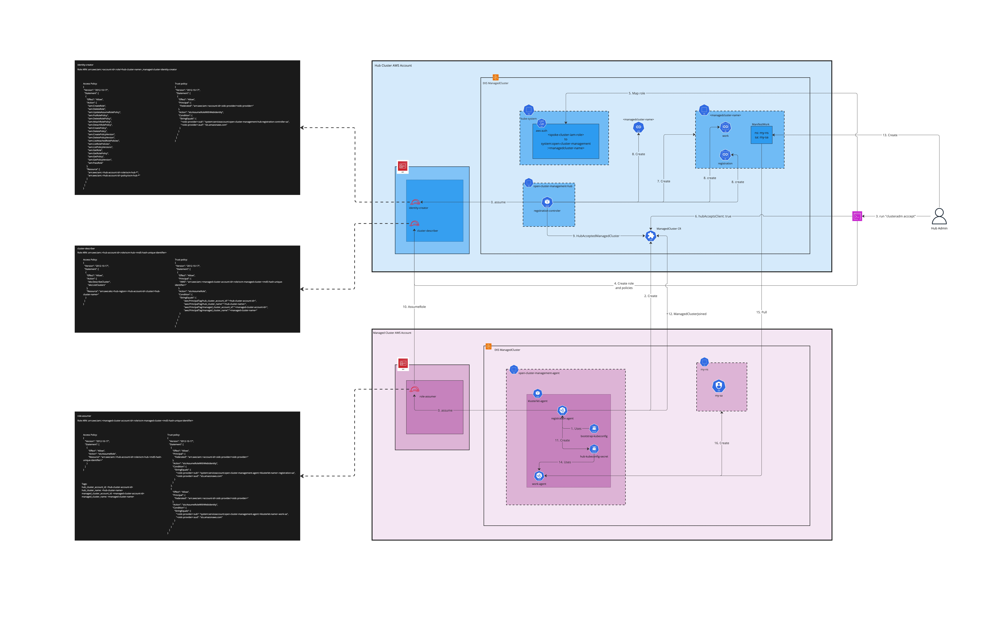

## Release Signoff Checklist

- [ ] Enhancement is `implementable`
- [ ] Design details are appropriately documented from clear requirements
- [ ] Test plan is defined
- [ ] Graduation criteria for dev preview, tech preview, GA
- [ ] User-facing documentation is created in [website](https://github.com/open-cluster-management-io/open-cluster-management-io.github.io/)

## Summary

OCM's use of a CSR based mechanism for registering managed clusters with the hub cluster is incompatible with Kubernetes environments that cannot issue client auth certificates such as Amazon Elastic Kubernetes Service (EKS).
This enhancement provides an AWS IAM based registration mechanism so that OCM can support EKS-based hub clusters natively. This proposal can be extended in future to support non-EKS hub to accept both csr and aws-irsa based registration requests at the same time.

## Motivation

For cluster administrators, it is often preferable to leverage their cloud provider’s managed Kubernetes service (e.g. AKS, EKS, IKS, GKE etc) rather than self-managing the Kubernetes control plane and worker nodes - reducing cluster management overhead and complexity.
However, in some of these environments (for example EKS), the use of CSRs for client authentication is unsupported.

Adopting OCM should not require its users to change how they deploy and manage their hub Kubernetes cluster.

One option is to run [multicluster-controlplane](https://github.com/open-cluster-management-io/multicluster-controlplane) service inside or outside Kubernetes and use that as a hub. However, multicluster-controlplane comes with following limitations:
- It is not a full Kubernetes controlplane and hence some OCM addons might not work
- The user is responsible for maintaining HA etcd cluster, instead of being able to leverage managed etcd that comes with EKS controlplane. 

As such, OCM needs to support an alternative registration mechanism to CSRs that is expected to work in EKS, providing maximum compatibility with managed EKS.

### Goals

- The OCM hub cluster can run on EKS.
- `clusteradm` tooling provides options to select aws-irsa registration while initializing the hub as well as joining a managed cluster to the hub.
- Make authentication strategy pluggable, making it easier for other cloud providers to add support for their platform in the future.

### Non-Goals

- Support for running a hub cluster on other cloud providers like Google Cloud Platform GKE and Azure AKS, even though this enhancement will make future support for other cloud providers easier.
- Support for EKS cluster as hub and any other cloud provider managed kubernetes service as a managed cluster. This enhancement aims at using EKS for both managed as well as hub cluster.
- Support for ocm addons to use AWS IAM based authentication to talk to an EKS hub cluster.

## Proposal

### User Stories

#### Story 1 - Hub administrator initializes a hub cluster using AWS IRSA authentication strategy

It must be possible for the cluster administrator to specify they wish to authenticate registration requests using `aws-irsa` authentication strategy in the `clusteradm init` command. The default authentication strategy will be `csr`:

```
% clusteradm init \
     --wait \
     --registration-auth=aws-irsa \
     --context ${CTX_HUB_CLUSTER}
```


#### Story 2 - Hub administrator can initialize a hub using aws-irsa authentication strategy or CSR based authentication.

`clusteradm init` command will be using `csr` authentication by default.

The `clusteradm init` command can verify CSR (Certificate Signing Request) support by creating a dummy CSR, attempting to approve it, and checking the outcome. If client CSR authentication is unavailable for the hub cluster, the dummy CSR will receive a "failed" condition, and the administrator will receive a warning.

OCM hub will support following authentication strategies:
- **aws-irsa** (supported only when both hub and managed cluster are on EKS)
- **csr** (supported only when hub is non EKS)
- **csr** and **aws-irsa** together at the same time (supported only when hub is non EKS)


#### Story 3 - Managed cluster administrator joins a cluster to the hub using AWS IRSA authentication strategy

It must be possible for the cluster administrator to specify they wish to use `aws-irsa` authentication strategy in the `clusteradm join` command to register with hub. The default authentication strategy will be `csr`:

```
% clusteradm join \
     --registration-auth=aws-irsa \
     --hub-token XXX \
     --hub-apiserver https://hub-0.k8s.example.com \
     --eks-hub-cluster-arn arn:aws:eks:<region>:<hub-cluster-account-id>:cluster/<hub-cluster-name> \
     --cluster-name managed-0
```

**Note**: If the selected `registration-auth` is `aws-irsa`, an additional option called `--eks-hub-cluster-arn` is required. The value of this option will be used to generate a role that the managed cluster will assume on startup.

#### Story 4 - Hub administrator accepts a managed cluster using respective authentication strategy

It must be possible for the cluster administrator to accept the cluster registration requests using `aws-irsa` authentication strategy based on the presense of `eks-managed-cluster-arn` annotation in `ManagedCuster`, such that it can create identities on hub AWS IAM for managed cluster. The authentication strategy will be `csr`, if this annotation is missing:

```
% clusteradm accept \
     --clusters managed-0
```


#### Story 5 - Managed cluster administrator un-joins a cluster and cleanup all resources from hub

Managed cluster admin should be able to unjoin itself and cleanup managed cluster specific resources on hub. Managed cluster admin can update the `spec.hubAcceptsClient` to false, which will trigger the hub to clean up all the resources on hub like RBAC resources, IAM roles and policies.

In order to complete the unjoin, managed cluster admin can delete `Klusterlet` CR and finally Klusterlet operator.


#### Story 6 - Procedure for managed cluster administrator to follow to refresh the token

The temporary IAM credentials, for the role assumed by pod, obtained by klusterlet-agent from sts will have TTL of 1 hour by default, which will be [renewed](https://docs.aws.amazon.com/AWSJavaScriptSDK/latest/AWS/Credentials.html#:~:text=Occasionally%20credentials%20can%20expire%20in%20the%20middle%20of%20a%20long%2Drunning%20application.%20In%20this%20case%2C%20the%20SDK%20will%20automatically%20attempt%20to%20refresh%20the%20credentials%20from%20the%20storage%20location%20if%20the%20Credentials%20class%20implements%20the%20refresh()%20method.) by AWS SDK automatically. More info can be found [here](https://docs.aws.amazon.com/eks/latest/userguide/pod-configuration.html).

The EKS kubeconfig will use these temporary IAM creds to generate temporary sts token using `aws eks get-token` command present in kubeconfig with [TTL of 15 mins](https://aws.github.io/aws-eks-best-practices/security/docs/iam/#:~:text=The%20token%20has%20a%20time,each%20time%20the%20token%20expires.). This sts token authenticates every request sent to EKS api-server, and is automatically renewed by kubeconfig on expiry. Snippet of user from an EKS kubeconfig:
```yaml
users:
- name: test-user
  user:
    exec:
      apiVersion: client.authentication.k8s.io/v1beta1
      command: aws
      args:
      - --region
      - my-aws-region
      - eks
      - get-token
      - --hub-cluster-name
      - my-cluster
```

We don't have to do anything additional to refresh the tokens, aws/eks infrastructure takes care of that for us.

#### Story 7 - Procedure for hub administrator to follow, to revoke access to a managed cluster

It must be possible for the hub cluster administrator to revoke access to a managed cluster. The hub admin can simply delete the `ManagedCluster` from hub or set spec.hubAcceptsClient to false and the registration-controller on the hub will be enhanced to delete all managed cluster specific IAM resources in addition RBAC resources on hub.

#### Story 8 - Managed cluster permission isolation on hub

One managed cluster should not be able to access resources on hub that belong to another managed cluster. 

### Implementation Details/Notes/Constraints

#### Changes required on hub
The IAM roles and policies for managed cluster will be created when hub-admin accepts the registration request by running `clusteradm accept` command on hub. The role name and policies will be created using templates to ensure standardization. The PrincipalTags in the newly created hub role's trust policy will contain managed cluster account id and name, which will be parsed from the `eks-managed-cluster-arn` annotation on `ManagedCluster`. The role name should follow a standard naming convention so that the role on managed cluster can assume the hub role with a standardized name. It will also create an entry [aws-auth](https://docs.aws.amazon.com/eks/latest/userguide/migrating-access-entries.html) configmap which will bind the iam role with permissions inside the cluster so that the incoming requests from managed cluster can have the required access inside the hub cluster.

If the feature gate `ManagedClusterAutoApproval` is enabled, choosing `aws-irsa` instead of `csr` will disable [csr controller](https://github.com/open-cluster-management-io/ocm/blob/main/pkg/registration/hub/csr/controller.go) on hub and enable a new `aws-irsa` controller, which will auto approve all registration requests, and create IAM roles and policies and RBAC permissions, and finally update the aws-auth configmap. 

The hub registration controller must assume an IAM role with the permissions allowing it to create roles for managed clusters and attach policies. The name of this role will follow a standard template which will contain cluster name which can be parsed from the kubeconfig used to run `clusteradm init` command. The role name should follow a standard name so that the role can be created before running `clusteradm init` command and the hub controller can assume the role with a standardized name, on startup:
```shell
arn:aws:iam::<hub-account-id>:role/<hub-cluster-name>_managed-cluster-identity-creator
```

#### Changes required on the managed cluster
Choosing `aws-irsa` instead of `csr` will disable [CSR Driver](https://github.com/open-cluster-management-io/ocm/blob/main/pkg/registration/spoke/spokeagent.go#L64) on managed cluster and enable a new `aws-irsa` driver in klusterlet/registration agent, which will create only `ManagedCluster` on hub and not CSR. Managed cluster eks arn will be added to an annotation called `eks-managed-cluster-arn` in `ManagedCluster`. The `aws-irsa` register driver will watch for the updates on `ManagedCluster`, and once accepted on hub and has HubAcceptedManagedCluster condition, it will generate a kubeconfig using following command and save it to a secret called hub-kubeconfig-secret on managed cluster:
```shell
aws eks update-kubeconfig --name <hub-eks-cluster-name> --kubeconfig <path/to/create/kubeconfig> --role-arn <role-on-hub-for-managed>
```

The klusterlet/registration agent on managed cluster must assume an IAM role, in the AWS account in which managed cluster is running, on startup, with the permissions allowing it assume the role on hub IAM. The role will be tagged with managed cluster name which can be parsed from the `--cluster-name` option passed to `clusteradm join` command. The managed cluster admin must know in advance, which hub cluster to join, as the role will be tagged with the name and aws account of the hub cluster. The md5 hash present in the name of managed cluster role will be calculated from the managedcluster name and account id and hub cluster name and account id. The hub cluster name and account id will be parsed from the `--eks-hub-cluster-arn` option passed to `clusteradm join` command.

The role name and policies created on managed cluster IAM will follow a templates to ensure standardization. The role name will contain md5 hash of the values of tags to uniquely identify.

```shell
arn:aws:iam::<managed-cluster-account-id>:role/ocm-managed-cluster-<md5-hash-unique-identifier>
```

Another reason to follow a standard name is to ensure that the role can be created before running `clusteradm join` command and the klusterlet/registration agent can assume that role, on startup, with a standardized name.

#### Graceful resource cleanup on both hub and managed cluster when managed cluster triggers unjoin

The managed cluster admin will use the hub-kubeconfig from hub-kubeconfig-secret in managed cluster and update the `ManagedCluster` on hub and set the `spec.hubAcceptsClient` to false, which will trigger the [managedcluster controller](https://github.com/open-cluster-management-io/ocm/blob/main/pkg/registration/hub/managedcluster/controller.go) on hub to clean-up all the managed cluster specific resources, like IAM roles and policies on hub.

The only resource left will be `ManagedCluster`, for which a `CronJob` will be added, along with a ClusterRole with permission to delete `ManagedCluster` CR, to cleanup left over `ManagedCluster` resources.

#### Managed cluster permission isolation on hub

Every managed cluster will have a separate role on both managed cluster as well as hub IAM. Every managed cluster role on hub will allow access to managed cluster's namespace only. All roles will follow a standard naming convention, and the IAM trust policies allow roles to be assumed by relevant resources (pods, clusters, etc) only.

This will ensure that roles can only be assumed by the consumers they are meant for, such that one managed cluster cannot assume roles and access resources belonging to other managed cluster

### Workflow Details

This is to describe the various process of cluster join

Actors:
1. cluster-admin on managed cluster
2. AWS IAM admin on managed cluster AWS account
3. cluster-admin on hub cluster
4. AWS IAM admin on hub cluster AWS account
5. hub controller
6. agent on managed cluster

Some rules on cluster join:
- The name of the cluster must be globally unique on hub and conforms to dns label format.

#### Managed Cluster Prerequisites

An IAM role named using following template:
```
arn:aws:iam::<managed-cluster-account-id>:role/ocm-managed-cluster-<md5-hash-unique-identifier>
```

Having following permissons access policy:
```json
{
   "Version": "2012-10-17",
   "Statement": [
      {
         "Effect": "Allow",
         "Action": "sts:AssumeRole",
         "Resource": "arn:aws:iam::<hub-account-id>:role/ocm-hub-<md5-hash-unique-identifier>"
      }
   ]
}
```

And following trust relationship policy:
```json
{
   "Version": "2012-10-17",
   "Statement": [
      {
         "Effect": "Allow",
         "Principal": {
            "Federated": "arn:aws:iam::<managed-cluster-account-id>:oidc-provider/<oidc-provider>"
         },
         "Action": "sts:AssumeRoleWithWebIdentity",
         "Condition": {
            "StringEquals": {
               "<oidc-provider>:sub": "system:serviceaccount:open-cluster-management-agent:<klusterlet-name>-registration-sa",
               "<oidc-provider>:aud": "sts.amazonaws.com"
            }
         }
      },
      {
         "Effect": "Allow",
         "Principal": {
            "Federated": "arn:aws:iam::<managed-cluster-account-id>:oidc-provider/<oidc-provider>"
         },
         "Action": "sts:AssumeRoleWithWebIdentity",
         "Condition": {
            "StringEquals": {
               "<oidc-provider>:sub": "system:serviceaccount:open-cluster-management-agent:<klusterlet-name>-work-sa",
               "<oidc-provider>:aud": "sts.amazonaws.com"
            }
         }
      }
   ]
}
```

With following tags:
```
hub_cluster_account_id: <hub-cluster-account-id>
hub_cluster_name: <hub-cluster-name>
managed_cluster_account_id: <managed-cluster-account-id>
managed_cluster_name: <managed-cluster-name>
```

**Note:** The _md5-hash-unique-identifier_ should be calculated, using the hash of the values of tags (`hub_cluster_account_id`, `hub_cluster_name`, `managed_cluster_account_id` and `managed_cluster_name`) on the role concatenated using `#` as the delimiter, in the alphabetical order of their keys:

For example, given the following tags:
- `hub_cluster_account_id: hubaccount1`
- `hub_cluster_name: hubcluster1`
- `managed_cluster_account_id: managedaccount1`
- `managed_cluster_name: managedcluster1`

The md5-hash-unique-identifier should be `hash(hubaccount1#hubcluster1#managedaccount1#managedcluster1)` which is `79e99112993014816615711cbd35a9bc`.

#### Hub Cluster Prerequisites

This prerequisite is only applicable when enabling [AutoApproval](https://github.com/open-cluster-management-io/api/blob/main/feature/feature.go#L61) feature gate. When accepting manually, the user accepting the request must have following permissions.

An IAM role named using following template:
```
arn:aws:iam::<hub-account-id>:role/<hub-cluster-name>_managed-cluster-identity-creator
```

Having the following access permissions policy:
```json
{
  "Version": "2012-10-17",
  "Statement": [
    {
      "Effect": "Allow",
      "Action": [
        "iam:CreateRole",
        "iam:DeleteRole",
        "iam:UpdateAssumeRolePolicy",
        "iam:PutRolePolicy",
        "iam:DeleteRolePolicy",
        "iam:AttachRolePolicy",
        "iam:DetachRolePolicy",
        "iam:CreatePolicy",
        "iam:DeletePolicy",
        "iam:CreatePolicyVersion",
        "iam:DeletePolicyVersion",
        "iam:ListAttachedRolePolicies",
        "iam:ListRolePolicies",
        "iam:ListPolicyVersions",
        "iam:GetRole",
        "iam:GetRolePolicy",
        "iam:GetPolicy",
        "iam:GetPolicyVersion",
        "iam:PassRole"
      ],
      "Resource": [
        "arn:aws:iam::<hub-account-id>:role/ocm-hub-*",
        "arn:aws:iam::<hub-account-id>:policy/ocm-hub-*"
      ]
    }
  ]
}
```

And following trust relationship policy:
```json
{
  "Version": "2012-10-17",
  "Statement": [
    {
      "Effect": "Allow",
      "Principal": {
        "Federated": "arn:aws:iam::<hub-account-id>:oidc-provider/<oidc-provider>"
      },
      "Action": "sts:AssumeRoleWithWebIdentity",
      "Condition": {
        "StringEquals": {
          "<oidc-provider>:sub": "system:serviceaccount:open-cluster-management-hub:registration-controller-sa",
          "<oidc-provider>:aud": "sts.amazonaws.com"
        }
      }
    }
  ]
}
```

#### Cluster join initiated from managed cluster
1. cluster-admin on managed cluster gets a bootstrap kubeconfig to connect to hub,
   and deploy the agent on managed cluster.
- it has the identity to create `ManagedCluster`.

2. agent on managed cluster creates `ManagedCluster` on hub if it does not exist.
- The name of `ManagedCluster` is passed using the `--cluster-name` option while running `clusteradm join` command.
- An annotation with the name `eks-managed-cluster-arn` is added to the `ManagedCluster`.
- The agent on the managed cluster will store it as `cluster-name` in `Secret` `hub-kubeconfig-secret`. The agent also stores name of the agent as `agent-name` in the same secret. So restarting agent or redeploying agent will not lose the UID after the cluster is managed successfully.

3. cluster-admin on hub-cluster accepts the registration request using `clusteradm accept` command, and triggers following. Only a user on hub who has IAM permissions to create IAM resources and RBAC permission to update [aws-auth](https://docs.aws.amazon.com/eks/latest/userguide/migrating-access-entries.html) `ConfigMap` and subresource of `managedclusters/accept` can run this command:
- Creates identities including role, access policy and trust policy using the following templates for the `ManagedCluster` on hub IAM. The value of some PrincipalTag fields in the trust policy will be extracted from `eks-managed-cluster-arn` annotation on `ManagedCluster`:

    Role
    ```
    arn:aws:iam::<hub-account-id>:role/ocm-hub-<md5-hash-unique-identifier>
    ```

    Access Policy
    ```json
    {
      "Version": "2012-10-17",
      "Statement": [
        {
          "Effect": "Allow",
          "Action": [
            "eks:DescribeCluster",
            "eks:ListClusters"
          ],
          "Resource": "arn:aws:eks:<hub-region>:<hub-account-id>:cluster/<hub-cluster-name>"
        }
      ]
    }
    ```

    Trust relationship policy
    ```shell
    {
      "Version": "2012-10-17",
      "Statement": [
        {
          "Effect": "Allow",
          "Principal": {
            "AWS": "arn:aws:iam::<managed-cluster-account-id>:role/ocm-managed-cluster-<md5-hash-unique-identifier>"
          },
          "Action": "sts:AssumeRole",
          "Condition": {  
            "StringEquals": {
                    "aws:PrincipalTag/hub_cluster_account_id":"<hub-cluster-account-id>",
                    "aws:PrincipalTag/hub_cluster_name":"<hub-cluster-name>",
                    "aws:PrincipalTag/managed_cluster_account_id":"<managed-cluster-account-id>",
                    "aws:PrincipalTag/managed_cluster_name":"<managed-cluster-name>"
            }
          }
        }
      ]
    }
    ```
- Creates an entry in the [aws-auth](https://docs.aws.amazon.com/eks/latest/userguide/migrating-access-entries.html) configmap for the newly created IAM role and maps it to a group with following name. The `ManagedCluster` gets permissions inside the hub through `system:open-cluster-management:<clusterName>` group.
- Updates `spec.hubAcceptsClient` on `ManagedCluster` to `true`

4. hub-controller creates a namespace as the name of managed cluster on hub cluster if it does not exist.
- managed cluster can only join a hub once, and it can join to multiple hubs.
- The UID of the managed cluster is identical on each of the hub the Klusterlet agent joins.
 
5. hub-controller creates a clusterrolebinding on the hub, binds role with the identity of
   `open-cluster-management:managedcluster:<clusterName>` to group `system:open-cluster-management:<clusterName>`
     - Allows status update of `ManagedCluster`

6. hub-controller creates rolebinding `open-cluster-management:managedcluster:<clusterName>:registration` bound to cluster role `open-cluster-management:managedcluster:registration` on the cluster namespace on the hub
- Allows the access of agent on managed cluster to the namespace.

7. hub-controller creates rolebinding `open-cluster-management:managedcluster:<clusterName>:work` bound to cluster role `open-cluster-management:managedcluster:work` on the cluster namespace on the hub
- Allows the access of agent on managed cluster to pull `ManifestWork` from the namespace.

8. hub-controller updates condition of `ManagedCluster` to `HubAcceptedManagedCluster`.

9. agent on managed cluster assumes its role on hub, and create a new kubeconfig `hub-kubeconfig-secret` using following command and saves it as secret:
    ```shell
    aws eks update-kubeconfig --name <hub-eks-cluster-name> --kubeconfig <path/to/create/kubeconfig> --role-arn <role-on-hub-for-managed>
    ```

10. agent on managed cluster connects to hub apiserver using the new kubeconfig.

11. agent on managed cluster updates conditions of `ManagedCluster` as `ManagedClusterJoined`.

12. agent on managed cluster appends updates other fields in status of `ManagedCluster`. 

13. agent on managed cluster pulls the`ManifestWork` and creates resource.

Registration workflow


### Risks and Mitigation

TODO

## Design Details

### TODO
1. Confirm, with a POC, that temporary IAM creds set in klusterlet-agent pod env are refreshed automatically after 1 hour.
2. Confirm, with a POC, that the permissions listed in the proposed IAM policies is the least permission set required for this solution to work. Also ensure that, the permission set is a complete set to required by work-agent.
3. Ensure that the role names fit in the aws role name limit of 64 character per role. We can perhaps use the hash of the tags present on the role to uniquely name a role. We can name it as `ocm-managed-cluster-<32-char-md5-hash>`.
4. Can we remove the `registration-auth` flag from some of the `clusteradm` commands like `accept`, `unjoin`, such that the existing authentication strategy can be detected as part of execution of these commands.

### Open Questions

#### New feature: Cleanup hub resources when a managed cluster unjoins

### Test Plan

**Note:** *Section not required until targeted at a release.*

TODO

### Graduation Criteria

**Note:** *Section not required until targeted at a release.*

TODO

### Upgrade / Downgrade Strategy

TODO

### Version Skew Strategy

TODO

## Implementation History

## Drawbacks

## Alternatives

- CSR remains the preferred approach to managed cluster authentication with the hub, where usable.

## Infrastructure Needed [optional]

No specific infrastructure required. 