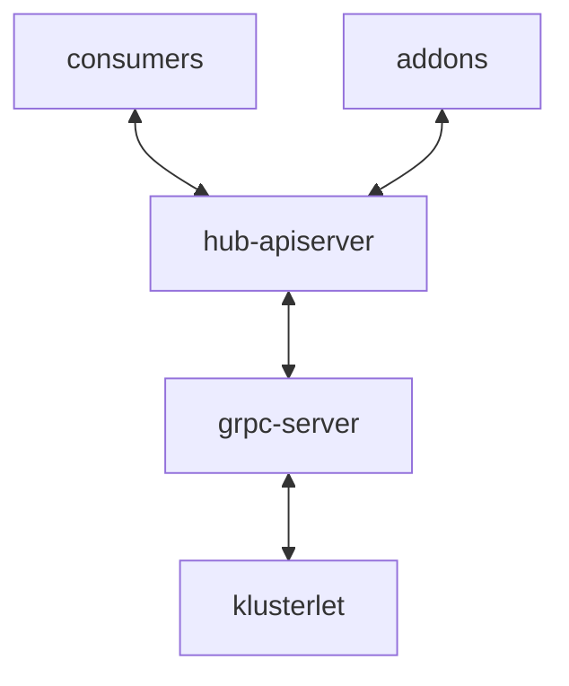

# gRPC based registration

## Release Signoff Checklist

- [x] Enhancement is `implementable`
- [ ] Design details are appropriately documented from clear requirements
- [ ] Test plan is defined
- [ ] Graduation criteria for dev preview, tech preview, GA
- [ ] User-facing documentation is created in [website](https://github.com/open-cluster-management-io/open-cluster-management-io.github.io/)

## Summary

This proposal is an introduction to providing an optional GRPC based connection 
between klusterlet agent and hub cluster to replace the kubernetes based connection.

## Motivation

Today ocm agent connects to the hub using a kubeconfig with limited permission. To obtain
this kubeconfig, the agent sends a CSR resource using a bootstrap kubeconfig with limited
permission as a join request. The hub side component/actor needs to approve the request, and
creates related RBAC for the agent. The agent then is able to use the signed certificate from
the csr to construct the kubeconfig and connect to the hub.

This document is to design an alternative approach on hub/spoke connection setup to use GRPC
instead of directly connecting kube-apiserver.

There were security concerns about an agent using a kubeconfig to connect to the hub apiserver.
Even though the permission of this kubeconfig is carefully controlled, there are risk
the permission is misconfigured such that kubeconfig on the spoke is able to access other APIs
on the hub apiserver, and compromise the hub apiserver.

Using a GRPC connection between the hub and spoke can limit the exposure of the apiserver to
the spoke cluster, avoiding agents directly talking to hub apiserver. It also opens the
possibility in the future to:
- avoid setting cluster namespace for each cluster on the hub.
- use a non-kube controlplane to store data.

The similar mechanism
has been investigated in event-based-manifestwork that utilizes cloudEvent with message queue
or grpc as the connection mechanism between server and agent.


### Goals
- The user can configure the klusterlet to connect to the grpc endpoint of the hub with a bootstrap config.
  The bootstrap process is identical to the process of what we have today.
- The agent is able to connect to the hub cluster with a GRPC endpoint to sync cluster status and
  deliver manifestwork.
- The user or controller on the hub can still use the kubernetes style API to manage cluster and
  manifestwork as today.

### Non-Goals

## Proposal

### Scenarios

the kube-apiserver is used as the persistence layer. gRPC server translates the kube
resources (manifestwork/clusters/csr) to the grpc message and sends them to the klusterlet
agent. The agent also sends the status update to the gRPC server, and then the server
updates resource status in the kube-apiserver. The consumer/addons on the hub side
do not need to adjust any code. Its benefit is the agent no longer connects hub apiserver
directly, but it will not bring benefit in terms of scale.



## Design Details

### gRPC server

gRPC server sits between the kube-apiserver and klusterlet agent. It receives request from
klusterlet agent in cloudevent format, translates to kube style API and call the kube-apiserver.
It also watches the kube-apiserver, translating the events from the informer to cloudevent and
sends to the related klusterlet agent. Requirements to the gRPC server are:

- Abstract the persistence layer: build an abstraction layer for persistence so that we can
  choose to use either k8s or db as the persistence layer.
- In addition to sync manifestwork, the grpc server also needs to support registration
  process and cluster status sync.
- How addon connects to the hub is out of scope of this design doc. The addon still uses the existing approach today.

### Abstract the persistence layer

We need several different interface abstraction to persistence layer:

Service interface: A common interface that sends resource spec to the agent and handles
status updates from the agent.

```go
type Service interface {
   // Get the cloudEvent based on resourceID from the service
   Get(ctx context.Context, resourceID string) (*cloudevents.Event, error)


   // List the cloudEvent from the service
   List(listOpts cetypes.ListOptions) ([]*cloudevents.Event, error)


   // HandleStatusUpdate processes the resource status update from the agent.
   HandleStatusUpdate(ctx context.Context, evt *cloudevents.Event) error


   // RegisterHandler register the handler to the service.
   RegisterHandler(handler EventHandler)
}
```

For each resources in kube-apiserver that klusterlet agent needs to interact with, e.g.
`ManagedCluster` and `ManagedClusterAddOn`, a service needs to be implemented.

### Registration process

The registration process should follow the same procedure as-is today. We will build a
grpc registration driver on the agent.

- A bootstrap config including grpc endpoint and token to connect to the grpc server
  on the hub is provided to the agent on the spoke. The token has limited permissions
  to only create certificate signing request and mamagedcluster with certain name.
- The agent uses this config to connect to the grpc server, sends the join request, and 
  subscribes to the response message. Only csr response will be returned from server in
  this stage.
- Upon receiving the join request, the server creates csr with
  open-cluster-mangement.io/grpc as the signer and managedcluster on the hub apiserver. 
- If another actor approves the csr on the hub apiserver, the server signs the csr,
  and sends the csr response back to the agent. Upon receiving the csr response, the
  agent builds a new grpc configuration to connect to the server. The agent monitors
  the certificate, and sends a new csr message when the certificate is about to expire.

### Agent authorization

The server should authorize the agent’s identity on what message the agent is permitted to send.
- The server gets the user identity from the context.
- The server gets event data type and action type in the event.
- The server builds a SAR request and checks if the message is allowed.

### Post registration

After registration is finished, the registration driver will generate a gRPC config using
client certificate, and then build clients for klusterlet agent to connect to gRPC server.
These clients is to sync cluster status, manifestwork, and managedclusteraddon resources.

### High Availability

gRPC server should be able to horizontal scalable. Each agent will be registered to one of the
gRPC server, and when one of the gRPC server is down, agent should reconnect to another one.
The gRPC server instance maintain a list of agents that is connecting to itself, and only send
messages to the agent in the list.

When the agent reconnects to another gRPC server, agent will send a `resync` request to the
server asking for messages that might be lost during the reconnection.

### Risks and Mitigation

The following security principles should be considered between the broker and sources/agents

- The sources and agents should be authenticated by broker to prevent arbitrary clients can consume the event messages from the broker
- The sources should be authorized by broker to avoid one source can consume event messages from other sources
- The agent should be authorized by broker to avoid one agent can consume event messages from other clusters 

### Test Plan

**Note:** *Section not required until targeted at a release.*

- Unit tests
- Integration tests

### Graduation Criteria

**Note:** *Section not required until targeted at a release.*

Define graduation milestones.

These may be defined in terms of API maturity, or as something else. Initial proposal
should keep this high-level with a focus on what signals will be looked at to
determine graduation.

Consider the following in developing the graduation criteria for this
enhancement:

- [Maturity levels][maturity-levels]
- [Deprecation policy][deprecation-policy]

Clearly define what graduation means by either linking to the [API doc definition](https://kubernetes.io/docs/concepts/overview/kubernetes-api/#api-versioning),
or by redefining what graduation means.

In general, we try to use the same stages (alpha, beta, stable), regardless how the functionality is accessed.

[maturity-levels]: https://git.k8s.io/community/contributors/devel/sig-architecture/api_changes.md#alpha-beta-and-stable-versions
[deprecation-policy]: https://kubernetes.io/docs/reference/using-api/deprecation-policy/

### Upgrade / Downgrade Strategy

N/A

### Version Skew Strategy

N/A

## Implementation History

N/A

## Drawbacks

N/A

## Alternatives

N/A
