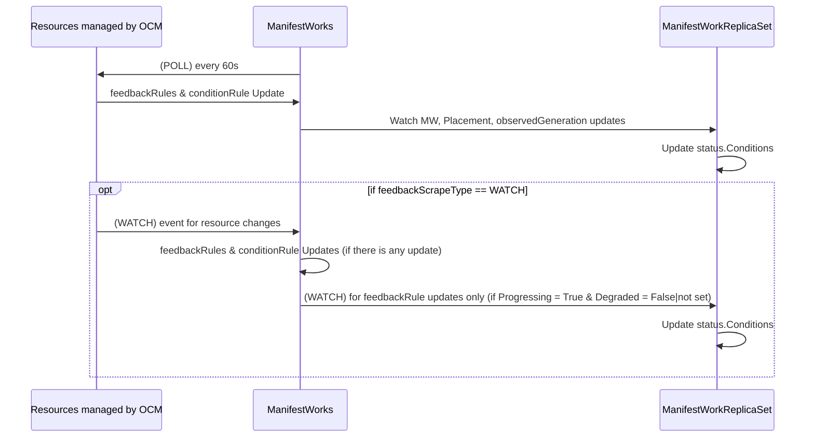

## Release Signoff Checklist

- [ ] Enhancement is `implementable`
- [ ] Design details are appropriately documented from clear requirements
- [ ] Test plan is defined
- [ ] Graduation criteria for dev preview, tech preview, GA
- [ ] User-facing documentation is created in [website](https://github.com/open-cluster-management-io/open-cluster-management-io.github.io/)

## Summary
Currently, the ManifestWork controller periodically polls (every 60s) resource 
statuses in managed clusters to populate statusFeedback values. This enhancement
introduces a new field, `feedbackScrapeType` to ManifestWorkReplicaSet CRD allowing 
users to specify whether status feedback should be collected via polling or 
watch-based mechanisms.

The MWRS controller should also be updated to explicitly watch and reconcile on changes 
in both ManifestWork.status.conditions and ManifestWork.status.feedbacks, when 
`feedbackScrapeType` == `WATCH` ensuring that feedback updates are properly aggregated 
into MWRS status in real time.

This feature enhances responsiveness and efficiency by enabling near-real-time status 
feedback updates for selected resources while preserving backward compatibility and
 operator control.

## Motivation

Today, the ManifestWork controller on the managed cluster periodically polls resources
every 60 seconds to collect status feedback defined in manifestConfigs. While this 
polling mechanism ensures eventual consistency, it introduces unnecessary latency for 
resources that change frequently and adds overhead from repeated list-and-get operations,
even when no changes occur. This limits OCM’s ability to provide near-real-time 
visibility of resource states and can delay downstream reconciliation actions or 
status reporting in large environments.

By introducing a new field, feedbackScrapeType, OCM allows users and platform operators 
to choose how feedback is collected—either through the existing periodic polling model 
(POLL) or an event-driven watch model (WATCH). With WATCH, the managed cluster agent can
immediately react to changes in specified resources, updating the corresponding 
ManifestWork and ensuring faster and more efficient feedback propagation to the hub. 
This reduces the need for fixed polling cadences, minimizes API load, and improves 
responsiveness for high-value workloads that require timely status updates.

For the ManifestWorkReplicaSet (MWRS) controller, this change ensures it accurately 
reflects aggregated feedback in real time, responding to both condition and feedback 
updates from its associated ManifestWork objects. This makes the OCM feedback loop 
more dynamic, scalable, and adaptive to workload characteristics.

### Goals

* Provide configurable feedback collection modes (POLL or WATCH) per resource in ManifestWork. 

* Ensure MWRS correctly aggregates and reflects feedback updates from both polling and watch-based sources.

* Maintain full backward compatibility for existing users and automation.

### Non-Goals

* Changing the core aggregation semantics in MWRS beyond supporting the new event-driven updates.

## Proposal

This is where we get down to the nitty gritty of what the proposal actually is.

### User Stories

Detail the things that people will be able to do if this is implemented.
Include as much detail as possible so that people can understand the "how" of
the system. The goal here is to make this feel real for users without getting
bogged down.

#### Story 1

User A uses MWRS to deploy a rollout to multiple cluster. The user wants 
to track the number of pod replicas that contain the change as it is rolled out to the cluster on the MWRS level.
To do this, the user must get the replica count as the change is rolling out, if it relies on the existing mechanism, it is likely that the change will be missed. 

For example, if the rollout happens every 10 seconds, then User A will not be able to track the per replica count. And only get the count when the rollout is completed.

### Implementation Details/Notes/Constraints [optional]

What are the caveats to the implementation? What are some important details that
didn't come across above. Go in to as much detail as necessary here. This might
be a good place to talk about core concepts and how they relate.

### Risks and Mitigation

#### Risk #1: Too many watch events and update calls to the ManifestWork. 

This will be mitigated by limiting when the ManifestWork controller sends updates to the ManifestWork and to stop processing WATCH events once the ManifestWork is "Ready". 

ManifestWork Controller will parse the response from the informer watch and only send an update to the ManifestWork if there is an update on the feedbackRules. 

ManifestWork Controller that registers informers per resource, will unregister the informer once the ManifestWork resource is no longer present.

Controller will control the total number of concurrent watch request, and set a limit, so if a new work comes requesting for watch, if the limit is reached, it will fallback to use poll mode. The controller can keep track of the number of informers created and cap the limit there. 

## Design Details
### ManifestWorkReplicaSet CRD changes
```yaml
apiVersion: work.open-cluster-management.io/v1alpha1
kind: ManifestWorkReplicaSet
...
spec:
  workload: ...
  manifestConfigs:
    - resourceIdentifier:
        group: apps
        resource: deployments
        namespace: default
        name: hello
      feedbackScrapeType: WATCH (Options: WATCH | POLL, POLL is default behavior)
    ....
```

#### ManifestWork CRD changes 
```yaml
apiVersion: work.open-cluster-management.io/v1alpha1
kind: ManifestWork
...
spec:
  manifestConfigs:
    - resourceIdentifier:
        group: apps
        resource: deployments
        namespace: default
        name: hello
      feedbackScrapeType: WATCH (Options: WATCH | POLL, POLL is default behavior)
    ....
```

This change will also be populated upwards to the ManifestWorkReplicaSet level of 
`spec.manifestWorkTemplate.manifestConfigs`. 



#### Spoke Level ManifestWork Controller Reconciler 

Default: resources continue to be polled on the existing interval.
If a resource is marked WATCH, the controller registers it for watch-based updates:
Immediate status/feedback recomputation on events.
Poll remains as a safety net.

Create a FeedbackScrape interface that polls or watches resources. 

In the ManifestWork Controller (pkg/work/spoke/controllers/statuscontroller/availablestatus_controller.go)
introduce a watch-based path alongside the existing poll loop. 

When syncing the ManifestWork, register a informer for the resource if `feedbackScrapeType`  WATCH. If the `feedbackScrapeType` is no longer WATCH, unregister the informer. If the ManifestWork is no longer available for that resource, unregister the informer. This will prevent long running WATCH from triggering too many ManifestWork changes.

When the informer recieves an event (create, update, delete), verify that there is a change on the fields defined in the `feedbackRules` and patch the status conditions for that resource. If there is no change on one of the `feedbackRules` field, ignore the WATCH event.

#### Hub Level ManifestWorkReplicaSet Controller Reconciler 

There should be no updates on the MWRS reconciler. The expected behavior is that when the ManifestWork has an update in the status feedback, trigger a resync of the MWRS to get the status feedback details.

In the current model, the MWRS controller is reconciled if there are changes to the ManifestWork (that are managed by manifestworkreplicaset), PlacementDecisions and Placements. Therefore any update to the status.Feedback on the ManifestWork should trigger the reconcile. Standard factory used [here](https://github.com/open-cluster-management-io/ocm/blob/main/pkg/work/hub/manager.go#L97-L98)


### Open Questions [optional]

TBD

### Upgrade / Downgrade Strategy

With the `POLL` flag or not set `feedbackScrapeType`, controllers will fallback to the previous behavior. 
## Alternatives

TBD 

## Infrastructure Needed [optional]

TBD
