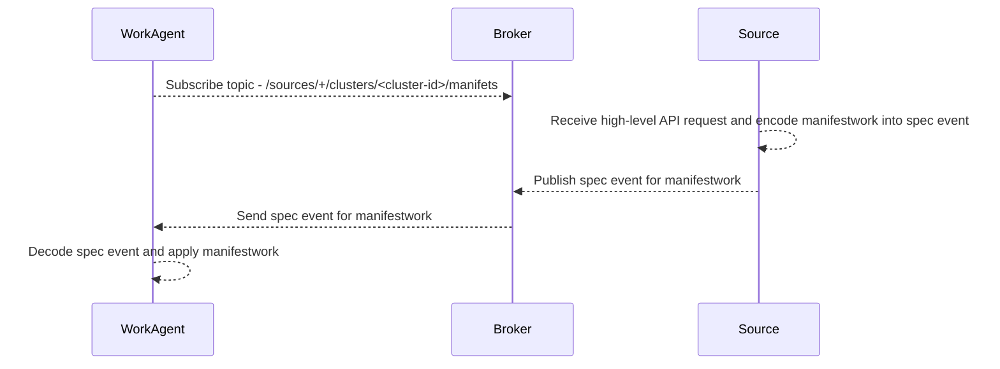
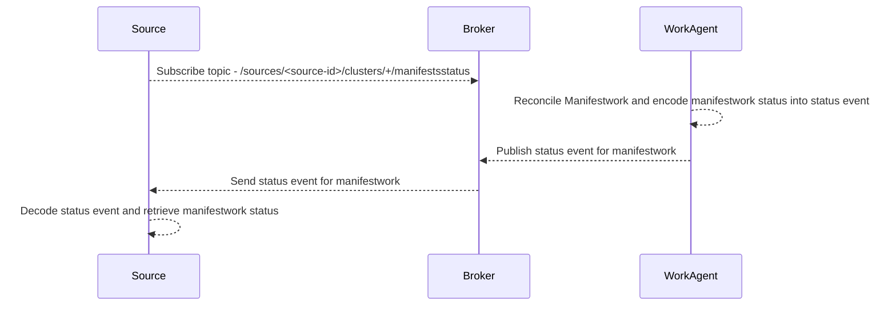
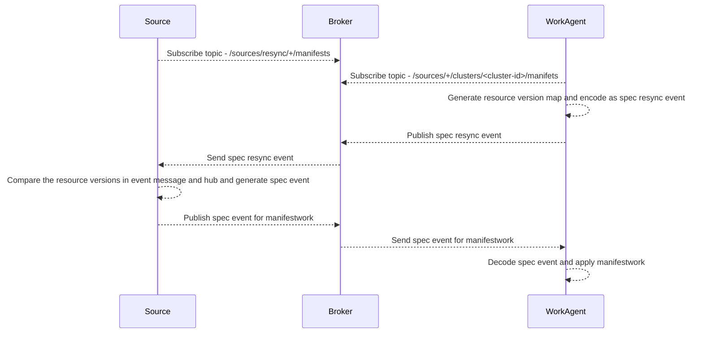
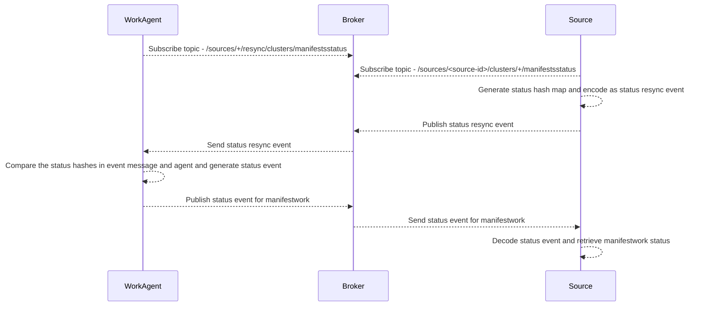

# Event Based Manifestwork

## Release Signoff Checklist

- [x] Enhancement is `implementable`
- [ ] Design details are appropriately documented from clear requirements
- [ ] Test plan is defined
- [ ] Graduation criteria for dev preview, tech preview, GA
- [ ] User-facing documentation is created in [website](https://github.com/open-cluster-management-io/open-cluster-management-io.github.io/)

## Summary

This proposal optimizes scaling and performance by treating manifestworks as event messages, reducing excessive storage on the hub cluster. This allows managed cluster agents to subscribe to relevant manifestworks, eliminating the need for extensive hub storage. The proposed changes also enable diverse architectures to consume ManifestWorks, while providing a client interface for seamless adoption of the event-based mechanism.

## Motivation

Manifestworks are used to deliver manifests from a hub cluster to managed clusters. As manifestwork adoption and managed cluster numbers increase, we encounter scaling issues due to excessive manifestwork creation on the hub. This adversely affects the performance of the hub apiserver. This proposal is to explore treating manifestworks as event messages instead of storing them in etcd.

By considering each cluster namespace as a separate topic or channel, managed cluster agents can subscribe to relevant manifestworks. This approach eliminates the need to store manifestworks on the hub cluster, as they are primarily consumed by controllers like the addon manager or manifestworkreplicaset controller. Additionally, this change allows other architectures, such as non-Kubernetes restful services or databases, to consume ManifestWorks.

To facilitate easy adoption of the event-based mechanism, a client interface should be provided, enabling existing work agents or consumers to transition without extensive code changes.

### Goals

- Establish a standardized event protocol for delivering manifestworks and returning status information.
- Define a resync mechanism to handle failures and ensure synchronization.
- Develop a client interface that facilitates easy integration for consumers.

### Non-Goals

- Define the controlplane to act as a consumer of the protocol.

## Proposal

### User Stories

#### Story 1

- As a hub controller developer, I can seamlessly transition to event-based manifestworks without modifying the controller logic by switching from the Kubernetes-style approach.

#### Story 2

- As a service developer, I can effortlessly utilize the event-based manifestwork API to construct a service that delivers manifestworks to managed clusters.

### Risks and Mitigation

- The authentication to the event transport layer (TBD)

## Design Details

We will adopt the CloudEvents specification as the message format for ManifestWorks. Multiple API consumers(sources) can leverage this format, and each consumer(source) must have a unique source ID to ensure proper identification and handling of events.

To ensure uniqueness and immutability of source components, each source, whether it is a consumer on the open cluster management hub cluster or a restful service handling resource requests, should possess a unique identifier. For instance, the open cluster management hub consumer can generate a source ID by hashing the hub cluster URL and appending a consumer name. Similarly, a restful service can choose a unique name or generate a unique ID in the associated database for its source identification.

### Spec Event

Sources send their resources along with the message to the work agent, enabling the creation, updating, or deletion of the respective resources on the managed cluster.

Event transfer flow:

1. The work agent subscribes to the spec event topic `/sources/+/clusters/<cluster-id>/manifests` from the broker, for example: `/sources/+/clusters/cluster1/manifests`.
2. The source receives high level API request and publishes its resources using the spec event to the topic `/sources/<source-id>/clusters/<cluster-id>/manifests`, for example: `/sources/sd3ded4-mwrs-controller/clusters/cluster1/manifests`.
3. The work agent receives the published event from the source and deploys the manifests included in the event.



Event Schema:

```json
{
    "specversion": "1.0", //The version of the CloudEvents specification which the event uses.
    "id": "<cloud-events-message-id>",
    "source": "<source-id>", //Identifies the context in which an event happened. Often this will include information such as the type of the event source, the organization publishing the event or the process that produced the event.
    "type": "io.open-cluster-management.v1.manifestwork.spec.created", //This attribute contains a value describing the type of event related to the originating occurrence. Often this attribute is used for routing, observability, policy enforcement, etc.
    "time": "2023-04-05T17:31:00Z", // Timestamp of when the occurrence happened.
    "datacontenttype": "application/json",
    // resourceID is the unique id for this manifestwork.
    // It is represented in string.
    // It is a required property.
    "resourceID": "748d04ad-887a-44dd-b788-da1373227072", 
    // resourceVersion is a sequence number that grows as the data of this message changes.
    // It is represented in int64.
    // It is a required property.
    "resourceVersion": 3,
    // deletionTimestamp is a timestamp representing the manifests of this message are
    // deleting from the source, the work-agent needs to clean up the manifests from its cluster.
    // It is represented in RFC3339 form and is in UTC.
    // It is an optional property, if not set, the agent will deploy the manifests on its cluster.
    "deletionTimestamp": "2018-04-05T17:31:00Z",
    "data": {
        // manifest represents a list of Kuberenetes resources to be
        // deployed on the cluster that the work agent is running.
        // It is represented in string.
        // It is a required property.
        "manifests": [],
        // deleteOption represents deletion strategy when the manifests are deleted.
        // It is an optional property, if not set, the Foreground 
        // deletion policy is applied to all the manifests
        "deleteOption": {
            // propagationPolicy can be Foreground, Orphan or SelectivelyOrphan.
            // Foreground represents that the resource in the manifest should be foreground deleted.
            // Orphan represents that the resource in the manifest is orphaned when this spec object is deleted.
            // SelectivelyOrphan represents that only selected manifests in this message are orphaned when this message is deleted. SelectivelyOrphan should be rarely used.  It is provided for cases where particular resources is transferring ownership from one ManifestWork to another or another management unit.
            "propagationPolicy": "",
            // selectiveOrphaningRules defines a slice of orphaningrule.
            // Each orphaningrule identifies a single resource included in this manifestwork.
            "selectiveOrphaningRules": []
        },
        // manifestConfigOption represents the configurations of a manifest defined in the workload field.
        // It is an optional property, if not set, the Update type strategy will be used to all the manifests, and no feedback rules will be honored
        "manifestConfigs": [{
            // resourceIdentifier represents the group, resource, name and namespace of a resource.
            "resourceIdentifier": {},
            // feedbackRules defines what resource status field should be returned. If it is not set or empty, no feedback rules will be honored.
            "feedbackRules": [{
                // Type defines the option of how status can be returned, it can be jsonPaths or wellKnownStatus.  If the type is JSONPaths, the user should specify the jsonPaths field. If the type is WellKnownStatus, certain common fields of status defined by a rule only If these status fields do not exist, no values will be reported.
                // required
                "type": "",
                // JsonPaths defines the json path under the status field to be synced.
                // optional
                "jsonPaths": []
            }],
            "updateStrategy": {
                // type defines the strategy to update this manifest, default value is Update.
                // Update type means to update resources by an update call.
                // CreateOnly type means do not update resources based on the current manifest.
                // ServerSideApply type means to update resource 
                // using server side apply with work-controller as the field manager required.
                "type": "",
                // serverSideApply defines the configuration for server side apply. It is honored only when type of updateStrategy is ServerSideApply
                // optional
                "serverSideApply": {
                    // Force represents to force apply the manifest.
                    // optional
                    "force": false,
                    // FieldManager is the manager to apply the  resource. It is work-agent by default, but can be another name with work-agent as the prefix.
                    // optional
                    "fieldManager": ""
                }
            }
        }]
    }
}
```

### Status Event

The work agent communicates the state of the resources it manages to the respective source using this message.

Event transfer flow:

1. The source subscribes to the status event topic `/sources/<source-id>/clusters/+/manifestsstatus` from the broker, for example: `/sources/sd3ded4-mwrs-controller/clusters/+/manifestsstatus`.
2. The work agent publishes the status of the resources using the status event to topic `/sources/<source-id>/clusters/<cluster-id>/manifestsstatus`, for example: `/sources/sd3ded4-mwrs-controller/clusters/cluster1/manifestsstatus`.
3. The source receives the published status event and updates the status of its corresponding resources.



Event Schema:

```json
{
    "specversion": "1.0",
    "id": "<cloud-events-message-id>",
    "source": "<agent-id>",
    "type": "io.open-cluster-management.v1.manifestwork.status.created",
    "datacontenttype": "application/json",
    "time": "2018-04-05T17:31:00Z",
    // specResourceID is from the corresponding spec message.
    // It is represented in string.
    // It is a required property.
    "specResourceID": "748d04ad-887a-44dd-b788-da1373227072",
    // specResouceVersion is from the corresponding spec message.
    // It is represented in int64.
    // It is a required property.
    "specResouceVersion": 3,
    "data": {
        // conditions contains the different condition statuses for this manifestwork.
        // The condition format is same with the Kuberenetes condition (k8s.io/apimachinery/pkg/apis/meta/v1) 
        // Valid condition types are:
        // 1. Applied represents workload in ManifestWork is applied successfully on a managed cluster.
       // 2. Progressing represents workload in ManifestWork that is being applied to a managed cluster.
      // 3. Available represents workload in ManifestWork exists on the managed cluster.
      // 4. Degraded represents the current state of workload does not match the desired
      // 5. Deleted represents the current ManifestWork is deleted successfully from a managed cluster.  
       "conditions" []
        // resourceStatus represents the status of each resource in manifestwork deployed on a managed cluster.
        "resourceStatus": {
            // manifestConditions represents the conditions of the resources deployed on a managed cluster.
            "manifestConditions": [{
                // resourceMeta represents the group, version,
                // kind, name and namespace of a resource.
                "resourceMeta": {},
                // statusFeedback represents the values of
                // the field synced back defined in statusFeedbacks
                "statusFeedback": {},
                // conditions represents the conditions of this resource on a managed cluster.
                // The condition format is same with the Kuberenetes
                // condition (k8s.io/apimachinery/pkg/apis/meta/v1) 
                "conditions": []
            }]
        }
    }
}
```

### Spec Resync Event

Event Scenarios:

1. After a work agent restarts, it sends a spec resync event with empty payload to the broker to synchronize all resources and avoid missing events during the restart period.
2. When a work agent reconnects to the broker after a disconnection, it sends a spec resync event containing the current versions of all resources to ensure synchronization and prevent data loss.
3. (Optional) The work agent may periodically send spec resync events to mitigate unexpected errors.

Event transfer flow:

1. The source subscribes to the spec resync event topic `/sources/resync/+/manifests` from the broker to receive spec resync request.
2. The work agent generates a spec resync event based on its current maintained resources.
3. The work agent sends the spec resync event to the broker with the topic `/sources/resync/<cluster-id>/manifests`, for example: `/sources/resync/cluster1/manifests`.
4. Upon receiving the spec resync event, the source processes the event message and interacts with the broker as follows:
  - If the request event message is empty, the source returns all resources associated with the work agent.
  - If the request event message contains resource IDs and versions, the source retrieves the resource with the specified ID and compares the versions.
  - If the requested resource version matches the source's current maintained resource version, the source does not resend the resource.
  - If the requested resource version is older than the source's current maintained resource version, the source sends the resource.



Event schema:

```json
{
    "specversion": "1.0",
    "id": "<cloud-events-message-id>",
    "source": "<source-id>",
    "type": "io.open-cluster-management.v1.manifestwork.specresync.requested”",
    "datacontenttype": "application/json",
    "time": "2018-04-05T17:31:00Z",
    "data": {
       resourceVersions: [
          {
           "resourceID": "748d04ad-887a-43aa-b123-da1373227011",
           "resourceVersion": "3"
          },
          {
            "resourceID": "858d03ad-997b-52bc-b456-ab1473228022",
            "resourceVersion": "1"
          }
        ]
    }
}
```

### Status Resync Event

Event Scenarios:

1. When a source restarts, it sends a status resync event to the broker to synchronize all resource status and prevent data loss. If the component has a database, it calculates the status hash of all resources stored in the database and includes it in the event. If the component does not have a database, it sends an status resync event with empty payload.
2. When a source reconnects to the broker after a disconnection, it sends a status resync event including the status hash of all its owned resources to ensure synchronization and prevent data loss.
3. (Optional) A source may periodically send status resync events to mitigate unexpected errors.

Event transfer flow:

1. The work agent subscribes to the status resync event topic `/sources/+/resync/clusters/manifestsstatus`, for example: `/sources/+/resync/clusters/manifestsstatus`.
2. The source calculates the hash of all resources it owns to generate a status hash.
3. The source sends a status resync event with the resources hash as the event payload to the broker.
4. Upon receiving the status resync event, the work agent responds by sending resource status events to the broker as follows:
  - If the event payload is empty, the work agent returns the status of all resources it maintains.
  - If the event payload is not empty, the work agent retrieves the resource with the specified ID and compares the received resource status hash with the current resource status hash. If they are not equal, the work agent resends the resource status message.



### Open Questions [optional]

N/A

### Test Plan

**Note:** *Section not required until targeted at a release.*

- Unit tests
- Integration tests

### Graduation Criteria

**Note:** *Section not required until targeted at a release.*

Define graduation milestones.

These may be defined in terms of API maturity, or as something else. Initial proposal
should keep this high-level with a focus on what signals will be looked at to
determine graduation.

Consider the following in developing the graduation criteria for this
enhancement:

- [Maturity levels][maturity-levels]
- [Deprecation policy][deprecation-policy]

Clearly define what graduation means by either linking to the [API doc definition](https://kubernetes.io/docs/concepts/overview/kubernetes-api/#api-versioning),
or by redefining what graduation means.

In general, we try to use the same stages (alpha, beta, stable), regardless how the functionality is accessed.

[maturity-levels]: https://git.k8s.io/community/contributors/devel/sig-architecture/api_changes.md#alpha-beta-and-stable-versions
[deprecation-policy]: https://kubernetes.io/docs/reference/using-api/deprecation-policy/

### Upgrade / Downgrade Strategy

N/A

### Version Skew Strategy

N/A

## Implementation History

N/A

## Drawbacks

N/A

## Alternatives

N/A
