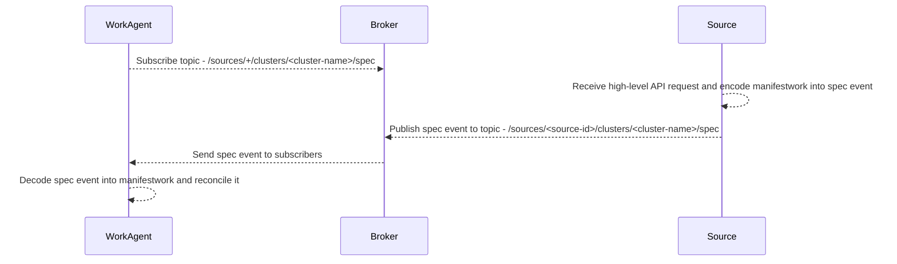
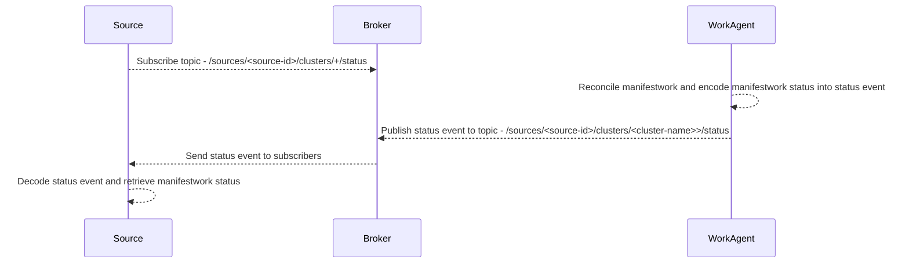
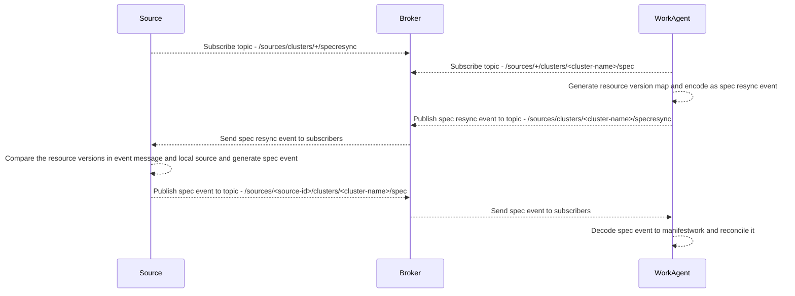
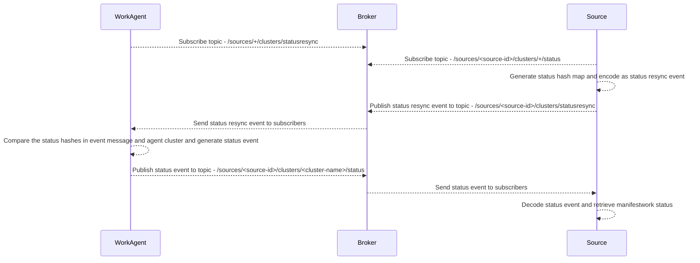

# Event Based Manifestwork

## Release Signoff Checklist

- [x] Enhancement is `implementable`
- [ ] Design details are appropriately documented from clear requirements
- [ ] Test plan is defined
- [ ] Graduation criteria for dev preview, tech preview, GA
- [ ] User-facing documentation is created in [website](https://github.com/open-cluster-management-io/open-cluster-management-io.github.io/)

## Summary

This proposal optimizes scaling and performance by treating manifestworks as event messages, reducing excessive storage on the kube-apiserver of hub cluster. This allows managed cluster agents to subscribe to relevant manifestworks, reducing the data being stored in ETCD of hub cluster. The proposed changes also enable diverse architectures to consume ManifestWorks, while providing a client interface for seamless adoption of the event-based mechanism.

## Motivation

Manifestworks are used to deliver manifests from a hub cluster to managed clusters. As manifestwork adoption and managed cluster numbers increase, we encounter scaling issues due to excessive manifestwork creation on the hub. This adversely affects the performance of the hub apiserver. This proposal is to explore treating manifestworks as event messages instead of storing them in ETCD.

By considering each cluster namespace as a separate topic or channel, managed cluster agents can subscribe to relevant manifestworks. This approach eliminates the need to store manifestworks on the hub cluster, as they are primarily consumed by controllers like the addon manager or manifestworkreplicaset controller. Additionally, this change allows other architectures, such as non-Kubernetes restful services with databases, to consume ManifestWorks.

Moreover, with the adoption of the event-based mechanism, ManifestWorks become highly versatile and applicable in IoT or edge computing scenarios, in which resource constraints and intermittent connectivity are common, the event-driven approach allows ManifestWorks to be efficiently distributed and applied to edge clusters. This enhances the overall flexibility and adaptability of ManifestWorks, extending their utility beyond traditional Kubernetes environments.

To facilitate easy adoption of the event-based mechanism, a client interface should be provided, enabling existing work agents or consumers to transition without extensive code changes.

### Terminology

- Source: The API consumer or component that utilizes this specification for ManifestWorks. It can be a controller on the hub cluster or a RESTful service handling resource requests. For RESTful service source, it often has a database to store the requested resources. Source should have a unique identifier to ensure its uniqueness and consistency, for example, a hub controller can generate a source ID by hashing the hub cluster URL and appending the controller name. Similarly, a RESTful service can select a unique name or generate a unique ID in the associated database for its source identification.
- Work Agent: The controller that handles the deployment of requested resources on the managed cluster and status report to the source. Work agent should have a unique identifier to ensure its uniqueness and consistency. Usually, work agent is uniquely identified by a string that combines managed cluster name and agent name for consistency.
- Broker: The message broker that handles the event transfer between the source and the work agent. It is represented by a message broker, such as MQTT or Kafka.

### Goals

- Establish a standardized event protocol for delivering manifestworks and returning status information.
- Define a resync mechanism to handle failures and ensure synchronization.
- Develop a client interface that facilitates easy integration for consumers.

### Non-Goals

- Define the source architecture to act as a consumer of the protocol.
- Define the storage and persistence requirement of message broker.

## Proposal

### User Stories

#### Story 1

- As a hub controller developer, I can seamlessly transition to event-based manifestworks without modifying the controller logic by switching from the Kubernetes-style approach.

#### Story 2

- As a service developer, I can effortlessly utilize the event-based manifestwork API to construct a service that delivers manifestworks to managed clusters and gather status information.

### Risks and Mitigation

- The authentication to the event transport layer (TBD)

## Design Details

We will adopt the CloudEvents specification as the message format for ManifestWorks. Multiple API consumers, referred to as "sources," can utilize this format to deliver resources to managed cluster and receive status information. Each source must have a unique source ID to ensure proper identification and handling of events. The work agent is the controller that handles the deployment of requested resources on the managed cluster and status feedback to the source.

### Spec Event

Sources send their resources along with the message to work agent, enabling the creation, updating, or deletion of the respective resources on the managed cluster.

#### Event Transfer Flow

1. The work agent subscribes to the spec event topic `/sources/+/clusters/<cluster-name>/spec` from the broker, for example: `/sources/+/clusters/cluster1/spec`.
2. The source receives high level API request and publishes its resources using the spec event to the topic `/sources/<source-id>/clusters/<cluster-name>/spec`, for example: `/sources/sd3ded4v-mwrs-hub-controller/clusters/cluster1/spec`.
3. The work agent receives the published event from the source and deploys the manifests included in the event.



#### Event Schema

1. Context Attributes
```JSON5
{
    // The version of the CloudEvents specification which the event uses.
    // Compliant event producers MUST use a value of "1.0" when referring to this version of the specification.
    "specversion": "1.0",
    // Unique identifier for cloud events message.
    "id": "<cloud-events-message-id>",
    // <source-id> should be a unique identifier for the source to identify the context in which an event occurred.
    // For example, a hub controller can generate a source ID by hashing the hub cluster URL and appending a controller name,
    // a work agent can generate a source ID with cluster name and agent name.
    "source": "<source-id>",
    // The type of the CloudEvents, use "<reverse-group-of-resource>.<resource-version>.<resource-name>.<subresource>.<action>"
    // as the format for this attribute, which contains a value describing the type of event data.
    // "<reverse-group-of-resource>.<resource-version>.<resource-name>" identifies the type of the resource included in the event payload;
    // "<subresource>" can be one of "spec" and "status";
    // "<action>" represents the action for this resource, e.g. create_request, update_request and delete_request and resync_request.
    // Eg. "io.open-cluster-management.works.v1alpha1.manifestbundle.spec.create_request", "io.open-cluster-management.works.v1alpha1.manifestbundle.status.update_request", "io.open-cluster-management.works.v1alpha1.manifest.spec.create_request", etc.
    "type": "<reverse-group-of-resource>.<resource-version>.<resource-name>.<subsource>.<action>",
    // Timestamp of when the occurrence happened. Optional, if present, MUST adhere to the format specified in RFC 3339.
    "time": "<timestamp-of-the-event-occurrence>",
    // Content type of data value, If present, MUST adhere to the format specified in RFC 2046.
    // By default "application/json" will be used if it is not set.
    "datacontenttype": "<data-content-type>"
}
```

2. Extensions
```JSON5
{
    // resourceid is a required string property representing the unique identifier for this manifestwork. It is the responsibility of the source to ensure its uniqueness and consistency. MUST adhere to the format specified in RFC 4122.
    "resourceid": "<uuid-of-the-resource>", 
    // resourceversion is a required int64 sequence number property that must be incremented by the source whenever the data of this message changes. It is the responsibility of the source to guarantee its incremental nature.
    "resourceversion": "<resource-version-in-int64>",
    // deletiontimestamp is an optional timestamp property representing the manifests of this message are deleting from the source, the work-agent needs to clean up the manifests from its cluster. It is represented in RFC3339 form and is in UTC. If not set, the agent will deploy or update the manifests on its cluster.
    // If present, MUST adhere to the format specified in RFC 3339.
    "deletiontimestamp": "<timestamp-of-the-resource-deletion>",
    // clustername indicates the resource will be deployed to which cluster
    "clustername": "<cluster-name>"
}
```

3. Payload

The payload of the spec event varies based on the resource name. Two supported resource types are "manifest" (for single resource) and "manifestbundle" (for multiple resources in an event message). For "manifest" resources, the payload matches the corresponding Kubernetes API resource. For "manifestbundle" resources, the payload aligns with the Kubernetes API's ManifestWork resource.

- **manifest (for single resource)**

```JSON5
{
  // manifest represents a Kuberenetes resource to be deployed on the cluster that the work agent is running.
  // It is a required property.
  "manifest": {}
}
```

- **manifestbundle (for multiple resources)**

```JSON5
{
    // manifest represents a list of Kuberenetes resources to be deployed on the cluster that the work agent is running.
    // It is a required property.
    "manifests": [],
    // deleteOption represents deletion strategy when the manifests are deleted.
    // It is an optional property, if not set, the Foreground deletion policy is applied to all the manifests
    "deleteOption": {
        // propagationPolicy can be Foreground, Orphan or SelectivelyOrphan. Foreground represents that the resource in the manifest should be foreground deleted. Orphan represents that the resource in the manifest is orphaned when this spec object is deleted. SelectivelyOrphan represents that only selected manifests in this message are orphaned when this message is deleted. SelectivelyOrphan should be rarely used.  It is provided for cases where particular resources is transferring ownership from one ManifestWork to another or another management unit.
        "propagationPolicy": "",
        // selectiveOrphaningRules defines a slice of orphaningrule. Each orphaningrule identifies a single resource included in this manifestwork.
        "selectiveOrphaningRules": []
    },
    // manifestConfigOption represents the configurations of a manifest defined in the workload field. It is an optional property, if not set, the Update type strategy will be used to all the manifests, and no feedback rules will be honored
    "manifestConfigs": [{
        // resourceIdentifier represents the group, resource, name and namespace of a resource.
        "resourceIdentifier": {},
        // feedbackRules defines what resource status field should be returned. If it is not set or empty, no feedback rules will be honored.
        "feedbackRules": [{
            // Type defines the option of how status can be returned, it can be jsonPaths or wellKnownStatus.  If the type is JSONPaths, the user should specify the jsonPaths field. If the type is WellKnownStatus, certain common fields of status defined by a rule only If these status fields do not exist, no values will be reported.
            // It is a required property.
            "type": "",
            // JsonPaths defines the json path under the status field to be synced.
            // It is a optional property.
            "jsonPaths": []
        }],
        "updateStrategy": {
            // type defines the strategy to update this manifest, default value is Update. Update type means to update resources by an update call. CreateOnly type means do not update resources based on the current manifest. ServerSideApply type means to update resource using server side apply with work-controller as the field manager required.
            "type": "",
            // serverSideApply defines the configuration for server side apply. It is honored only when type of updateStrategy is ServerSideApply
            // It is a optional property.
            "serverSideApply": {
                // Force represents to force apply the manifest.
                // It is a optional property.
                "force": false,
                // FieldManager is the manager to apply the  resource. It is work-agent by default, but can be another name with work-agent as the prefix.
                // It is a optional property.
                "fieldManager": ""
            }
        }
    }]
}
```

#### Event Example

In this example, we have a hub controller called "mwrs-hub-controller" serving as the resource management source. Additionally, we have a work agent operating on "cluster1" that handles the deployment of requested resources within the cluster.

- **manifest (for single resource)**

1. Resource creation - the mwrs-hub-controller can send a cloud event to the topic `/sources/sd3ded4v-mwrs-hub-controller/clusters/cluster1/spec`:

```JSON5
// Context Attributes
{
  "specversion": "1.0",
  "type": "io.open-cluster-management.works.v1alpha1.manifest.spec.create_request",
  "source": "sd3ded4v-mwrs-hub-controller",
  "id": "35dc1966-1447-49f4-95ae-7fba6017a4fd",
  "time": "2023-07-19T03:01:11.548189454Z",
  "datacontenttype": "application/json",
}
// Extensions
{
  "resourceid": "a52adbe8-b6f2-52c8-9378-c4f544502fb7",
  "resourceversion": 1
}
// Data
{
  "manifest": {
    "apiVersion": "apps/v1",
    "kind": "Deployment",
    "metadata": {
      "name": "busybox-48150",
      "namespace": "default"
    },
    "spec": {
      "replicas": 1,
      "selector": {"matchLabels": {"app": "busybox"}},
      "template": {
        "metadata": {
          "labels": {"app": "busybox"}
        },
        "spec": {
          "containers": [{
              "command": ["sh", "-c", "sleep 3600"],
              "image": "busybox:1.28",
              "imagePullPolicy": "IfNotPresent",
              "name": "busybox",
            }]}
      }
    },
  }
}
```

2. Updating resource (updating the deployment replicas) - the mwrs-hub-controller can send a cloud event to the topic `/sources/sd3ded4v-mwrs-hub-controller/clusters/cluster1/spec`:

```JSON5
// Context Attributes
{
  "specversion": "1.0",
  "type": "io.open-cluster-management.works.v1alpha1.manifest.spec.update_request",
  "source": "sd3ded4v-mwrs-hub-controller",
  "id": "35dc1966-1447-49f4-95ae-7fba6017a4fd",
  "time": "2023-07-19T03:02:30.548189454Z",
  "datacontenttype": "application/json",
}
// Extensions
{
  "resourceid": "a52adbe8-b6f2-52c8-9378-c4f544502fb7",
  "resourceversion": 2
}
// Data
{
  "manifest": {
    "apiVersion": "apps/v1",
    "kind": "Deployment",
    "metadata": {
      "name": "busybox-48150",
      "namespace": "default"
    },
    "spec": {
      "replicas": 2,
      "selector": {"matchLabels": {"app": "busybox"}},
      "template": {
        "metadata": {
          "labels": {"app": "busybox"}
        },
        "spec": {
          "containers": [
            {
              "command": ["sh", "-c", "sleep 3600"],
              "image": "busybox:1.28",
              "imagePullPolicy": "IfNotPresent",
              "name": "busybox",
            }]}
      }
    },
  }
}
```

3. Deletion resource - the mwrs-hub-controller can send a cloud event to the topic `/sources/sd3ded4v-mwrs-hub-controller/clusters/cluster1/spec`:

```JSON5
// Context Attributes
{
  "specversion": "1.0",
  "type": "io.open-cluster-management.works.v1alpha1.manifest.spec.delete_request",
  "source": "d3ded4/mwrs-hub-controller",
  "id": "35dc1966-1447-49f4-95ae-7fba6017a4fd",
  "time": "2023-07-19T03:03:11.548189454Z",
  "datacontenttype": "application/json",
}
// Extensions
{
  "resourceid": "a52adbe8-b6f2-52c8-9378-c4f544502fb7",
  "resourceversion": 2,
  "deletiontimestamp": "2023-07-19T03:03:46.841308779Z"
}
```

- **manifestbundle (for multiple resources)**

1. Resource creation - the mwrs-hub-controller can send a cloud event to the topic `/sources/sd3ded4v-mwrs-hub-controller/clusters/cluster1/spec`:

```JSON5
// Context Attributes
{
  "specversion": "1.0",
  "type": "io.open-cluster-management.works.v1alpha1.manifestbundle.spec.create_request",
  "source": "sd3ded4v-mwrs-hub-controller",
  "id": "35dc1966-1447-49f4-95ae-7fba6017a4fd",
  "time": "2023-07-19T03:01:11.548189454Z",
  "datacontenttype": "application/json",
}
// Extensions
{
  "resourceid": "a52adbe8-b6f2-52c8-9378-c4f544502fb7",
  "resourceversion": 1
}
// Data
{
"manifests": [{
    "apiVersion": "apps/v1",
    "kind": "Deployment",
    "metadata": {
        "name": "busybox-48150",
        "namespace": "default"
    },
    "spec": {
        "replicas": 1,
        "selector": {"matchLabels": {"app": "busybox"}},
        "template": {
          "metadata": {
            "creationTimestamp": null,
            "labels": {"app": "busybox"}
          },
          "spec": {
            "containers": [{
                "command": ["sh", "-c", "sleep 3600"],
                "image": "busybox:1.31",
                "imagePullPolicy": "IfNotPresent",
                "name": "busybox",
                "ports": [{"containerPort": 80}]
            }]}
        }
    }
}],
"manifestConfigs": [{
    "resourceIdentifier": {
        "group": "apps",
        "resource": "deployments",
        "name": "busybox-48150",
        "namespace": "default"
    },
    "feedbackRules": [
        {
        "type": "JSONPaths",
        "jsonPaths": [{"name": "status", "path": ".status"}]
        }
    ]
  }]
}
```

2. Updating resource (updating the deployment replicas) - the mwrs-hub-controller can send a cloud event to the topic `/sources/sd3ded4v-mwrs-hub-controller/clusters/cluster1/spec`:

```JSON5
// Context Attributes
{
  "specversion": "1.0",
  "type": "io.open-cluster-management.works.v1alpha1.manifestbundle.spec.update_request",
  "source": "sd3ded4v-mwrs-hub-controller",
  "id": "35dc1966-1447-49f4-95ae-7fba6017a4fd",
  "time": "2023-07-19T03:02:11.548189454Z",
  "datacontenttype": "application/json",
}
// Extensions
{
  "resourceid": "a52adbe8-b6f2-52c8-9378-c4f544502fb7",
  "resourceversion": 2
}
// Data
{
"manifests": [{
    "apiVersion": "apps/v1",
    "kind": "Deployment",
    "metadata": {
        "name": "busybox-48150",
        "namespace": "default"
    },
    "spec": {
        "replicas": 2,
        "selector": {"matchLabels": {"app": "busybox"}},
        "template": {
          "metadata": {
            "creationTimestamp": null,
            "labels": {"app": "busybox"}
          },
          "spec": {
            "containers": [{
                "command": ["sh", "-c", "sleep 3600"],
                "image": "busybox:1.31",
                "imagePullPolicy": "IfNotPresent",
                "name": "busybox",
                "ports": [{"containerPort": 80}]
            }]}
        }
    }
}],
"manifestConfigs": [{
    "resourceIdentifier": {
        "group": "apps",
        "resource": "deployments",
        "name": "busybox-48150",
        "namespace": "default"
    },
    "feedbackRules": [
        {
        "type": "JSONPaths",
        "jsonPaths": [{"name": "status", "path": ".status"}]
        }
    ]
  }]
}
```

3. Deletion resource - the mwrs-hub-controller can send a cloud event to the topic `/sources/sd3ded4v-mwrs-hub-controller/clusters/cluster1/spec`:

```JSON5
// Context Attributes
{
  "specversion": "1.0",
  "type": "io.open-cluster-management.works.v1alpha1.manifestbundle.spec.delete_request",
  "source": "sd3ded4v-mwrs-hub-controller",
  "id": "35dc1966-1447-49f4-95ae-7fba6017a4fd",
  "time": "2023-07-19T03:03:11.548189454Z",
  "datacontenttype": "application/json",
}
// Extensions
{
  "resourceid": "a52adbe8-b6f2-52c8-9378-c4f544502fb7",
  "resourceversion": 3,
  "deletiontimestamp": "2023-07-19T03:05:46.841308779Z"
}
```

### Status Event

The work agent communicates the state of the resources it manages to the respective source using this message.

#### Event Transfer Flow

1. The source subscribes to the status event topic `/sources/<source-id>/clusters/+/status` from the broker, for example: `/sources/sd3ded4v-mwrs-hub-controller/clusters/+/status`.
2. The work agent publishes the status of the resources using the status event to topic `/sources/<source-id>/clusters/<cluster-name>/status`, for example: `/sources/sd3ded4v-mwrs-hub-controller/clusters/cluster1/status`.
3. The source receives the published status event and updates the status of its corresponding resources.



#### Event Schema

1. Context Attributes
```JSON5

{
    // The version of the CloudEvents specification which the event uses.
    // Compliant event producers MUST use a value of "1.0" when referring to this version of the specification.
    "specversion": "1.0",
    // Unique identifier for cloud events message.
    "id": "<cloud-events-message-id>",
    // <source-id> should be a unique identifier for the source to identify the context in which an event occurred.
    // For example, a hub controller can generate a source ID by hashing the hub cluster URL and appending a controller name,
    // a work agent can generate a source ID with cluster name and agent name.
    "source": "<source-id>",
    // The type of the CloudEvents, use "<reverse-group-of-resource>.<resource-version>.<resource-name>.<subresource>.<action>"
    // as the format for this attribute, which contains a value describing the type of event data.
    // "<reverse-group-of-resource>.<resource-version>.<resource-name>" identifies the type of the resource included in the event payload;
    // "<subresource>" can be one of "spec" and "status";
    // "<action>" represents the action for this resource, e.g. create_request, update_request and delete_request and resync_request.
    // For example, "io.open-cluster-management.works.v1alpha1.manifestbundle.status.update_request".
    "type": "<reverse-group-of-resource>.<resource-version>.<resource-name>.<subsource>.<action>",
    // Timestamp of when the occurrence happened. Optional, if present, MUST adhere to the format specified in RFC 3339.
    "time": "<timestamp-of-the-event-occurrence>",
    // Content type of data value, If present, MUST adhere to the format specified in RFC 2046.
    // By default "application/json" will be used if it is not set.
    "datacontenttype": "<data-content-type>"
}
```

2. Extensions
```JSON5
{
    // resourceid is from identifier of the corresponding spec message.
    // It is represented in string.
    // It is a required property.
    "resourceid": "<uuid-of-the-resource>",
    // resouceversion is resource version of the corresponding spec message.
    // It is represented in int64.
    // It is a required property.
    "resouceversion": "<resource-version-in-int64>",
    // clustername indicates the resource status from which cluster
    "clustername": "<cluster-name>"
}
```

3. Payload

The payload of the status event varies based on the resource name. For "manifest" (single resource), the status event payload contains the reconcile status and resource status of the resource. For "manifestbundle" (multiple resources), the status event payload contains the status of each resource in the manifestwork.

- **manifest (for single resource)**

```JSON5
{
  // resourceStatus represents the reconcile status of the resource deployed on a managed cluster.
  "reconcileStatus": {
    // conditions represents the reconcile conditions of this resource on a managed cluster. The condition format is same with the Kuberenetes condition (k8s.io/apimachinery/pkg/apis/meta/v1)
    // Valid condition types are:
    // 1. Applied represents workload in ManifestWork is applied successfully on a managed cluster.
    // 2. Progressing represents workload in ManifestWork that is being applied to a managed cluster.
    // 3. Available represents workload in ManifestWork exists on the managed cluster.
    // 4. Degraded represents the current state of workload does not match the desired
    // 5. Deleted represents the current ManifestWork is deleted successfully from a managed cluster.  
    "conditions": []
  },
  // resourceMeta represents the group, version, kind, name and namespace of a resource.
  "resourceMeta": {},
  "contentStatus": {
    // conditions represents the conditions of this resource on a managed cluster. The condition format is same with the Kuberenetes condition (k8s.io/apimachinery/pkg/apis/meta/v1)
    "conditions": []
  }
}
```

- **manifestbundle (for multiple resources)**

```JSON5
{
    // conditions contains the different condition statuses for this manifestwork. The condition format is same with the Kuberenetes condition (k8s.io/apimachinery/pkg/apis/meta/v1).
    // Valid condition types are:
    // 1. Applied represents workload in ManifestWork is applied successfully on a managed cluster.
    // 2. Progressing represents workload in ManifestWork that is being applied to a managed cluster.
    // 3. Available represents workload in ManifestWork exists on the managed cluster.
    // 4. Degraded represents the current state of workload does not match the desired
    // 5. Deleted represents the current ManifestWork is deleted successfully from a managed cluster.  
    "conditions": [],
    // resourceStatus represents the status of each resource in manifestwork deployed on a managed cluster.
    "resourceStatus": {
        // manifestConditions represents the conditions of the resources deployed on a managed cluster.
        "manifestConditions": [{
            // resourceMeta represents the group, version, kind, name and namespace of a resource.
            "resourceMeta": {},
            // statusFeedback represents the values of the field synced back defined in statusFeedbacks
            "statusFeedback": {},
            // conditions represents the conditions of this resource on a managed cluster. The condition format is same with the Kuberenetes condition (k8s.io/apimachinery/pkg/apis/meta/v1) 
            "conditions": []
        }]
    }
}
```

#### Event Example

In this example, we have a hub controller called "mwrs-hub-controller" serving as the resource management source. Additionally, we have a work agent operating on "cluster1" that handles the deployment and status report of requested resources within the cluster.

- **manifest (for single resource)**

1. Report resource status - the work-agent can send a cloud event to the topic `/sources/sd3ded4v-mwrs-hub-controller/clusters/cluster1/status`:

```JSON5
// Context Attributes,
{
  "specversion": "1.0",
  "type": "io.open-cluster-management.works.v1alpha1.manifest.status.update_request",
  "source": "cluster1-work-agent",
  "id": "2623db30-32ee-4309-b464-b46f42737af3",
  "time": "2023-07-19T03:03:11.548189454Z",
  "datacontenttype": "application/json",
}
// Extensions
{
  "resourceid": "a52adbe8-b6f2-52c8-9378-c4f544502fb7",
  "resourceversion": 1
}
// Data
{
  "reconcileStatus": {
    "conditions": [
      {
        "type": "Applied",
        "status": "True",
        "observedGeneration": 1,
        "lastTransitionTime": "2023-07-28T01:58:01Z",
        "reason": "AppliedManifestWorkComplete",
        "message": "Apply manifest work complete"
      },
      {
        "type": "Available",
        "status": "True",
        "observedGeneration": 1,
        "lastTransitionTime": "2023-07-28T01:58:01Z",
        "reason": "ResourcesAvailable",
        "message": "All resources are available"
      }
    ]
  },
  "resourceMeta": {
    "ordinal": 0,
    "group": "apps",
    "version": "v1",
    "kind": "Deployment",
    "resource": "deployments",
    "name": "busybox-48150",
    "namespace": "default"
  },
  "contentStatus": {
    "conditions": [
      {
        "lastTransitionTime": "2023-07-28T01:58:01Z",
        "lastUpdateTime": "2023-07-28T01:58:01Z",
        "message": "Created new replica set \"busybox-48150-79477589cf\"",
        "reason": "NewReplicaSetCreated",
        "status": "True",
        "type": "Progressing"
      }
    ]
  }
}
```

- **manifestbundle (for multiple resources)**

1. Report resource status - the work-agent can send a cloud event to the topic `/sources/sd3ded4v-mwrs-hub-controller/clusters/cluster1/status`:

```JSON5
// Context Attributes,
{
  "specversion": "1.0",
  "type": "io.open-cluster-management.works.v1alpha1.manifestbundle.status.update_request",
  "source": "cluster1-work-agent",
  "id": "2623db30-32ee-4309-b464-b46f42737af3",
  "time": "2023-07-19T03:03:11.548189454Z",
  "datacontenttype": "application/json",
}
// Extensions
{
  "resourceid": "a52adbe8-b6f2-52c8-9378-c4f544502fb7",
  "resourceversion": 1
}
// Data
{
"conditions": [
  {
    "type": "Applied",
    "status": "True",
    "observedGeneration": 1,
    "lastTransitionTime": "2023-07-19T03:01:11Z",
    "reason": "AppliedManifestWorkComplete",
    "message": "Apply manifest work complete"
  },
  {
    "type": "Available",
    "status": "False",
    "observedGeneration": 3,
    "lastTransitionTime": "2023-07-19T04:45:46Z",
    "reason": "ResourcesNotAvailable",
    "message": "1 of 1 resources are not available"
  }
],
"resourceStatus": [{
    "resourceMeta": {
        "ordinal": 0,
        "group": "apps",
        "version": "v1",
        "kind": "Deployment",
        "resource": "deployments",
        "name": "busybox-48150",
        "namespace": "default"
    },
    "statusFeedback": {
        "values": [
          {
            "name": "status",
            "fieldValue": {
            "type": "JsonRaw",
            "jsonRaw": "{\"availableReplicas\":1,\"conditions\":[{\"lastTransitionTime\":\"2023-07-19T03:01:11Z\",\"lastUpdateTime\":\"2023-07-19T03:01:14Z\",\"message\":\"ReplicaSet \\\"busybox-48150-9cbccc9c7\\\" has successfully progressed.\",\"reason\":\"NewReplicaSetAvailable\",\"status\":\"True\",\"type\":\"Progressing\"},{\"lastTransitionTime\":\"2023-07-19T04:01:15Z\",\"lastUpdateTime\":\"2023-07-19T04:01:15Z\",\"message\":\"Deployment has minimum availability.\",\"reason\":\"MinimumReplicasAvailable\",\"status\":\"True\",\"type\":\"Available\"}],\"observedGeneration\":1,\"readyReplicas\":1,\"replicas\":1,\"updatedReplicas\":1}"
            }
          }
        ]
    },
    "conditions": [
      {
        "type": "Applied",
        "status": "True",
        "lastTransitionTime": "2023-07-19T03:01:11Z",
        "reason": "AppliedManifestComplete",
        "message": "Apply manifest complete"
      },
      {
        "type": "Available",
        "status": "False",
        "lastTransitionTime": "2023-07-19T04:45:46Z",
        "reason": "ResourceNotAvailable",
        "message": "Resource is not available"
      },
      {
        "type": "StatusFeedbackSynced",
        "status": "True",
        "lastTransitionTime": "2023-07-19T03:01:11Z",
        "reason": "StatusFeedbackSynced",
        "message": ""
      }
    ]}]
}
```

### Spec Resync Event

#### Event Scenarios

1. After a work agent restarts, it sends a spec resync event with empty payload to the broker to synchronize all resources to avoid missing events during the restart period.
2. When a work agent reconnects to the broker after a disconnection, it sends a spec resync event containing the current versions of all resources to ensure synchronization and prevent data loss.
3. (Optional) The work agent may periodically send spec resync events to mitigate unexpected errors.

#### Event Transfer Flow

1. The source subscribes to the spec resync event topic `/sources/clusters/+/specresync` from the broker to receive spec resync request.
2. The work agent generates a spec resync event based on its current maintained resources.
3. The work agent sends the spec resync event to the broker with the topic `/sources/clusters/<cluster-name>/specresync`, for example: `/sources/clusters/cluster1/specresync`.
4. Upon receiving the spec resync event, the source processes the event message and interacts with the broker as follows:
  - If the request event message is empty, the source returns all resources associated with the work agent.
  - If the request event message contains resource IDs and versions, the source retrieves the resource with the specified ID and compares the versions.
  - If the requested resource version matches the source's current maintained resource version, the source does not resend the resource.
  - If the requested resource version is older than the source's current maintained resource version, the source sends the resource.



Event schema:

```JSON5
// Context Attributes
{
    // The version of the CloudEvents specification which the event uses.
    // Compliant event producers MUST use a value of "1.0" when referring to this version of the specification.
    "specversion": "1.0",
    // Unique identifier for cloud events message.
    "id": "<cloud-events-message-id>",
    // <source-id> should be a unique identifier for the source to identify the context in which an event occurred.
    // For example, a hub controller can generate a source ID by hashing the hub cluster URL and appending a controller name,
    // a work agent can generate a source ID with cluster name and agent name.
    "source": "<source-id>",
    // The type of the CloudEvents, use "<reverse-group-of-resource>.<resource-version>.<resource-name>.<subresource>.<action>"
    // as the format for this attribute, which contains a value describing the type of event data.
    // "<reverse-group-of-resource>.<resource-version>.<resource-name>" identifies the type of the resource included in the event payload;
    // "<subresource>" can be one of "spec" and "status";
    // "<action>" represents the action for this resource, e.g. create_request, update_request and delete_request and resync_request.
    // For example, "io.open-cluster-management.works.v1alpha1.manifest.spec.resync_request".
    "type": "<reverse-group-of-resource>.<resource-version>.<resource-name>.<subsource>.<action>",
    // Timestamp of when the occurrence happened. Optional, if present, MUST adhere to the format specified in RFC 3339.
    "time": "<timestamp-of-the-event-occurrence>",
    // Content type of data value, If present, MUST adhere to the format specified in RFC 2046.
    // By default "application/json" will be used if it is not set.
    "datacontenttype": "<data-content-type>"
}
// Data
{
    // resourceVersions represents the resource versions of the resources maintained by the work agent. It is a map of resource ID and resource version.
    "resourceVersions": [
        {
        "resourceID": "<uuid-of-the-resource>",
        "resourceVersion": "<resource-version-in-int64>"
        }
    ]
}
```

### Status Resync Event

#### Event Scenarios

1. When a source restarts, it sends a status resync event to the broker to synchronize all resource status and prevent data loss. If the component has a database, it calculates the status hash of all resources stored in the database and includes it in the event. If the component does not have a database, it sends an status resync event with empty payload.
2. When a source reconnects to the broker after a disconnection, it sends a status resync event including the status hash of all its owned resources to ensure synchronization and prevent data loss.
3. (Optional) A source may periodically send status resync events to mitigate unexpected errors.

#### Event Transfer Flow

1. The work agent subscribes to the status resync event topic `sources/+/clusters/statusresync` from the broker to receive status resync request.
2. The source calculates the hash of all resources it owns to generate a status hash.
3. The source sends a status resync event with the resources hash as the event payload to the broker with the topic `sources/<source-id>/clusters/statusresync`, for example: `/sources/sd3ded4v-mwrs-hub-controller/clusters/statusresync`.
4. Upon receiving the status resync event, the work agent responds by sending resource status events to the broker as follows:
  - If the event payload is empty, the work agent returns the status of all resources it maintains.
  - If the event payload is not empty, the work agent retrieves the resource with the specified ID and compares the received resource status hash with the current resource status hash. If they are not equal, the work agent resends the resource status message.



#### Event Schema

```JSON5
// Context Attributes
{
    // The version of the CloudEvents specification which the event uses.
    // Compliant event producers MUST use a value of "1.0" when referring to this version of the specification.
    "specversion": "1.0",
    // Unique identifier for cloud events message.
    "id": "<cloud-events-message-id>",
    // <source-id> should be a unique identifier for the source to identify the context in which an event occurred.
    // For example, a hub controller can generate a source ID by hashing the hub cluster URL and appending a controller name,
    // a work agent can generate a source ID with cluster name and agent name.
    "source": "<source-id>",
    // The type of the CloudEvents, use "<reverse-group-of-resource>.<resource-version>.<resource-name>.<subresource>.<action>"
    // as the format for this attribute, which contains a value describing the type of event data.
    // "<reverse-group-of-resource>.<resource-version>.<resource-name>" identifies the type of the resource included in the event payload;
    // "<subresource>" can be one of "spec" and "status";
    // "<action>" represents the action for this resource, e.g. create_request, update_request and delete_request and resync_request.
    // For example, "io.open-cluster-management.works.v1alpha1.manifest.status.resync_request".
    "type": "<reverse-group-of-resource>.<resource-version>.<resource-name>.<subsource>.<action>",
    // Timestamp of when the occurrence happened. Optional, if present, MUST adhere to the format specified in RFC 3339.
    "time": "<timestamp-of-the-event-occurrence>",
    // Content type of data value, If present, MUST adhere to the format specified in RFC 2046.
    // By default "application/json" will be used if it is not set.
    "datacontenttype": "<data-content-type>"
}
// Data
{
    // statusHashes represents the status hash of the resources maintained by the source. It is a map of resource ID and status hash.
    "statusHashes": [
        {
        "resourceID": "<uuid-of-the-resource>",
        "statusHash": "<status-hash-of-the-resource>"
        }
    ]
}
```

### Failure Handling

~~- Retry Mechanism(TBD):~~

~~In the event of a failure during event delivery or processing, a retry mechanism should be implemented to ensure reliable event propagation. When an event fails to reach its destination or encounters an error during processing, it should be retried for a certain number of times before giving up.~~

~~The retry mechanism should employ exponential backoff, gradually increasing the delay between retries to prevent overwhelming the system with failed events. Each retry attempt should be logged, including relevant information such as the event payload, timestamp, and error details.~~

- Resync Mechanism:

To ensure the integrity of the event-based manifestworks system during source or work agent restart or reconnection, the following optimized resync mechanism is employed:

1. On start, the source subscribes to the spec resync event topic `/sources/clusters/+/specresync` from the broker.
2. On start, the work agent subscribes to the status resync event topic `/sources/+/clusters/statusresync` from the broker.
3. Upon work agent restarts or reconnects, the work agent generates a spec resync event with resource versions and sends it to the broker.
4. Upon source restarts or reconnects, the source calculates a status hash of its owned resources and sends a status resync event with the resource hash to the broker.
5. The source compares the resource versions in the spec resync event message with the hub's state and generates spec events to the broker for the work agent to receive missing spec events.
6. The work agent compares the status hashes in the status resync event message with its own state and generates status events to the broker for the source to receive missing status events.

### Clients

We provide a generic based client implementation to pub/sub/resync resource objects between sources and agents with
cloud events.

```golang
type Interface[T Object] interface {
	Resync(ctx context.Context, eventType CloudEventType) error
	Publish(ctx context.Context, eventType CloudEventType, obj T) error
	Subscribe(ctx context.Context, handlers ...ResourceHandler[T]) error
}
```

The resource object should implement the following interface, so that we can get the `resourceID` with `GetUID` function
and get the `resourceVersion` with `GetResourceVersion` function.

```golang
type Object interface {
	GetUID() types.UID
	GetResourceVersion() string
	GetDeletionTimestamp() *metav1.Time
	SetDeletionTimestamp(timestamp *metav1.Time)
}
```

and the object should have its Codec to encode the object to cloud event and decode the cloud event to the object.

```golang
type Codec[T Object] interface {
	Encode(eventType, source string, obj T) (*cloudevents.Event, error)
	Decode(*cloudevents.Event) (T, error)
}
```

and the object should have the status hash getter, so that we can get the status hash to resync the status

```golang
type StatusHashGetter[T Object] interface {
	Get(T) (string, error)
}
```

at last, we need lister to list the objects to resync the objects between sources and agents

```golang
type Lister[T ManifestObject] interface {
	List(source, clusterName string) ([]T, error)
}
```

Developers can use `NewCloudEventClient[T Object]` function to create the client for their resources, for example, we can
easily to build a client for `ManifestWork`

```golang
mwCloudEventClient := NewCloudEventClient[*workv1.ManifestWork](
			workAgentSourceID,
			mqttCloudEventSubClient, mqttCloudEventPubClient,
			manifestWorkLister,
			manifestWorkStatusHashGetter,
		)

// add multiple encoders/decoders to support different cloud event payload
mwCloudEventClient.AddCodec("io.open-cluster-management.works.v1alpha1.manifestbundle", manifestbundleCodec)
mwCloudEventClient.AddCodec("io.open-cluster-management.works.v1alpha1.manifest", manifestCodec)
```

By default, we provide a work client builder for developers, developers can enable the cloud event based on the MQTT
for `ManifestWork` with MQTT options, the builder returns a work client holder, we can get the work client set from this
holder, e.g.

```golang
workClientHolder, err := workclient.NewWorkClientBuilder("work-agent-id").
		WithHubKubeConfig(hubKubeConfig).
		WithMQTTOptions(o.mqttOptions).
		WithClusterName(o.SpokeClusterName).
		WithCloudEventTypes(workclient.ManifestBundle, workclient.Manifest).
		NewWorkClientHolder(ctx)
if err != nil {
		return err
}

workClientSet := hubWorkClientHolder.GetWorkClientSet()
```

Using the work client set, developers can access the ManifestWork or create a Kubernetes informer and lister. This
process closely mirrors what developers typically do in a Kubernetes environment.

```golang
workInformerFactory := workinformers.NewSharedInformerFactoryWithOptions(workClientSet, 5*time.Minute, workinformers.WithNamespace(o.SpokeClusterName))
manifestWorkClient := workClientSet.WorkV1().ManifestWorks(o.SpokeClusterName)
manifestWorkInformer := workInformerFactory.Work().V1().ManifestWorks()
manifestWorkLister := workInformerFactory.Work().V1().ManifestWorks().Lister().ManifestWorks(o.SpokeClusterName)
```

### Test Plan

**Note:** *Section not required until targeted at a release.*

- Unit tests
- Integration tests

### Graduation Criteria

**Note:** *Section not required until targeted at a release.*

Define graduation milestones.

These may be defined in terms of API maturity, or as something else. Initial proposal
should keep this high-level with a focus on what signals will be looked at to
determine graduation.

Consider the following in developing the graduation criteria for this
enhancement:

- [Maturity levels][maturity-levels]
- [Deprecation policy][deprecation-policy]

Clearly define what graduation means by either linking to the [API doc definition](https://kubernetes.io/docs/concepts/overview/kubernetes-api/#api-versioning),
or by redefining what graduation means.

In general, we try to use the same stages (alpha, beta, stable), regardless how the functionality is accessed.

[maturity-levels]: https://git.k8s.io/community/contributors/devel/sig-architecture/api_changes.md#alpha-beta-and-stable-versions
[deprecation-policy]: https://kubernetes.io/docs/reference/using-api/deprecation-policy/

### Upgrade / Downgrade Strategy

N/A

### Version Skew Strategy

N/A

## Implementation History

N/A

## Drawbacks

N/A

## Alternatives

N/A
