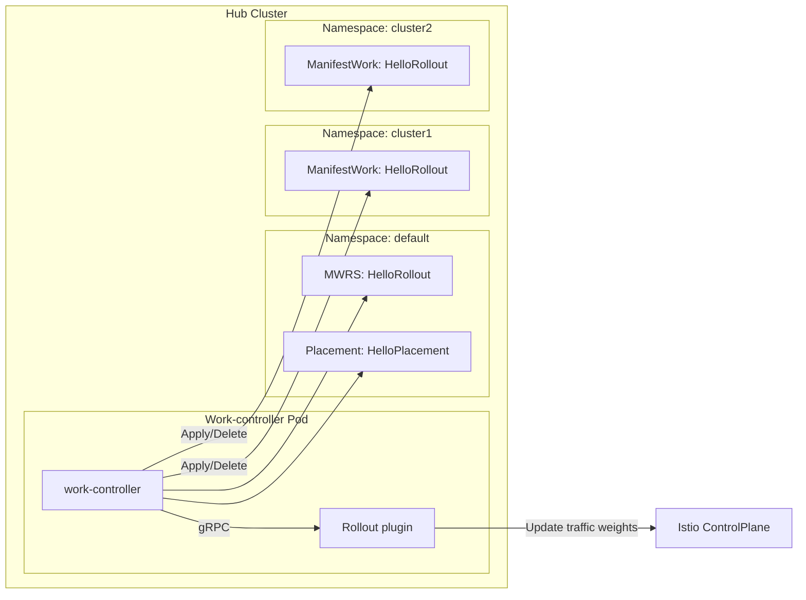

# ManifestWorkReplicaSet Rollout Plugin

## Release Signoff Checklist

- [ ] Enhancement is `implementable`
- [ ] Design details are appropriately documented from clear requirements
- [ ] Test plan is defined
- [ ] Graduation criteria for dev preview, tech preview, GA
- [ ] User-facing documentation is created in [website](https://github.com/open-cluster-management-io/open-cluster-management-io.github.io/)

## Summary

The ManifestWorkReplicaSet (MWRS) Rollout Plugin introduces a plugin-based extensibility model for the OCM Work Controller, enabling users to inject custom logic at critical phases of the multi-cluster rollout and rollback lifecycle.

This design allows user to implement domain-specific logic — such as progressive traffic management, post-deployment validation, and automatic rollback — without changing the core MWRS controller.

Through a sidecar-based gRPC extension point, the rollout plugin framework provides a flexible and secure mechanism to orchestrate multi-cluster rollouts that integrate seamlessly with external systems such as Argo Rollout, Istio / service meshes, or custom validation frameworks.

## Motivation

The ManifestWorkReplicaSet (MWRS) simplifies multi-cluster workload distribution by supporting several rollout strategies that enable gradual deployment of workloads across clusters.

In real-world use cases, rollout orchestration often requires cross-cluster coordination and dynamic control at each rollout phase. Examples include:

* Multi-cluster aware Argo Rollouts, where progressive canary traffic shifting must align with MWRS orchestration status.
* Multi-cluster mesh traffic control, where traffic weights must be adjusted across clusters as rollout progresses.

Currently, workloads deployed in managed clusters have no visibility into orchestration context or progress at the hub level, making such coordination challenging.

Additionally, to ensure safe rollouts, users need the ability to verify functionality at each cluster stage before promotion to the next cluster. This often involves executing custom post-deployment validation tests to prevent propagating a faulty deployment across clusters — beyond what can be expressed through existing `conditionRules`.

Finally, users also require automated rollback capabilities to revert to a previous revision when failures are detected. Rollback procedures often include cluster-specific cleanup or manifest mutation steps that are hard to standardize.

Because these rollout, validation, and rollback workflows are domain-specific, it is difficult to generalize them within the work controller itself. A flexible extension mechanism is therefore needed to allow users to define custom logic for these operations.

### Goals

- Design a plugin architecture for the work-controller that supports custom hooks at various rollout phases.
- Define the gRPC API contract and protocol for communication between the work-controller.
- Define the configuration required to enable and load a custom plugin.

### Non-Goals

- Implementing any specific plugin (e.g., an Argo Rollouts or Istio plugin). This design focuses only on the plugin architecture and contract.
- Designing the core rollback logic within the work-controller itself. The design will provide Rollback hooks, but the plugin is responsible for implementing the actual rollback orchestration logic.
- Designing a manifest template revisioning system or history for the ManifestWorkReplicaSet.

## Proposal

### User Stories

#### Story 1 - multi-cluster aware argo rollout

As a user, I want to perform progressive canary rollouts across multiple clusters using existing Argo Rollout resources.
During the rollout, I need each cluster to understand its position in the global rollout sequence (for example, cluster 3 of 10) and adjust its behavior — such as traffic weights — accordingly.
This coordination should happen automatically based on MWRS orchestration progress, so that rollout across clusters can be synchronized and traffic shifts can occur safely.

#### Story 2 - safe multi-cluster rollout

As a user, I want to pause or stop rollout immediately if a newly deployed version fails validation in one of the clusters.
After each cluster completes its deployment, I need to run post-deployment tests (such as integration or smoke tests) before continuing to the next cluster. If a test fails, MWRS should stop further rollouts to prevent cascading impact.

#### Story 3 — automated rollback on failure

As a user, I want MWRS to automatically roll back workloads in the event of a failed rollout. When a deployment fails, MWRS should identify the previous revision and restore it consistently to the already rolled out clusters. The rollback should be able to perform any additional operations needed to safely revert to the stable version — for example, reverting manifests or skipping rollout steps in dependent systems in Argo Rollout use-case, which requires the mutation of old manifest resources.

### Risks and Mitigation

> TBD. Add more details

## Design Details



To enable the user stories described above, the following custom hooks will be required:

| **Hook**                     | **Description**                                                                                 |
| ---------------------------- | ----------------------------------------------------------------------------------------------- |
| `BeginRollout`               | Called before rollout starts. Used to prepare metadata, preconditions, or environment setup. |
| `ProgressRollout`            | Called every MWRS reconciler is triggered during rollout. |
| `ValidateRolloutCompletion`  | Called when cluster rollout finishes. Plugin determines success, failure, or in-progress state. |
| `BeginRollback`              | Called before rollback starts to prepare environment. |
| `ProgressRollback`           | Called every MWRS reconciler is triggered during rollback. |
| `ValidateRollbackCompletion` | Called after rollback completion for verification. |
| `MutateManifestWork`         | Called before creating or updating ManifestWork to modify manifest templates dynamically. |

The design extends the work-controller with these custom hooks, which are implemented using a gRPC protocol between the controller and a plugin sidecar.

### Plugin protocol

The plugin will be implemented as a sidecar container running alongside the MWRSController. We chose a sidecar model to simplify the plugin onboarding process. gRPC will be used for communication. The plugin will run as a gRPC server, and the MWRSController will act as the gRPC client.

#### Plugin Initialiation

When the work controller at hub starts, it attempts to call the `Initialize()` gRPC endpoint on the plugin server. If successful, the plugin returns its supported capabilities (e.g., Rollout, Rollback, MutateManifestWork). The reconciler will update the MWRS resource status with a `PluginLoaded` condition. If no plugin is configured, this condition will not be present.

```yaml
apiVersion: work.open-cluster-management.io/v1alpha1
kind: ManifestWorkReplicaSet
metadata:
  name: hello-rollout
  namespace: default
spec:
  ...
status:
  conditions:
    - lastTransitionTime: "2025-10-09T04:40:41Z"
      message: "Plugin is loaded successfully. Supported capability: Rollout, Rollback, mutateManifestWork."
      observedGeneration: 1
      reason: PluginInitialized
      status: "True"
      type: PluginLoaded
```

| Condition                    | Type                 | Reason                       | Message                                                                                      |
| ---------------------------- | -------------------- | ---------------------------- | -------------------------------------------------------------------------------------------- |
| Plugin not configured        | —                    | —                            | No condition present                                                                         |
| Plugin initialization failed | `PluginLoaded=False` | `PluginInitializationFailed` | `Cannot connect to plugin server`                                                            |
| Plugin loaded successfully   | `PluginLoaded=True`  | `PluginInitialized`          | `Plugin is loaded successfully. Supported capability: Rollout, Rollback, MutateManifestWork` |

#### Rollout with plugin

The following sequence describes the simplified rollout flow with plugin:

1. Get Placement from the current MWRS resource
2. Get all ManifestWorks associated with current MWRS resource.
3. Find all valid ManifestWork resources
  3.1 find the same workload as what the current MWRS resource manifestwork template
  3.2 determine cluster rollout status
    3.2.1 (NEW) Call ValidateRolloutCompletion() Before setting Status to Succeeded. Add additional step `ValidationProgress`. If ValidateRolloutCompletion() returns IN_PROGRESS, it doesn't set the status to `Suceeded`. It will retry in the next reconciling loop until it returns FAILED or SUCCEEDED. only if it returns to SUCCEDED, it sets the rollout status to SUCCEEDED. Otherwise, it will mark it FAILED.
4. Create rollout handler with the current selected placement decisions
5. Get the rollout result which includes roll out candidate clusters and removed clusters.
6. (NEW) Call ProgressRollout() Plugin API
6. Iterate all the rollout candidate clusters
   6.1 (NEW) Call BeforeRollout() Plugin API
   6.2 Create ManifestWork resources to the rollout candidate clusters.
7. Clean up manifestworks which are deployed to the removed clusters.

#### Rollback with plugin

The sequence is similar to rollout sequence.

### gRPC API design

The following service defines the contract between Work Controller and the plugin. Each call must be idempotent, stateless, and time-bounded (≤30 s) to ensure consistent controller reconciliation. Plugin server must implement the following APIs. The helpers to implement server and clients will be implemented in [ocm/sdk-go](https://github.com/open-cluster-management-io/sdk-go) repository. 

```proto
// RolloutPluginService is the service for the rollout plugin.
service RolloutPluginService {
  // Initialize initializes the plugin.
  rpc Initialize(InitializeRequest) returns (InitializeResponse);

  // BeginRollout is called before the manifestwork resource is applied.
  // It is used to prepare the rollout.
  rpc BeginRollout(RolloutPluginRequest) returns (RolloutPluginResponse);

  // ProgressRollout is called after the manifestwork is applied.
  // Whenever the feedbacks are updated, this method will be called.
  // The plugin can execute the rollout logic based on the feedback status changes.
  rpc ProgressRollout(RolloutPluginRequest) returns (RolloutPluginResponse);

  // ValidateRollout is called to validate the completion of the rollout.
  // It is used to check if the rollout is completed successfully.
  // If the validation is completed successfully, the plugin should return a OK result.
  // If the validation is still in progress, the plugin should return a INPROGRESS result.
  // If the validation is failed, the plugin should return a FAILED result.
  rpc ValidateRollout(RolloutPluginRequest) returns (ValidateResponse);

  // BeginRollback is called before the manifestwork resource is rolled back.
  // It is used to prepare the rollback.
  rpc BeginRollback(RolloutPluginRequest) returns (RolloutPluginResponse);

  // ProgressRollback is called after the manifestwork is rolled back.
  // Whenever the feedbacks are updated, this method will be called.
  // The plugin can execute the rollback logic based on the feedback status changes.
  rpc ProgressRollback(RolloutPluginRequest) returns (RolloutPluginResponse);

  // ValidateRollback is called to validate the completion of the rollback.
  // It is used to check if the rollback is completed successfully.
  // If the validation is completed successfully, the plugin should return a OK result.
  // If the validation is still in progress, the plugin should return a INPROGRESS result.
  // If the validation is failed, the plugin should return a FAILED result.
  rpc ValidateRollback(RolloutPluginRequest) returns (ValidateResponse);

  // MutateManifestWork is called to mutate the manifestwork resource before it is applied or rolled back.
  // MWRS controller provides the current rollout status to the plugin.
  // The plugin can use this information to mutate the manifestwork resource.
  rpc MutateManifestWork(MutateManifestWorkRequest) returns (MutateManifestWorkResponse);
}
```

#### Request

To address the user scenarios, the work controller will pass a common set of information in the gRPC request payload for each hook.

The plugin hook APIs will identify the ManifestWorkReplicaSet being processed with the following input:
* MWRS Name: The name of the ManifestWorkReplicaSet resource.
* MWRS Namespace: The namespace of the ManifestWorkReplicaSet resource.
* Placement Name: The name of the Placement resource currently driving the rollout.
* Current Cluster Name: The name of the specific managed cluster being progessed. only for hooks that operate on a specific cluster (e.g., MutateManifestWork, ValidateRolloutCompletion)
* Total Cluster Count: The total number of clusters selected by the current Placement.
* Rollout Status: The cluster rollout status (completed clusters, progressing clusters, timed_out clusters, removed clusters). Each entry in the list includes:
  - clusterName: The name of the cluster.
  - rolloutStatus: The current [cluster rollout status](https://github.com/open-cluster-management-io/sdk-go/blob/main/pkg/apis/cluster/v1alpha1/rollout.go#L23-L39) (e.g., ToApply, Progressing, Succeeded, Failed, TimeOut, Skip).
  - manifestRevisionName: The name of the manifest revision applied to the cluster.

### Configure custom plugin for work controller

A new `workConfiguration.plugin` field is introduced in ClusterManager to configure the rollout plugin:

```yaml
apiVersion: operator.open-cluster-management.io/v1
kind: ClusterManager
metadata:
  name: cluster-manager
spec:
  ...
  workImagePullSpec: quay.io/open-cluster-management/work:v1.0.0
  workConfiguration:
    workDriver: kube
    # Plugin configuration
    plugin:
      # the image name of plugin sidecar
      image: quay.io/open-cluster-management/my-rollout-plugin:v0.0.1
      # localhost sidecar port
      # port: 6767
```


### Open Questions [optional]

> WIP

### Test Plan

- Unit-test
- Integration-test: Create the sample K8s deployment based safe rollout plugin.

### Graduation Criteria

> TBD

### Upgrade / Downgrade Strategy

The plugin mechanism is opt-in. Work controller without plugin configuration behave identically to today’s work controller. Additive CRD changes (new condition PluginLoaded) are backward-compatible.

### Version Skew Strategy

The proposed changes introduce new condition and new fields in the exising custom resources. 

## Alternatives

- Implement plugin server as a standalone service: In order to run plugin server securely, we need to enable TLS connection. Using a sidecar, we can avoid the complex network and security configuration.