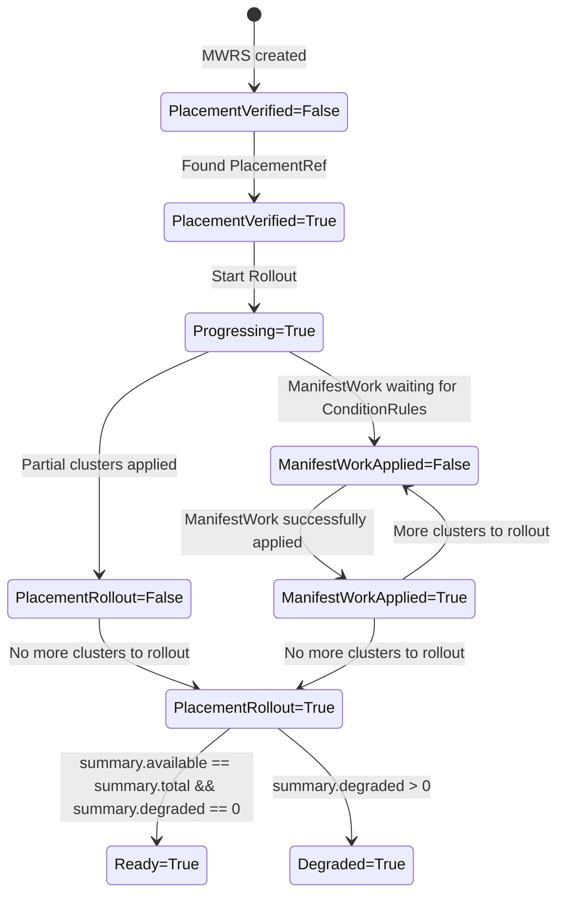

## Release Signoff Checklist

- [ ] Enhancement is `implementable`
- [ ] Design details are appropriately documented from clear requirements
- [ ] Test plan is defined
- [ ] Graduation criteria for dev preview, tech preview, GA
- [ ] User-facing documentation is created in [website](https://github.com/open-cluster-management-io/open-cluster-management-io.github.io/)

## Summary

This proposal introduces two new top-level conditions — Progressing and Ready — for the ManifestWorkReplicaSet (MWRS) resource.
These conditions provide a more intuitive, aggregated view of the rollout state across multiple managed clusters.

These conditions would also be exposed when the ManifestWorkReplicaSet is viewed in the kubectl get mwrs -owide view. 

Currently, MWRS exposes lower-level conditions such as:
* PlacementVerified
* PlacementRolledOut
* ManifestWorkApplied

However, these do not clearly express overall readiness or ongoing progress when applying ManifestWorks across multiple clusters.
Adding aggregate Progressing and Ready conditions will:
* Improve operator and user visibility.
* Align with Kubernetes convention (e.g., Deployments, DaemonSets, OpenShift Operators).
* Enable more robust automation, alerting, and dashboard summarization.

## Motivation

ManifestWorkReplicaSet currently has the following conditions:
* PlacementVerified (True == a corresponding placement is found and identified)
* PlacementRolledOut (True == all clusters rolled out)
* ManifestWorkApplied (True == ManifestWork is successfully applied to a cluster)

The status reporting lacks clear granulaity of the progress of a manifest rollout amongst the clusters on the following conditions:
1. How many clusters has it been rolled out to?
2. Is it waiting to rollout, or is there an issue on the current cluster?
3. Which clusters are degraded or failed. 

Today, users must infer readiness by inspecting an aggregation of the conditions or, summary.progressing, summary.available, or individual placement summaries, which is cumbersome and error-prone.

Without Ready or Progressing, higher-level controllers and dashboards cannot easily aggregate MWRS status.

Without aggregating it for the kubectl get view, the user will not be able to easily view the status. 

### Goals

* Expose clear rollout state at the top level of the MWRS status using standardized conditions.
* Expose new standard conditions on MWRS kubectl get level. 
* Summarize distributed progress across clusters (partial vs. full rollout).
* Align with Kubernetes patterns used in Deployments and Operators.
* Preserve backward compatibility (no schema-breaking changes).

### Non-Goals

* Redefining existing conditions (PlacementVerified, PlacementRolledOut, ManifestWorkApplied).
* Changing the internal rollout or placement logic.
* Altering how per-cluster summaries are calculated.

## Proposal

### User Stories

#### Story 1

User A rolls out MWRS with a Progressive rollout strategy to 2 clusters. The current status conditions report only on the following:
1. PlacementRolledOut == True, indicates all clusters recieved the ManifestWork 
2. ManifestWorkApplied == AsExpected, indicates that the ManifestWork deployed to the current cluster is successful. 

However, it is missing the information when the rollout is waiting in between deploying cluster 1 and cluster 2. 

With the new status conditions - Ready and Progressing, here is the flow that the user will see while the rollout is Progressing:


Step 1: Processing ManifestworkApplied on Cluster 1 
`
status:
  conditions:
    # Previous conditions
    - lastTransitionTime: "2025-10-28T20:32:40Z"
      message: ""
      reason: AsExpected
      status: "True"
      type: PlacementVerified
    - lastTransitionTime: "2025-10-28T21:01:51Z"
      message: ""
      reason: Progressing
      status: "False"
      type: PlacementRolledOut
    - lastTransitionTime: "2025-10-28T21:01:51Z"
      message: ""
      reason: Processing
      status: "False"
      type: ManifestworkApplied
    ...
    # New derived conditions
    - lastTransitionTime: "2025-10-28T21:01:52Z"
      type: Progressing
      status: "True"
      reason: RollingOutToClusters
      message: "1 of 2 clusters reporting progressing state"

    - lastTransitionTime: "2025-10-28T21:01:52Z"
      type: Ready
      status: "False"
      reason: NotAllClustersAvailable
      message: "ManifestWorks available in 0/2 clusters"
`
Step 2: Completed ManifestworkApplied on Cluster 1, waiting to rollout to next cluster
`
status:
  conditions:
    # Previous conditions
    - lastTransitionTime: "2025-10-28T20:32:40Z"
      message: ""
      reason: AsExpected
      status: "True"
      type: PlacementVerified
    - lastTransitionTime: "2025-10-28T21:01:51Z"
      message: ""
      reason: Progressing
      status: "False"
      type: PlacementRolledOut
    - lastTransitionTime: "2025-10-28T21:01:51Z"
      message: ""
      reason: AsExpected
      status: "True"
      type: ManifestworkApplied
    ...
    # New derived conditions
    - lastTransitionTime: "2025-10-28T21:01:52Z"
      type: Progressing
      status: "True"
      reason: Paused
      message: "Rollout is paused to wait for progressive rules"

    - lastTransitionTime: "2025-10-28T21:01:52Z"
      type: Ready
      status: "False"
      reason: NotAllClustersAvailable
      message: "ManifestWorks available in 1/2 clusters"
`
Step 3: Rolling out in Cluster 2
`
status:
  conditions:
    # Previous conditions
    - lastTransitionTime: "2025-10-28T20:32:40Z"
      message: ""
      reason: AsExpected
      status: "True"
      type: PlacementVerified
    - lastTransitionTime: "2025-10-28T21:01:51Z"
      message: ""
      reason: Progressing
      status: "False"
      type: PlacementRolledOut
    - lastTransitionTime: "2025-10-28T21:01:51Z"
      message: ""
      reason: Processing
      status: "False"
      type: ManifestworkApplied
    ...
    # New derived conditions
    - lastTransitionTime: "2025-10-28T21:01:52Z"
      type: Progressing
      status: "True"
      reason: RollingOutToClusters
      message: "2 of 2 clusters reporting progressing state"

    - lastTransitionTime: "2025-10-28T21:01:52Z"
      type: Ready
      status: "False"
      reason: NotAllClustersAvailable
      message: "ManifestWorks available in 1/2 clusters"
`
Step 3: Completed Rollout in both clusters
`
status:
  conditions:
    # Previous conditions
    - lastTransitionTime: "2025-10-28T20:32:40Z"
      message: ""
      reason: AsExpected
      status: "True"
      type: PlacementVerified
    - lastTransitionTime: "2025-10-28T21:01:51Z"
      message: ""
      reason: Completed
      status: "True"
      type: PlacementRolledOut
    - lastTransitionTime: "2025-10-28T21:01:51Z"
      message: ""
      reason: AsExpected
      status: "True"
      type: ManifestworkApplied
    ...
    # New derived conditions
    - lastTransitionTime: "2025-10-28T21:01:52Z"
      type: Progressing
      status: "False"
      reason: AllClustersReady
      message: "2 of 2 clusters reporting Completed state"

    - lastTransitionTime: "2025-10-28T21:01:52Z"
      type: Ready
      status: "True"
      reason: AllClustersAvailable
      message: "ManifestWorks available in 2/2 clusters"
`

### Implementation Details/Notes/Constraints [optional]

What are the caveats to the implementation? What are some important details that
didn't come across above. Go in to as much detail as necessary here. This might
be a good place to talk about core concepts and how they relate.

### Risks and Mitigation

TBD

## Design Details

#### New Conditions:

The proposal is to introduce two new derived conditions under .status.conditions and a new .status.Phase which will indicate the current phase it is in. 

| Condition Type | Status Values | Message                                        | Meaning                                                                        |
| -------------- | ------------- | ---------------------------------------------- | ------------------------------------------------------------------------------ |
| Progressing    | True / False  | RollingOutToClusters, Paused, AllClustersReady | Indicates if the MWRS roll out is still progressing                            |
| Ready          | True / False  | NotAllClustersAvailable, AllClustersAvailable  | Indicates whether MWRS rollout and ManifestWork application is fully completed |

| Status      | Conditions                                                  |
| ----------- | ----------------------------------------------------------- |
| Ready       | summary.available == summary.total && summary.degraded == 0 |
| Progressing | summary.progressing > 0                                     |
| Failed      | summary.degraded > 0                                        |

`
status:
  conditions:
    # Previous conditions
    - lastTransitionTime: "2025-10-28T20:32:40Z"
      message: ""
      reason: AsExpected
      status: "True"
      type: PlacementVerified
    - lastTransitionTime: "2025-10-28T21:01:51Z"
      message: ""
      reason: Completed
      status: "True"
      type: PlacementRolledOut
    - lastTransitionTime: "2025-10-28T21:01:51Z"
      message: ""
      reason: AsExpected
      status: "True"
      type: ManifestworkApplied
    ...
    #
    # New derived conditions
    #
    - lastTransitionTime: "2025-10-28T21:01:52Z"
      type: Progressing
      status: "False"
      reason: AllClustersReady
      message: "2 of 2 clusters reporting Completed state"

    - lastTransitionTime: "2025-10-28T21:01:52Z"
      type: Ready
      status: "True"
      reason: AllClustersAvailable
      message: "ManifestWorks available in 2/2 clusters"

  phase: Ready 
  message: ManifestWorks available in 2/2 clusters
`

`kubectl get mwrs` would be updated to show the following status:


With the status column updates as follows:
```
- additionalPrinterColumns:
    - description: Reason
      jsonPath: .status.conditions[?(@.type=="PlacementVerified")].reason
      name: Placement
      type: string
    - description: Configured
      jsonPath: .status.conditions[?(@.type=="PlacementVerified")].status
      name: Found
      type: string
    - description: Reason
      jsonPath: .status.conditions[?(@.type=="ManifestworkApplied")].reason
      name: ManifestWorks
      type: string
    - description: Applied
      jsonPath: .status.conditions[?(@.type=="ManifestworkApplied")].status
      name: Applied
      type: string

    ### New values below
    - description: Status 
      jsonPath: .status.Phase
      type: string
      description: MWRS status phase of the current MWRS
    - description: Summary message of cluster rollout state 
      jsonPath: .status.conditions[?(@.status=="True")].message
      name: Ready
      type: string
```

Below diagram shows the state flow.




#### Status conditions populated by MWRS controller 


### Open Questions [optional]
TBD

### Test Plan
TBD

### Graduation Criteria

TBD

### Upgrade / Downgrade Strategy
This change introduces new status.Conditions but does not change any of the existing logic. It will show new Progressing and Ready status in the kubectl view, but not change the existing logic. 

### Version Skew Strategy
TBD 

## Implementation History
TBD

## Drawbacks

TBD 

## Alternatives
TBD
## Infrastructure Needed [optional]

Use this section if you need things from the project. Examples include a new
subproject, repos requested, github details, and/or testing infrastructure.

Listing these here allows the community to get the process for these resources
started right away.