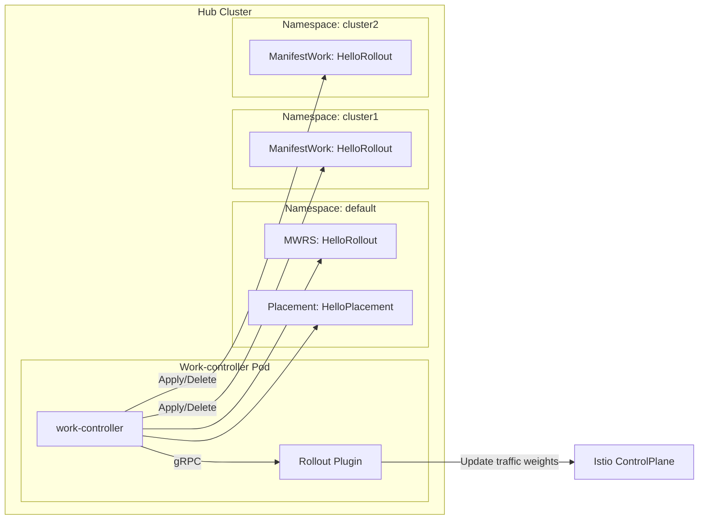
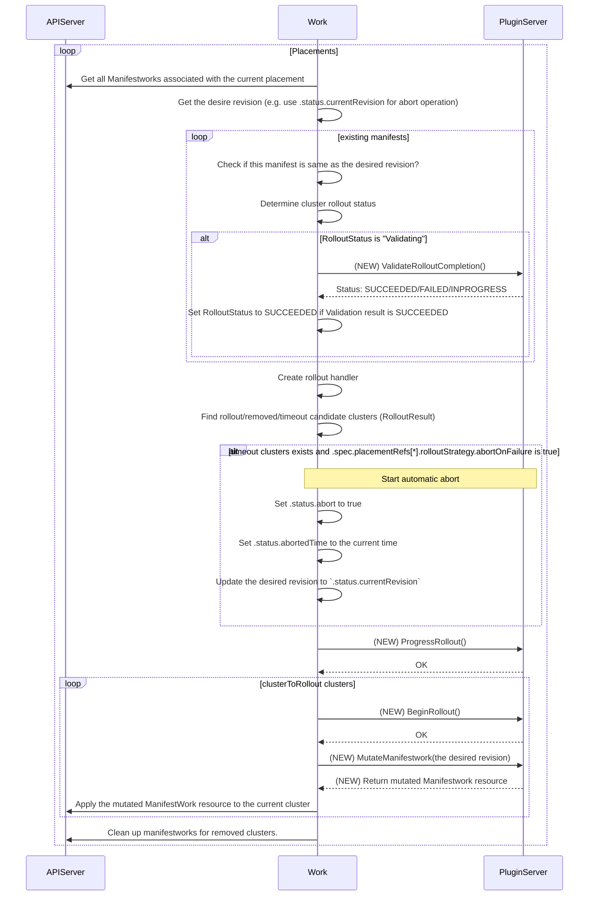
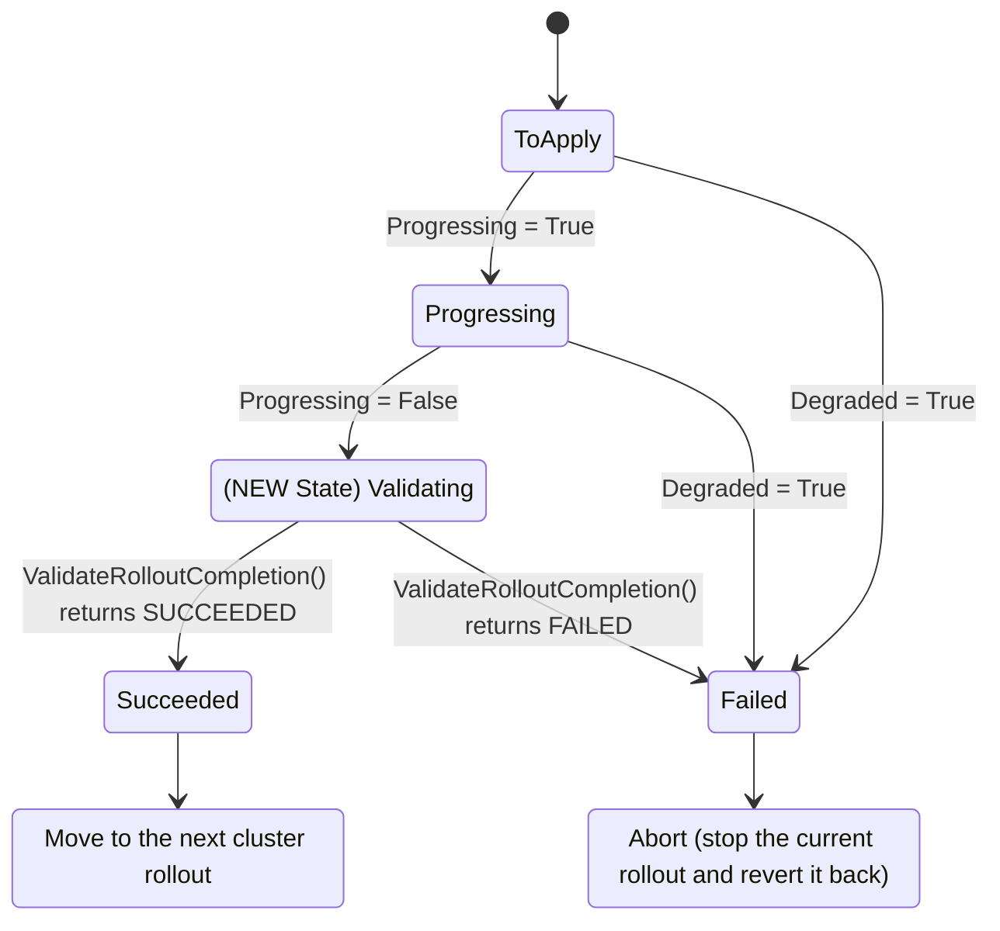

# ManifestWorkReplicaSet Rollout Plugin

## Release Signoff Checklist

- [x] Enhancement is `implementable`
- [ ] Design details are appropriately documented from clear requirements
- [ ] Test plan is defined
- [ ] Graduation criteria for dev preview, tech preview, GA
- [ ] User-facing documentation is created in [website](https://github.com/open-cluster-management-io/open-cluster-management-io.github.io/)

## Summary

The ManifestWorkReplicaSet (MWRS) Rollout plugin introduces a plugin-based extensibility model for the OCM Work Controller, enabling users to inject custom logic at critical phases of the multi-cluster rollout and rollback lifecycle.

This design allows user to implement domain-specific logic -- such as progressive traffic management, post-deployment validation, and automatic rollback -- without changing the core MWRS controller.

The rollout plugin framework provides a flexible and secure mechanism to orchestrate multi-cluster rollouts that integrate seamlessly with external components and services such as Argo Rollout, Istio / service meshes, or custom validation frameworks.

## Motivation

The ManifestWorkReplicaSet (MWRS) simplifies multi-cluster workload distribution by supporting several rollout strategies that enable gradual deployment of workloads across clusters.

In real-world use cases, rollout orchestration often requires cross-cluster coordination and dynamic control at each rollout phase. Examples include:

* Multi-cluster aware Argo Rollouts, where progressive canary traffic shifting must align with MWRS orchestration status.
* Multi-cluster mesh traffic control, where traffic weights must be adjusted across clusters as rollout progresses.

To ensure safe rollouts, users need the ability to verify functionality at each cluster stage before promotion to the next cluster. This often involves executing custom post-deployment validation tests to prevent propagating a faulty deployment across clusters — beyond what can be expressed through existing `conditionRules`.

Finally, users also require automated rollback capabilities to revert to a previous revision when failures are detected. Rollback procedures often include cluster-specific cleanup or manifest mutation steps that are hard to standardize.

Because these rollout, validation, and rollback workflows are domain-specific, it is difficult to generalize them within the work controller itself. A flexible plugin mechanism is therefore needed to allow users to define custom logic for these operations.

### Goals

- Design a plugin architecture for the work-controller that supports custom hooks at various rollout phases.
- Define the gRPC API contract and protocol for communication between the work-controller.
- Define the configuration required to enable and load a custom plugin.

### Non-Goals

- Implementing any specific plugin (e.g., an Argo Rollouts or Istio plugin). This design focuses only on the plugin architecture and contract.
- Designing the core rollback logic within the work-controller itself. The design will provide Rollback hooks, but the plugin is responsible for implementing the actual rollback orchestration logic.
- Designing a manifest template revisioning system or history for the ManifestWorkReplicaSet.

## Proposal

### User Stories

#### Story 1 - multi-cluster aware argo rollout

As a user, I want to perform progressive canary rollouts across multiple clusters using existing Argo Rollout resources.
During the rollout, I need each cluster to understand its position in the global rollout sequence (for example, cluster 3 of 10) and adjust its behavior — such as traffic weights — accordingly.
This coordination should happen automatically based on MWRS orchestration progress, so that rollout across clusters can be synchronized and traffic shifts can occur safely.

#### Story 2 - safe multi-cluster rollout

As a user, I want to pause or stop rollout immediately if a newly deployed version fails validation in one of the clusters.
After each cluster completes its deployment, I need to run post-deployment tests (such as integration or smoke tests) before continuing to the next cluster. If a test fails, MWRS should stop further rollouts to prevent cascading impact.

#### Story 3 — automated rollback on failure

As a user, I want MWRS to automatically roll back workloads in the event of a failed rollout. When a deployment fails, MWRS should identify the previous revision and restore it consistently to the already rolled out clusters. The rollback should be able to perform any additional operations needed to safely revert to the stable version - for example, reverting manifests or skipping rollout steps in dependent systems in Argo Rollout use-case, which requires the mutation of old manifest resources.

## Design Details



The design extends the work-controller with the plugin, which are implemented using a gRPC protocol between the controller and a plugin sidecar.

### Plugin protocol

The Plugin will be implemented as a sidecar container running alongside the work controller in hub cluster. We chose a sidecar model to simplify the plugin onboarding process. gRPC will be used for communication. The plugin will run as a gRPC server, and the work controller will act as the gRPC client.

#### Plugin initialization

When the work controller at hub starts, it attempts to call the `Initialize()` gRPC endpoint on the plugin server.

#### Rollout sequence with plugin

The following sequence diagram describes the high-level orchestration with Plugin API calls.



This workflow introduces four new plugin API calls:

* `BeginRollout()`: Called before applying the ManifestWork to a target cluste to roll out new revision, allowing the plugin to perform any necessary preparations.
* `ProgressRollout()`: Called during every reconciliation loop to report the current rollout status to the plugin.
* `ValidateRolloutCompletion()`: Called after the `Progressing` condition on the target cluster's ManifestWork becomes `False` and `clsRolloutStatus.LastTransitionTime` will be set.  This hook enables post-rollout testing before the status is set to Succeeded.
  - The work reconciler polls this hook periodicaly until the current time reaches to `clsRolloutStatus.LastTransitionTime+progressingDeadline`.
  - For example, the plugin could use this call to create a new ManifestWork that runs a Kubernetes Job for rollout validation.
* `MutateManifestWork()`: Called before applying the `ManifestWork` to the cluster. This hook allows the plugin to modify the manifest, which is essential for:
  - Injecting orchestration status (like the cluster's rollout index) into resource labels or annotations.
  - Enabling advanced scenarios, such as modifying an Argo Rollout resource to skip steps during a rollback.
  - This direct mutation is required because it is difficult to inject this context via a default admission webhook without exposing all orchestration information in the ManifestWorkReplicaSet status.

The overall Rollout Status is determined by the ManifestWork conditions and the validation result:

| Progressing (ConditionRule) | Degraded (ConditionRule) | ValidateRolloutCompletion() | Rollout Status	| Description |
|---|---|---|---|---|
| True | True | N/A | Failed | Work is progressing but degraded |
| True | False or not set | N/A | Progressing | Work is being applied and is healthy |
| False | False or not set | INPROGRESS | Validating | Validating rollout |
| False | False or not set | FAILED | Failed | The current rollout is failed |
| False | False or not set | SUCCEEDED | Succeeded | Work has been successfully applied |
| Unknown/Not set | Any | N/A | Progressing | Conservative fallback: treat as still progressing |

The following state machine shows the expected transitions between rollout statuses:



### gRPC API design

The following service defines the contract between Work Controller and the plugin. Each call must be idempotent, stateless, and time-bounded (≤30 s) to ensure consistent controller reconciliation. Plugin server must implement the following APIs. The helpers to implement server and clients will be implemented in [ocm/sdk-go](https://github.com/open-cluster-management-io/sdk-go) repository. 

```proto
// RolloutPluginService is the service for the rollout plugin.
service RolloutPluginService {
  // Initialize initializes the plugin.
  rpc Initialize(InitializeRequest) returns (InitializeResponse);

  // BeginRollout is called before the manifestwork resource is applied.
  // It is used to prepare the rollout.
  rpc BeginRollout(RolloutPluginRequest) returns (google.protobuf.Empty);

  // ProgressRollout is called after the manifestwork is applied.
  // Whenever the feedbacks are updated, this method will be called.
  // The plugin can execute the rollout logic based on the feedback status changes.
  rpc ProgressRollout(RolloutPluginRequest) returns (google.protobuf.Empty);

  // ValidateRolloutCompletion is called to validate the completion of the rollout.
  // It is used to check if the rollout is completed successfully.
  // If the validation is completed successfully, the plugin should return a SUCCEEDED result.
  // If the validation is still in progress, the plugin should return an INPROGRESS result.
  // If the validation fails, the plugin should return a FAILED result.
  rpc ValidateRolloutCompletion(ValidateCompletionRequest) returns (ValidateResponse);

  // MutateManifestWork is called to mutate the manifestwork resource before it is applied or aborted.
  // MWRS Controller provides the current rollout status to the plugin.
  // The plugin can use this information to mutate the manifestwork resource.
  rpc MutateManifestWork(MutateManifestWorkRequest) returns (MutateManifestWorkResponse);
}
```

#### Request message

To address the user scenarios, the work controller will pass a common set of information in the gRPC request payload for each hook.

The plugin hook APIs will identify the ManifestWorkReplicaSet being processed with the following input:
* MWRS Name: The name of the ManifestWorkReplicaSet resource.
* MWRS Namespace: The namespace of the ManifestWorkReplicaSet resource.
* Placement Name: The name of the Placement resource currently driving the rollout.
* Current Cluster Name: The name of the specific managed cluster being progessed. only for hooks that operate on a specific cluster (e.g., MutateManifestWork, ValidateRolloutCompletion)
* Total Cluster Count: The total number of clusters selected by the current Placement.
* Rollout Status: The cluster rollout status (completed clusters, progressing clusters, timed_out clusters, removed clusters). Each entry in the list includes:
  - clusterName: The name of the cluster.
  - rolloutStatus: The current [cluster rollout status](https://github.com/open-cluster-management-io/sdk-go/blob/main/pkg/apis/cluster/v1alpha1/rollout.go#L23-L39) (e.g., ToApply, Progressing, Succeeded, Failed, TimeOut, Skip).
  - manifestRevisionName: The name of the manifest revision applied to the cluster.

#### Error handling

gRPC status codes follow the [standard gRPC status codes](https://grpc.github.io/grpc/core/md_doc_statuscodes.html): 0 = OK, 1 = CANCELLED, 2 = UNKNOWN, 3 = INVALID_ARGUMENT, 4 = DEADLINE_EXCEEDED, etc. Work controller will also utilize the [standard gRPC retry](https://grpc.io/docs/guides/retry/) for `UNAVAILABLE` status code. 

Error messages from the plugin server are reported in status conditions:
* When plugin initialization fails, the error message is shown in the `message` field of the `PluginLoaded` condition type.
* When the plugin returns errors during rollout, the error message is shown in the `message` field of the `Progressing` condition type.

### Register custom plugins for work controller

A new `workConfiguration.plugins` field is introduced in ClusterManager to register the rollout plugins:

```yaml
apiVersion: operator.open-cluster-management.io/v1
kind: ClusterManager
metadata:
  name: cluster-manager
spec:
  ...
  workImagePullSpec: quay.io/open-cluster-management/work:v1.0.0
  workConfiguration:
    workDriver: kube
    plugins:
      - name: my-rollout-1
        endpoint: my-rollout.my-namespace:10843
        caCertificate:
          caBundle: "REPLACE_WITH_BASE64_CA_CERT"
      - name: my-rollout-2
        endpoint: my-rollout.my-namespace:10843
        caCertificate:
          caBundle: "REPLACE_WITH_BASE64_CA_CERT"
```

ClusterManager will create the following `work-controller-config` configmap in `open-cluster-management-hub` namespace.

```yaml
apiVersion: v1
kind: ConfigMap
metadata:
  name: work-controller-config
  namespace: {{ .ClusterManagerNamespace }}
data:
  config.yaml: |
    plugins:
      - name: my-rollout-1
        endpoint: my-rollout1.my-namespace:10843
        caCertificate:
          caBundle: "REPLACE_WITH_BASE64_CA_CERT"
      - name: my-rollout-2
        endpoint: my-rollout2.my-namespace:10843
        caCertificate:
          caBundle: "REPLACE_WITH_BASE64_CA_CERT"
```

With the following helm chart change, work-controller will load work-controller-config configmap to get the plugin connection information.

```yaml
apiVersion: apps/v1
kind: Deployment
metadata:
  name: {{ .ClusterManagerName }}-work-controller
  namespace: {{ .ClusterManagerNamespace }}
spec:
  template:
    spec:
      ...
      containers:
      - name: {{ .ClusterManagerName }}-work-controller
        image:  {{ .WorkImage }}
        imagePullPolicy: IfNotPresent
        args:
          - "/work"
          - "manager"
          ...
          {{ if .WorkConfigEnabled }}
          - "--work-config=/var/run/config/work/config.yaml"
          {{ end }}
        ...
        volumeMounts:
        - name: tmpdir
          mountPath: /tmp
        ...
        {{ if .WorkConfigEnabled }}
        - mountPath: /var/run/config/work
          name: workconfig
          readOnly: true
        {{ end }}
      volumes:
      ...
      {{ if .WorkConfigEnabled }}
      - name: workconfig
        configMap:
          name: work-controller-config
      {{ end }}
```

### Using plugin in MWRS

Plugin is an opt-in feature. User can use the registered plugin by setting `.spec.placementRefs[*].rolloutStrategy.plugin`. The reconciler makes sure that plugin is available and show its availability or error messages in `PluginLoaded` status condition type.

```yaml
apiVersion: work.open-cluster-management.io/v1
kind: ManifestWorkReplicaSet
metadata:
  name: <MWRS_Name>
spec:
  placementRefs:
    - name: placement-rollout-progressive
      rolloutStrategy:
        type: Progressive
        # plugin is optional.
        plugin: my-rollout
        progressive:
          ...
status:
  conditions:
    - lastTransitionTime: "2025-10-09T04:40:41Z"
      message: "my-rollout plugin is available."
      observedGeneration: 1
      reason: Available
      status: "True"
      type: PluginLoaded
```

The following example shows `Available` and `Failed` reasons for `PluginLoaded` status condition type

| Reason | Status | Message |
| --- | --- | --- |
| Available | True | `my-rollout plugin is available.` |
| Failed | False | `Initialize fails with unavaiable plugin server endpoint.` |

### Test Plan

- Unit-test
- Integration-test: Create the sample K8s deployment based safe rollout plugin.


### Upgrade / Downgrade Strategy

The plugin mechanism is opt-in. Work controller without plugin configuration behave identically to today’s work controller.

### Version Skew Strategy

The proposed changes introduce new condition and new fields in the exising custom resources. 
