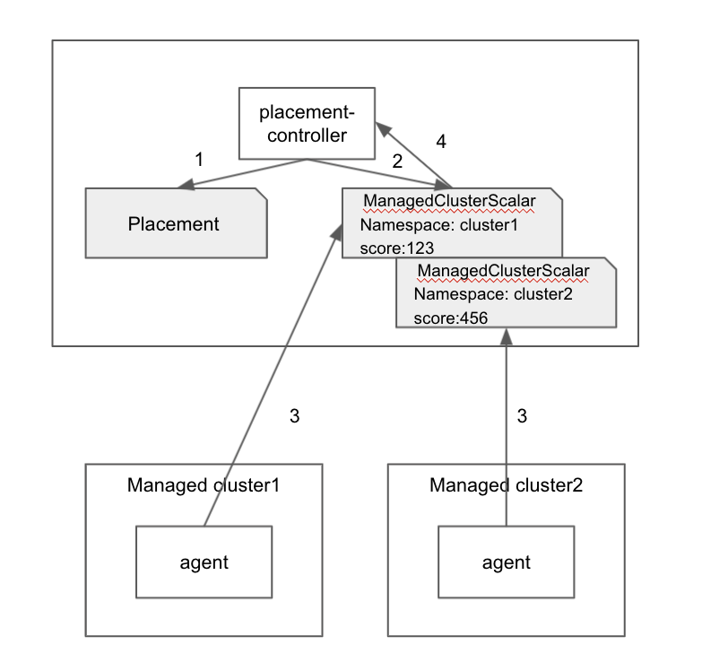
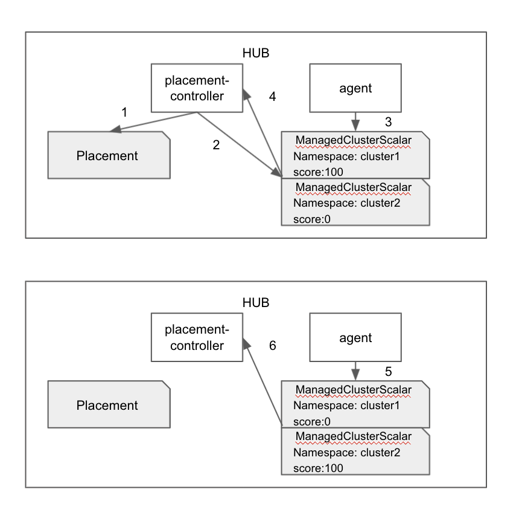

# placement extensible scheduling

## Release Signoff Checklist

- [ ] Enhancement is `implementable`
- [ ] Design details are appropriately documented from clear requirements
- [ ] Test plan is defined
- [ ] Graduation criteria for dev preview, tech preview, GA
- [ ] User-facing documentation is created in [website](https://github.com/open-cluster-management-io/website/)

## Summary

The proposed work provides an API to represent a scalar value of the managed cluster, to support placement extensible scheduling.

## Motivation

When implementing placement resource based scheduling, we find in some cases, prioritizer needs extra data (more than the defualt value provided by `ManagedCluster` and `ManagedClusterInfo`) to calculate the score of the managed cluster.

For example, prioritizer ResourceRatioCPU depends on knowing the real-time CPU usage, which is not provided by `ManagedCluster`.
So we want a more extensible way to support scheduling based on customized value.

### User Stories

#### Story 1: The placement controller could prioritize clusters by data pushed from each managed cluster.
  - As an end user, can define prioritizer name `customized-resourceratiocpu` in placment spec.prioritizerPolicy.configurations to say he wants to schedule based on customized value resourceratiocpu.
  - On each managed cluster, there would be a customized agent to sum up the cpu usage of the cluster. Then update the value into the ManagedClusterScalar CR with name `customized-resourceratiocpu`.
  - On the hub, the placement prioritizer will read value from ManagedClusterScalar `customized-resourceratiocpu` and score based on it. 

#### Story 2: The placement controller could prioritize clusters by metrics collected on hub.
  - As an end user, can define prioritizer name `customized-resourceratiocpu` in placment spec.prioritizerPolicy.configurations to say he wants to schedule based on customized value resourceratiocpu.
  - On the hub, there would be a customized agent to read cpu usage from thanos. It will generate a value for each cluster and update it into ManagedClusterScalar CR with name `customized-resourceratiocpu`.
  - On the hub, the placement prioritizer will read value from ManagedClusterScalar `customized-resourceratiocpu` and score based on it.

#### Story 3: The placement controller could prioritize clusters for disaster recovery.
  - As an end user, can define prioritizer name `customized-dr` in placment spec.prioritizerPolicy.configurations to say he wants to schedule workload based on disaster recovery score.
  - On the hub, there would be a customized agent to give cluster in the frist DC the highest score.
  - On the hub, the placement prioritizer will select the cluster in the frist DC. Then disaster recovery workload will be running on it.
  - When this cluster is unavailable (a taint is added), the customized agent will give cluster in the second DC the highest value.
  - On the hub, the placement prioritizer will re-schedule to select the cluster in the second DC. Then disaster recovery workload will be running on the second DC.

### Goals
- Design an new API(CRD) to contain a scalar value for each managed cluster.
- Let placement prioritizer plugin support schedule with customized value.
- Let placement controller maintain creating and cleaning new CR based on placement configurations.

### Non-Goals
- How the customized agent generate and update value into new CR.
- Placement filter will not support customized value.

## Proposal

### 1. ManagedClusterScalar API
ManagedClusterScalar is the new API we want to add, to represents a scalable value (aka score) of one managed cluster.
```go
// +genclient
// +k8s:deepcopy-gen:interfaces=k8s.io/apimachinery/pkg/runtime.Object
// +kubebuilder:resource:scope="Namespaced"
// +kubebuilder:subresource:status

// ManagedClusterScalar represents a scalable value (aka score) of one managed cluster.
// Each ManagedClusterScalar only represents the score for one specific calculator type.
// ManagedClusterScalar is a namesapce scoped resource.
//
// The ManagedClusterScalar name should follow the format {cluster name}-{calculator name}.
// For example, a calculator named ResourceAllocatableMemory can calculate the totale allocatable memory
// of one cluster.
// So for cluster1, the corresponding ManagedClusterScalar name is cluster1-resourceallocatablememory.
type ManagedClusterScalar struct {
	metav1.TypeMeta   `json:",inline"`
	metav1.ObjectMeta `json:"metadata,omitempty"`

	// Status represents the status of the ManagedClusterScalar.
	// +optional
	Status ManagedClusterScalarStatus `json:"status,omitempty"`
}

//ManagedClusterScalarStatus represents the current status of ManagedClusterScalar.
type ManagedClusterScalarStatus struct {
	// Conditions contains the different condition statuses for this managed cluster score.
	Conditions []metav1.Condition `json:"conditions"`

	// Score contains a scalable value of this managed cluster.
	Score int64 `json:"score,omitempty"`

	// ExpireTime is the expire time the score.
	// +required
	// +kubebuilder:validation:Required
	// +kubebuilder:validation:Type=string
	// +kubebuilder:validation:Format=date-time
	ExpireTime metav1.Time `json:"expireTime" protobuf:"bytes,4,opt,name=lastTransitionTime"`
}

// +k8s:deepcopy-gen:interfaces=k8s.io/apimachinery/pkg/runtime.Object

// ManagedClusterScalarList is a collection of managed cluster score.
type ManagedClusterScalarList struct {
	metav1.TypeMeta `json:",inline"`
	// Standard list metadata.
	// More info: https://git.k8s.io/community/contributors/devel/api-conventions.md#types-kinds
	// +optional
	metav1.ListMeta `json:"metadata,omitempty"`

	// Items is a list of managed clusters
	Items []ManagedClusterScalar `json:"items"`
}
```

### 2. Let placement controller maintain creating and cleaning new CR.
Add PreScore() in Prioritizer interface. To create ManagedClusterScalar CR for "customized-" prefixed prioritizer.
```go
// Prioritizer defines a prioritizer plugin that score each cluster. The score is normalized
// as a floating betwween 0 and 1.
type Prioritizer interface {
	Plugin

	// PreScore() do some prepare work before Score().
  // For example, creating ManagedClusterScalar CR for "customized-" prefixed prioritizer.
	PreScore(ctx context.Context, placement *clusterapiv1alpha1.Placement, clusters []*clusterapiv1.ManagedCluster) error

	// Score gives the score to a list of the clusters,  it returns a map with the key as
	// the cluster name.
	Score(ctx context.Context, placement *clusterapiv1alpha1.Placement, clusters []*clusterapiv1.ManagedCluster) (map[string]int64, error)
}
```

Add GC() funcion in placement controller, to clean not used ManagedClusterScalar CR every 10 minutes.

### 3. Let prioritizer plugin support schedule with customized value in ManagedClusterScalar.
Add a new plugin called customized plugin, which can score clusters based on ManagedClusterScalar CR `customized-{prioritizer-name}`.

### 4. Workflow
Refer to [Examples](#Examples)

### 5. Open Questions
1. Is one score enough? any other missed use cases? For example, spreading depends on previous choice.

## Alternative
Using scheduler extender mechanism, to support schedule based on metrics, schedule based on SLA.

Pros: 
  - More flexible compared with above proposal can only store one score.

Cons:
  - Calling extender by http/https may have performance issue.

## Examples

### 1. An agent on managed cluster update ResourceRatioCPU score to API, and placement prioritizer plugin score based on it. (Use Story 1)

1. User create a new placement as below
```yaml
apiVersion: cluster.open-cluster-management.io/v1alpha1
kind: Placement
metadata:
  name: placement
  namespace: ns1
spec:
  numberOfClusters: 1
  prioritizerPolicy:
    mode: Exact
    configurations:
      - name: Customized-ResourceRatioCPU
```
2. Placement-controller watch the placement changes and generate a new ManagedClusterScalar CR `customized-resourceratiocpu` to trigger customized data collection.
```yaml
apiVersion: cluster.open-cluster-management.io/v1alpha1
kind: ManagedClusterScalar
metadata:
  name: customized-resourceratiocpu
  namespace: cluster1
```
3. The agent on managed cluster watch the new ManagedClusterScalar CR and update score into it. The agent on managed cluster prerefresh the score periodically before expire time.
```yaml
apiVersion: cluster.open-cluster-management.io/v1alpha1
kind: ManagedClusterScalar
metadata:
  name: customized-resourceratiocpu
  namespace: cluster1
status:
  conditions:
  - lastTransitionTime: "2021-10-28T08:31:39Z"
    message: ManagedClusterScalar updated successfully
    reason: ManagedClusterScalarUpdated
    status: "True"
    type: ManagedClusterScalarUpdated
  expireTime: "2021-10-29T18:31:39Z"
  score: 74
```
4. Placement read value from CR and score on it. (when to trigger re-schedule???)
5. Placement GC will clean the CR every 10 mins.


### 2. An agent on hub update disaster recovery score to API, and placement prioritizer plugin score based on it. (Use Story 2/3)

1. As an end user, can define prioritizer name `customized-dr` in placment spec.prioritizerPolicy.configurations to say he wants to schedule workload based on disaster recovery score.
```yaml
apiVersion: cluster.open-cluster-management.io/v1alpha1
kind: Placement
metadata:
  name: placement
  namespace: ns1
spec:
  numberOfClusters: 1
  prioritizerPolicy:
    mode: Exact
    configurations:
      - name: Customized-DR
```
2. Placement-controller watch the placement changes and generate a new ManagedClusterScalar CR `customized-dr` to trigger customized data collection.
```yaml
apiVersion: cluster.open-cluster-management.io/v1alpha1
kind: ManagedClusterScalar
metadata:
  name: customized-dr
  namespace: cluster1
```
```yaml
apiVersion: cluster.open-cluster-management.io/v1alpha1
kind: ManagedClusterScalar
metadata:
  name: customized-dr
  namespace: cluster2
```
3. On the hub, there would be a customized agent to give cluster in the frist DC the highest score.
```yaml
apiVersion: cluster.open-cluster-management.io/v1alpha1
kind: ManagedClusterScalar
metadata:
  name: customized-dr
  namespace: cluster1
status:
  conditions:
  - lastTransitionTime: "2021-10-28T08:31:39Z"
    message: ManagedClusterScalar updated successfully
    reason: ManagedClusterScalarUpdated
    status: "True"
    type: ManagedClusterScalarUpdated
  expireTime: "2021-10-29T18:31:39Z"
  score: 100
```
```yaml
apiVersion: cluster.open-cluster-management.io/v1alpha1
kind: ManagedClusterScalar
metadata:
  name: customized-dr
  namespace: cluster2
status:
  conditions:
  - lastTransitionTime: "2021-10-28T08:31:39Z"
    message: ManagedClusterScalar updated successfully
    reason: ManagedClusterScalarUpdated
    status: "True"
    type: ManagedClusterScalarUpdated
  expireTime: "2021-10-29T18:31:39Z"
  score: 0
```
4. On the hub, the placement prioritizer will select the cluster in the frist DC. Then disaster recovery workload will be running on it.
5. When this cluster is unavailable (a taint is added), the customized agent will give cluster in the second DC the highest value.
```yaml
apiVersion: cluster.open-cluster-management.io/v1alpha1
kind: ManagedClusterScalar
metadata:
  name: customized-dr
  namespace: cluster1
status:
  conditions:
  - lastTransitionTime: "2021-10-28T08:31:39Z"
    message: ManagedClusterScalar updated successfully
    reason: ManagedClusterScalarUpdated
    status: "True"
    type: ManagedClusterScalarUpdated
  expireTime: "2021-10-29T18:31:39Z"
  score: 0
```
```yaml
apiVersion: cluster.open-cluster-management.io/v1alpha1
kind: ManagedClusterScalar
metadata:
  name: customized-dr
  namespace: cluster2
status:
  conditions:
  - lastTransitionTime: "2021-10-28T08:31:39Z"
    message: ManagedClusterScalar updated successfully
    reason: ManagedClusterScalarUpdated
    status: "True"
    type: ManagedClusterScalarUpdated
  expireTime: "2021-10-29T18:31:39Z"
  score: 100
```
6. On the hub, the placement prioritizer will re-schedule to select the cluster in the second DC. Then disaster recovery workload will be running on the second DC.

## Test Plan

- Unit tests cover placement creating/reading/cleaning ManagedClusterScalar.
- Unit tests cover placement desicion when ManagedClusterScalar score changes/expire/empty.
- Integration tests cover user story 1-3;

## Graduation Criteria
#### Alpha
1. The new APIs is reviewed and accepted;
2. Implementation is completed to support the functionalities;
3. Develop test cases to demonstrate that the above user stories work correctly;

#### Beta
1. Need to revisit the API shape before upgrade to beta based on user’s feedback.

## Upgrade / Downgrade Strategy
N/A

## Version Skew Strategy
N/A

## Appendix
N/A

#### Scale up
N/A

#### Scale down
N/A
