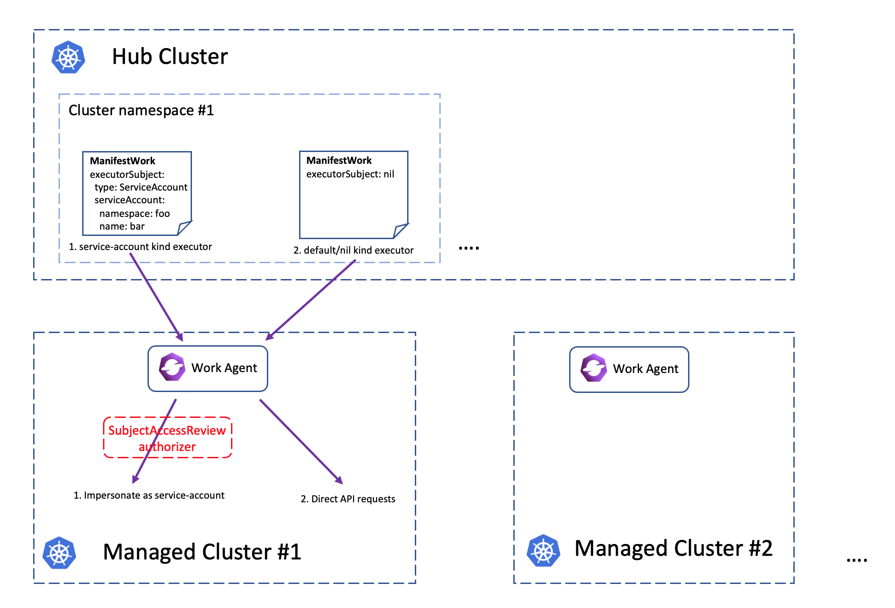

# Work Executor Group

## Release Signoff Checklist

- [ ] Enhancement is `implementable`
- [ ] Design details are appropriately documented from clear requirements
- [ ] Test plan is defined
- [ ] Graduation criteria for dev preview, tech preview, GA
- [ ] User-facing documentation is created in [website](https://github.com/open-cluster-management-io/website/)

## Summary

The proposal adds a new field `executorSubject` to the spec of `ManifestWork` 
api, to support dynamic identity authentication/authorization upon the execution
of `ManifestWork` resources. If the `executorSubject` is absent, it means the
work agent will keep using the mounted service account to raise requests against
the managed cluster which is also for preserving the backward compatibility.

## Motivation

### Separate the identity and its held permission for the work agent

There can be different actors using the work api to distribute resource from
the hub cluster. Currently the work agent has the cluster-admin access to the
managed cluster which means that every hub users with write access to the
work resources will be able to dispatch any resources to the managed cluster.
This can be a security hole for OCM, e.g. one can apply/overwrite some
cluster-scoped configuration to the managed cluster which potentially break/halt
the cluster. Hence, we need a way to clarify the owner identity/role of the
"ManifestWork" before it takes effect so that we can explicitly check whether 
that owner has sufficient permission in the managed cluster.

### Auditing the API request history from work agent

Currently all the API requests raised by work agent in the managed cluster are
from a fixed service account ("open-cluster-management-agent/klusterlet-work-sa"
under the default installation). However in some cases, we need to clarify the
source/owner identity of the `ManifestWork` resource so that we can record the
api audits in a finer granularity. This will be helpful for the managed
cluster's admin to be capable of knowing "who is operating that `ManifestWork`
from the hub cluster".

### Goals

- `ManifestWork` resource be able to clarify the executor/owner identity before
  actually writing the resources to the managed cluster.

### Non-Goals

- This proposal doesn't put any requirement to the selection of executor/owner in
  the "ManifestWork", which allows hub admin to reference any valid Kubernetes 
  user/role to be the executor/owner.

## Proposal

### API Changes

This proposal adds a new field `executorSubject` to the `ManifestWork` api, 
which is defaulted to nil if absent. A nil executor subject indicates that the 
work agent doesn't perform any impersonation before requesting the hosting 
managed cluster.


A sample of the new `executorSubject` field in Yaml is shown below:

```yaml
apiVersion: work.open-cluster-management.io/v1
kind: ManifestWork
metadata: ...
spec:
  executorSubject:
    type: [ServiceAccount] # union discriminator for extensibility
    serviceAccount:
      name: ...
      namespace: ...
  workload:
    manifests: [...]
```

### Work-agent client permission muzzling

The supported executor subject types will be merely "ServiceAccount".
For "ServiceAccount" type, intuitively the referenced service account is 
working like an "ambassador" identity, and the work agent will need to 
explicitly check whether that "ambassador" has sufficient RBAC permission 
in the managed cluster via SubjectAccessReview api. Due to the limit of 
the SubjectAccessReview api, we need to send (# of contained objects) times 
SAR requests to the spoke cluster, but this should be fine b/c the work-agent 
is working asynchronously. 

Note that the authorization via subject access review api doesn't require the
service account to be actually present in the managed cluster, so in the cases
where you have too many executor subject to manage, the number of service 
accounts resources in the managed cluster is bounded.

A sample of the requesting `SubjectAccessReview` payload is:

```yaml
apiVersion: authentication.open-cluster-management.io/v1alpha1
kind: SubjectAccessReview
spec:
  # requester is the referenced service-account in executor subject
  user: "system:serviceaccount:<sa namespace>:<sa name>"
  groups: ["system:serviceaccounts", "system:authenticated"]
  # requesting resource attributes
  resourceAttributes:
    # verb
    verb: <the intended verb, can be create/update/patch/delete>
    # the GVR tuple
    group: <api group>
    version: <api version>
    resource: <api resource name>
    # the object identifier
    name: <resource name>
    namespace: <resource namespace if applicable>
```

### Architecture

The overall architecture is shown in the picture below:



#### Workflow

The following is what will happen when a `ManifestWork` with non-nil executor
subject specified is applied to the hub cluster:

0. Create a "ManifestWork" with non-nil executor subject
1. The work-agent observes the new resource via watch event
2. The work-agent builds a SubjectAccessReview request which:
   - The target subject is the executor subject from `ManifestWork`
   - The target attribute should contain the "*" verbs for all the inlined
     objects in the spec of `ManifestWork`. Note that the "resourceNames"
     should also be specified.
3. The work-agent writes the objects to the managed cluster if SAR passes.
   3.1 Otherwise set the failure condition to the `ManifestWork`.
4. The work-agent reports the results back to the hub cluster.

### Proposing changes to the work agent


### Backward Compatibility

Considering the data-plane backward compatibility, those existing legacy 
`ManifestWork` resources will be considered as nil executor subject, so
the work agent keeps using the original service account.


### Authorizing hub-user to executor subjects

#### Admission control via `SubjectAccessReview`

A validating webhook admission controller that checks whether the requesting
hub users has sufficient RBAC permission to write certain resources to a
managed cluster:

```yaml
apiVersion: authentication.open-cluster-management.io/v1alpha1
kind: SubjectAccessReview
spec:
  user: <requester username>
  groups: <requester groups>
  resourceAttributes:
    # virtual verb
    verb: useOnManagedCluster
    name: <the target managed cluster name>
    # the GVR tuple of the requesting resources
    group: <api group>
    version: <api version>
    resource: <api resource name>
    # the object identifier
    namespace: <resource namespace if applicable>
```


#### (Alternative) Admission control via `ManagedServiceAccountBinding`

We can do an optional authorization in the hub cluster to check whether the
manipulator of the `ManifestWork` can use a `ServiceAccount` as the executor
subject by the integration between `ManagedServiceAccount` api. The 
authorization works by plugging an admission webhook to the hub cluster.
The webhook list/watches the `ManagedServiceAccountBinding` resource which
specifies the mapping between actual hub user and the `ManagedServiceAccount`.

A sample of `ManagedServiceAccountBinding` is shown below:

```yaml
apiVersion: authentication.open-cluster-management.io/v1alpha1
kind: ManagedServiceAccountBinding
spec:
  ref:
    namespace: <namespace of the managed service-account>
    name: <name of the managed service-account>
  subjects:
    - kind: User
      name: dave
    - kind: Group
      name: my-group
    - kind: ServiceAccount
      namespace: <namespace>
      name: <name>
```

The content under `.spec.subjects` is inspired by the original "Subject"
struct from Kubernetes' RBAC api:

```yaml
apiVersion: rbac.authorization.k8s.io/v1
kind: RoleBinding
metadata: ...
subjects:
- kind: User
  name: dave
```

Also, based on OCM's "managed-serviceaccount" addon which automatically 
distributes local service-account to the managed clusters upon discovering new 
`ManagedServiceAccount` resources in the hub cluster.

### Test Plan

- Unit tests will cover the fundamental functionalities.
- Integration tests will cover all user stories.
- e2e tests will cover the following cases:
  - default executor-group won't manage non-default groups.
  - non-default executor-group #1 will manage non-default group #1.
  - non-default executor-group #1 won't manage non-default group #2.
    
### Graduation Criteria

Alpha:

- The proposal is reviewed and accepted.
- Implementation is completed to support the primary goals.