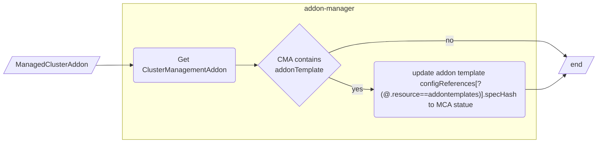
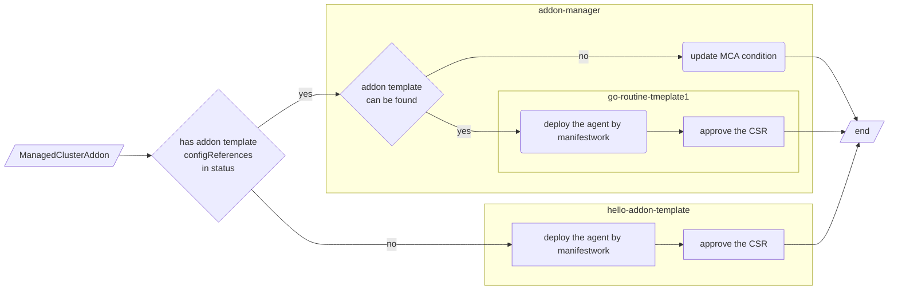

# Add-on Template

## Release Signoff Checklist

- [x] Enhancement is `implementable`
- [x] Design details are appropriately documented from clear requirements
- [x] Test plan is defined
- [ ] Graduation criteria for dev preview, tech preview, GA
- [x] User-facing documentation is created in [website](https://github.com/open-cluster-management-io/open-cluster-management-io.github.io/)

## Summary

This proposal adds a new CRD addonTemplate, to simplify the development of an add-on. it makes developers no longer
need to compile and deploy an addon manager for each add-on.

## Motivation

Currently, OCM provides the addon framework, which is a library that provides functions such as addon installation and
registration. Developers can use the addon framework to implement the corresponding interface, define the resources that
need to be deployed on the managed cluster, and then build the addon image and deploy it to the hub cluster. After that,
The addon can be enabled for the corresponding managed cluster by creating a `ManagedClusterAddon`.

This simplifies the addon development process, but it still requires developers to implement the interface defined in
the addon-framework via code, and the development process is still slightly complicated. so we hope to explore a more
straightforward addon development way.

### Goals

- Provide a new addon development model, developers can define an addon YAML template and some parameters to describe
  how the addon agent will be installed on the managed cluster and how to register it to the hub, developers do not need
  to deploy an addon-manager on the hub cluster to manage the addon agent.
- Make the addon agent deployment and registration configurable, modifying the deployment and registration logic does
  not need to recompile the addon image.

### Non-Goals

- The addon agent image is still required.
- The hosted mode addon is not supported.
- For complicated addon which has special RBAC requirement etc would still need to use addon-framework.
- For the agent runtime, only `Deployment` and `DaemonSet` are fully supported, for `Statefulset`, and other runtime
  resources can be deployed to the managed cluster, but no volumes will be injected, and can not be used to check the
  health of the addon.

## Proposal

### User Stories

#### Story 1

As an addon developer, I hope that I can focus on addon business development. After preparing the addon agent image, I
only need to define some configurations to deploy and register my addon agent.

#### Story 2

As an addon developer, when the installation and registration of the addon agent changes, I hope that the change can
take effect by only modifying some configurations without changing the code.

## Design Details

The design is based on [Add-on Lifecycle](https://github.com/open-cluster-management-io/enhancements/tree/main/enhancements/sig-architecture/81-addon-lifecycle).

### Overview

The main idea is to provide a new API (CRD), `AddonTemplate`, which is used to describe how to deploy the addon agent
and how to register the addon. Then add a new addon template controller to the addon-manager component on the hub
cluster to process the CRD in order to deploy and register the addon.

### API changes

Introduce a new cluster-scoped API `AddonTemplate` which is used to describe how to deploy the addon agent and how to
register the addon to the hub cluster. And it is needed to reference the `AddonTemplate` by the `spec.supportedConfigs`
field of `ClusterManagementAddon` to indicate that this addon is using a template.

```golang
// AddOnTemplate is a cluster-scoped resource, and will only be used on the hub cluster.
type AddOnTemplate struct {
	metav1.TypeMeta   `json:",inline"`
	metav1.ObjectMeta `json:"metadata"`

	// spec holds the registration configuration for the addon and the
	// addon agent resources yaml description.
	// +kubebuilder:validation:Required
	// +required
	Spec AddOnTemplateSpec `json:"spec"`
}

// AddOnTemplateSpec defines the template of an addon agent which will be deployed on managed clusters.
type AddOnTemplateSpec struct {
	// AddonName represents the name of the addon which the template belongs to
	// +kubebuilder:validation:Required
	// +required
	AddonName string `json:"addonName"`

	// AgentSpec describes what/how the kubernetes resources of the addon agent to be deployed on a managed cluster.
	// +kubebuilder:validation:Required
	// +required
	AgentSpec work.ManifestWorkSpec `json:"agentSpec"`

	// Registration holds the registration configuration for the addon
	// +optional
	Registration []RegistrationSpec `json:"registration"`
}

// RegistrationType represents the type of the registration configuration,
// it could be KubeClient or CustomSigner
type RegistrationType string

// HubPermissionsBindingType represent how to bind permission resources(role/clusterrole)
// on the hub cluster for the addon agent
type HubPermissionsBindingType string

const (
	// RegistrationTypeKubeClient represents the KubeClient type registration of the addon agent.
	// For this type, the addon agent can access the hub kube apiserver with kube style API.
	// The signer name should be "kubernetes.io/kube-apiserver-client".
	RegistrationTypeKubeClient RegistrationType = "KubeClient"
	// RegistrationTypeCustomSigner represents the CustomSigner type registration of the addon agent.
	// For this type, the addon agent can access the hub cluster through user-defined endpoints.
	RegistrationTypeCustomSigner RegistrationType = "CustomSigner"

	// HubPermissionsBindingSingleNamespace means that will only allow the addon agent to access the
	// resources in a single user defined namespace on the hub cluster.
	HubPermissionsBindingSingleNamespace HubPermissionsBindingType = "SingleNamespace"
	// HubPermissionsBindingCurrentCluster means that will only allow the addon agent to access the
	// resources in managed cluster namespace on the hub cluster.
	// It is a specific case of the SingleNamespace type.
	HubPermissionsBindingCurrentCluster HubPermissionsBindingType = "CurrentCluster"
)

// RegistrationSpec describes how to register an addon agent to the hub cluster.
// With the registration defined, The addon agent can access to kube apiserver with kube style API
// or other endpoints on hub cluster with client certificate authentication. During the addon
// registration process, a csr will be created for each Registration on the hub cluster. The
// CSR will be approved automatically, After the csr is approved on the hub cluster, the klusterlet
// agent will create a secret in the installNamespace for the addon agent.
// If the RegistrationType type is KubeClient, the secret name will be "{addon name}-hub-kubeconfig"
// whose content includes key/cert and kubeconfig. Otherwise, If the RegistrationType type is
// CustomSigner the secret name will be "{addon name}-{signer name}-client-cert" whose content
// includes key/cert.
type RegistrationSpec struct {
	// Type of the registration configuration, it supports:
	// - KubeClient: the addon agent can access the hub kube apiserver with kube style API.
	//   the signer name should be "kubernetes.io/kube-apiserver-client". When this type is
	//   used, the KubeClientRegistrationConfig can be used to define the permission of the
	//   addon agent to access the hub cluster
	// - CustomSigner: the addon agent can access the hub cluster through user-defined endpoints.
	//   When this type is used, the CustomSignerRegistrationConfig can be used to define how
	//   to issue the client certificate for the addon agent.
	// +kubebuilder:validation:Required
	// +kubebuilder:validation:Enum:=KubeClient;CustomSigner
	Type RegistrationType `json:"type"`

	// KubeClient holds the configuration of the KubeClient type registration
	// +optional
	KubeClient *KubeClientRegistrationConfig `json:"kubeClient,omitempty"`

	// CustomSigner holds the configuration of the CustomSigner type registration
	// required when the Type is CustomSigner
	CustomSigner *CustomSignerRegistrationConfig `json:"customSigner,omitempty"`
}

type KubeClientRegistrationConfig struct {
	// HubPermissions represent the permission configurations of the addon agent to access the hub cluster
	// +optional
	HubPermissions []HubPermissionConfig `json:"hubPermissions,omitempty"`
}

// HubPermissionConfig configures the permission of the addon agent to access the hub cluster.
// Will create a RoleBinding in the same namespace as the managedClusterAddon to bind the user
// provided ClusterRole/Role to the "system:open-cluster-management:cluster:<cluster-name>:addon:<addon-name>"
// Group.
type HubPermissionConfig struct {
	// Type of the permissions setting. It defines how to bind the roleRef on the hub cluster. It can be:
	// - CurrentCluster: Bind the roleRef to the namespace with the same name as the managedCluster.
	// - SingleNamespace: Bind the roleRef to the namespace specified by SingleNamespaceBindingConfig.
	//
	// +kubebuilder:validation:Required
	// +kubebuilder:validation:Enum:=CurrentCluster;SingleNamespace
	Type HubPermissionsBindingType `json:"type"`

	// CurrentCluster contains the configuration of CurrentCluster type binding.
	// It is required when the type is CurrentCluster.
	CurrentCluster *CurrentClusterBindingConfig `json:"currentCluster,omitempty"`

	// SingleNamespace contains the configuration of SingleNamespace type binding.
	// It is required when the type is SingleNamespace
	SingleNamespace *SingleNamespaceBindingConfig `json:"singleNamespace,omitempty"`
}

type CurrentClusterBindingConfig struct {
	// ClusterRoleName is the name of the clusterrole the addon agent is bound. A rolebinding
	// will be created referring to this cluster role in each cluster namespace.
	// The user must make sure the clusterrole exists on the hub cluster.
	// +kubebuilder:validation:Required
	ClusterRoleName string `json:"clusterRoleName"`
}

type SingleNamespaceBindingConfig struct {
	// Namespace is the namespace the addon agent has permissions to bind to. A rolebinding
	// will be created in this namespace referring to the RoleRef.
	// +kubebuilder:validation:Required
	Namespace string `json:"namespace"`

	// RoleRef is an reference to the permission resource. it could be a role or a cluster role,
	// the user must make sure it exist on the hub cluster.
	// +kubebuilder:validation:Required
	RoleRef rbacv1.RoleRef `json:"roleRef"`
}

type CustomSignerRegistrationConfig struct {
	// signerName is the name of signer that addon agent will use to create csr.
	// +required
	// +kubebuilder:validation:MaxLength=571
	// +kubebuilder:validation:MinLength=5
	SignerName string `json:"signerName"`

	// Subject is the user subject of the addon agent to be registered to the hub.
	// If it is not set, the addon agent will have the default subject
	// "subject": {
	//   "user": "system:open-cluster-management:cluster:{clusterName}:addon:{addonName}:agent:{agentName}",
	//   "groups: ["system:open-cluster-management:cluster:{clusterName}:addon:{addonName}",
	//             "system:open-cluster-management:addon:{addonName}", "system:authenticated"]
	// }
	Subject *Subject `json:"subject,omitempty"`

	// SigningCA represents the reference of the secret on the hub cluster to sign the CSR
	// the secret type must be "kubernetes.io/tls"
	// Note: The addon manager will not have permission to access the secret by default, so
	// the user must grant the permission to the addon manager(by creating rolebinding/clusterrolebinding
	// for the addon-manager serviceaccount "addon-manager-controller-sa").
	// +kubebuilder:validation:Required
	SigningCA SigningCARef `json:"signingCA"`
}

// SigningCARef is the reference to the signing CA secret which type must be "kubernetes.io/tls" and
// which namespace must be the same as the addon-manager.
type SigningCARef struct {
	// Name of the signing CA secret
	// +kubebuilder:validation:Required
	Name string `json:"name"`
	// Namespace of the signing CA secret, the namespace of the addon-manager will be used if it is not set.
	// +optional
	Namespace string `json:"namespace,omitempty"`
}
```

### Template rendering

#### Built-in parameters

Will provide some built-in parameters for using in the template:

- constant parameters(can not be overridden by user's variables):
  - `CLUSTER_NAME`: <managed-cluster-name> (e.g cluster1)
- default parameters(can be overridden by user's variables)
  - `HUB_KUBECONFIG`: /managed/hub-kubeconfig/kubeconfig

#### Inject env variables

All parameters mentioned in the [Built-in parameters section](#built-in-parameters) will be injected into containers as
Environments, so developers can use them in their agent code.

#### Inject volumes

The volumes are generated based on the `addonTemplate.spec.registration` field.

1. If there is a `KubeClient` type registration, the hub kubeconfig will be injected to the deployments and daemonsets
defined in the addon template

```yaml
...
spec:
  containers:
    - name: addon-agent
      ...
      volumeMounts:
        - mountPath: /managed/hub-kubeconfig
          name: hub-kubeconfig
  volumes:
    - name: hub-kubeconfig
      secret:
        defaultMode: 420
        secretName: <addon-name>-hub-kubeconfig
...
```

2. If there is a `CustomSigner` type registration, the secret signed via the custom signer defined in the
`CustomSignerRegistrationConfig` will be injected to the deployments and daemonsets defined in the addon template

```yaml
...
spec:
  containers:
    - name: addon-agent
      ...
      volumeMounts:
        - mountPath: /managed/<signer-name> # if the signer name contains "/", it will be replaced by "-"
          name: cert-<signer-name>
  volumes:
    - name: cert-<signer-name> # if the signer name contains "/", it will be replaced by "-"
      secret:
        defaultMode: 420
        secretName: <addon-name>-<signer-name>-client-cert # if the signer name contains "/", it will be replaced by "-"
```

#### Use Variables in addonTemplate

Users can use variables in the `addonTemplate.agentSpec.workload.manifests` field in the form of `{{VARIABLE_NAME}}`,
it is similar to go template syntax but not identical, only String value is supported. And there are two types of
variables:

1. built-in variables;
All parameters mentioned in the [Built-in parameters section](#built-in-parameters) can be used.

2. Customize variables;
Variables defines in `addonDeploymentConfig.customizedVariables` can be used.

### Registration

When we talk about registration, there are 2 parts of work:

1. issue a client certificate according to the CSR to the addon agent to access the hub(authentication)
2. define the permissions for the certificate which resources the addon agent can access(authorization)

The `AddonTemplate` API provides two ways to register the addon, "KubeClient" and "CustomSigner".

1. For "KubeClient", the addon agent can only access to the hub kube api-server, kubernetes will issue a client
certificate for the agent, and authorization can be done by configuring the `HubPermissionConfig` which describes what
roles the agent will be bound.
2. For "CustomSigner", users can control what endpoint on the hub cluster the addon agent can access, users can use the
`CustomSignerRegistrationConfig` to configure how to issue the client certificate. For authorization of CustomSigner,
users need to implement it themselves.

With the registration configured, the credentials info used to access the hub cluster will be injected into all
deployments and daemonsets as volumes. See [inject volumes](#inject-volumes) for more details.

### Example

Here holds an [example](./examples), it contains:

- an [addonTemplate](./examples/addon-template.yaml)
- a [clusterManagementAddon](./examples/cluster-management-addon.yaml)
- a [managedClusterAddon](./examples/cluster-management-addon.yaml)
- an [addonDeploymentConfig](./examples/addon-deployment-config.yaml)

The rendering output of the agent deployment will be like [this](./examples/agent-deployment-output.yaml).

### Probe the health of addons

Since we only support the Deployment and DaemonSet resources as the agent runtime workload, we can inject a feedback
rule to the agent deployment resource, the feedback rule will check if the deployment and daemonset are available, if
not, the addon will be considered as unhealthy.

### Upgrade an addon template

With the addon developed via a template, if we want to update the resources deployed on the managed cluster, we don't
need to rebuild the addon manager image, we can leverage the [addon-lifecycle management](./../81-addon-lifecycle/README.md)
feature to achieve it.

1. Create a new addon-template containing the new changes to the resources, the [example](./examples/upgrade/addon-template-v2.yaml)
creates a new addon template `hello-template-v2` and adds a new label for the addon agent deployment and pod.
2. Create a [placement](./examples/upgrade/placement.yaml) to select on which clusters we want the addon to upgrade.
3. Update the [clusterManagementAddon](./examples/upgrade/cluster-management-addon.yaml), in the installStartegy field
set the placement and reference the new addon template `hello-template-v2`, then the addon manager will upgrade all the
agent resources on the placement selected clusters automatically.

### Implementation Details

Add a new controller to the addon-manager component to:

1. reconcile `status.configReferences[*].desiredConfig` of the `ManagedClusterAddon`



2. if an addon has an addontemplates type `configReferences` in its `ManagedClusterAddon` status(means the addon is
using a template), start a go-routine to act as the manager of this template-type addon to install and register the
addon agent.



### Test Plan

- Unit tests will cover the fundamental functionalities.
- e2e tests will cover the following cases:
  - install and register an addon to the hub by addonTemplate
  - update the addon agent when there is change on the addonTemplate

### Graduation Criteria

#### Alpha

At first, This proposal will be in the alpha stage and needs to meet:

1. The new APIs are reviewed and accepted;
2. Implementation is completed to support the functionalities;
3. Develop test cases to demonstrate this proposal works correctly;

#### Beta

1. Need to revisit the API shape before upgrading to beta based on user feedback.

### Upgrade / Downgrade Strategy

TBD

### Version Skew Strategy

N/A
