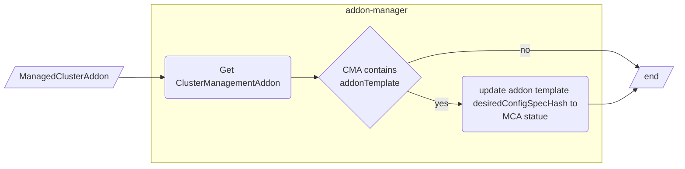
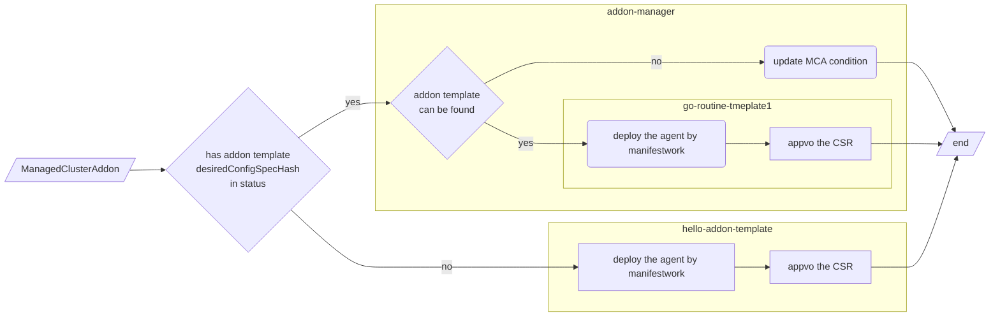

# Add-on Template

## Release Signoff Checklist

- [ ] Enhancement is `implementable`
- [ ] Design details are appropriately documented from clear requirements
- [ ] Test plan is defined
- [ ] Graduation criteria for dev preview, tech preview, GA
- [ ] User-facing documentation is created in [website](https://github.com/open-cluster-management-io/open-cluster-management-io.github.io/)

## Summary

This proposal adds a new CRD addonTemplate, to simplify the development of an add-on. it makes developers no longer
need to compile and deploy an addon manager for each add-on.

## Motivation

Currently, OCM provides the addon framework, which is a library that provides functions such as addon installation and
registration. Developers can use the addon framework to implement the corresponding interface, define the resources that
need to be deployed on the managed cluster, and then build the addon image and deploy it to the hub cluster. After that,
The addon can be enabled for the corresponding managed cluster by creating a `ManagedClusterAddon`.

This simplifies the addon development process, but it still requires developers to implement the interface defined in
the addon-framework via code, and the development process is still slightly complicated. so we hope to explore a more
straightforward addon development way.

### Goals

- Provide a new addon development model, developers can define an addon YAML template and some parameters to describe
  how the addon agent will be installed on the managed cluster and how to register it to the hub, developers do not need
  to deploy an addon-manager on the hub cluster to manage the addon agent.
- Make the addon agent deployment and registration configurable, modifying the deployment and registration logic does
  not need to recompile the addon image.

### Non-Goals

- The addon agent image is still required.

## Proposal

### User Stories

Detail the things that people will be able to do if this is implemented.
Include as much detail as possible so that people can understand the "how" of
the system. The goal here is to make this feel real for users without getting
bogged down.

#### Story 1

As an addon developer, I hope that I can focus on addon business development. After preparing the addon agent image, I
only need to define some configurations to deploy and register my addon agent.

#### Story 2

As an addon developer, when the installation and registration of the addon agent changes, I hope that the change can
take effect by only modifying some configurations without changing the code

## Design Details

The design is based on [Add-on Lifecycle](https://github.com/open-cluster-management-io/enhancements/tree/main/enhancements/sig-architecture/81-addon-lifecycle).

### Overview

The main idea is to provide a new API (CRD), `AddonTemplate`, which is used to describe how to deploy the addon agent
and how to register the addon. Then add a new addon template controller to the addon-manager component on the hub
cluster to process the CRD in order to deploy and register the addon.

### API changes

Introduce a new cluster-scoped API `AddonTemplate` which is used to describe how to deploy the addon agent and how to
register the addon to the hub cluster.

```golang
// AddOnTemplateSpec defines the template of an addon agent which will be deployed on managed clusters.
type AddOnTemplateSpec struct {
	// AddonName represents the name of the addon which the template belongs to
	// +kubebuilder:validation:Required
	// +required
	AddonName string `json:"addonName"`

	// AgentManifests represents the kubernetes resources of the addon agent to be deployed on a managed cluster.
	// +kubebuilder:validation:Required
	// +required
	AgentManifests []Manifest `json:"agentManifests"`

	// Registration holds the registration configuration for the addon
	// +kubebuilder:validation:Required
	// +required
	Registration []RegistrationSpec `json:"registration"`
}

// Manifest represents a resource to be deployed on the managed cluster.
type Manifest struct {
	// +kubebuilder:validation:EmbeddedResource
	// +kubebuilder:pruning:PreserveUnknownFields
	runtime.RawExtension `json:",inline"`
}

// RegistrationType represents the type of the registration configuration,
// it could be KubeClient or CustomSigner
type RegistrationType string

// HubPermissionsBindingType represent how to bind permission resources(role/clusterrole)
// on the hub cluster for the addon agent
type HubPermissionsBindingType string

const (
	// RegistrationTypeKubeClient represents the KubeClient type registration of the addon agent.
	// For this type, the addon agent can access the hub kube apiserver with kube style API.
	// The signer name should be "kubernetes.io/kube-apiserver-client".
	RegistrationTypeKubeClient RegistrationType = "KubeClient"
	// RegistrationTypeCustomSigner represents the CustomSigner type registration of the addon agent.
	// For this type, the addon agent can access the hub cluster through user-defined endpoints.
	RegistrationTypeCustomSigner RegistrationType = "CustomSigner"

	// HubPermissionsBindingSingleNamespace means that will only allow the addon agent to access the
	// resources in a single user defined namespace on the hub cluster.
	HubPermissionsBindingSingleNamespace HubPermissionsBindingType = "SingleNamespace"
	// HubPermissionsBindingCurrentCluster means that will only allow the addon agent to access the
	// resources in managed cluster namespace on the hub cluster.
	// It is a special case of the SingleNamespace type.
	HubPermissionsBindingCurrentCluster HubPermissionsBindingType = "CurrentCluster"
)

// RegistrationSpec describes how to register an addon agent to the hub cluster.
// With the registration defined, The addon agent can access to kube apiserver with kube style API
// or other endpoints on hub cluster with client certificate authentication. During the addon
// registration process, a csr will be created for each RegistrationSpec on the hub cluster. The
// CSR can be approved automatically(Auto) or manually(None), After the csr is approved on the hub
// cluster, the klusterlet agent will create a secret in the installNamespace for the addon agent.
// If the RegistrationType type is KubeClient, the secret name will be "{addon name}-hub-kubeconfig"
// whose content includes key/cert and kubeconfig. Otherwise, If the RegistrationType type is
// CustomSigner the secret name will be "{addon name}-{signer name}-client-cert" whose content
// includes key/cert.
type RegistrationSpec struct {
	// Type of the registration configuration
	// +kubebuilder:validation:Required
	// +kubebuilder:validation:Enum:=KubeClient;CustomSigner
	Type RegistrationType `json:"type"`

	// KubeClient holds the configuration of the KubeClient type registration
	// +optional
	KubeClient *KubeClientRegistrationConfig `json:"kubeClient,omitempty"`

	// KubeClient holds the configuration of the CustomSigner type registration
	// required when the Type is CustomSigner
	CustomSigner *CustomSignerRegistrationConfig `json:"customSigner,omitempty"`
}

type KubeClientRegistrationConfig struct {
	// Permission represents the permission configuration of the addon agent to access the hub cluster
	// +optional
	Permission []HubPermissionConfig `json:"permission,omitempty"`
}

// HubPermissionConfig configures the permission of the addon agent to access the hub cluster.
// Will create a RoleBinding in the same namespace as the managedClusterAddon to bind the user
// provided ClusterRole/Role to the "system:open-cluster-management:cluster:<cluster-name>:addon:<addon-name>"
// Group.
type HubPermissionConfig struct {
	// Type of the permissions setting. It defines how to bind the roleRef
	// +kubebuilder:validation:Required
	// +kubebuilder:validation:Enum:=CurrentCluster;SingleNamespace
	Type HubPermissionsBindingType `json:"type"`

	// RoleRef is an reference to the permission resource. it could be a role or a cluster role,
	// the user must make sure it exist on the hub cluster.
	// +kubebuilder:validation:Required
	RoleRef rbacv1.RoleRef `json:"roleRef"`

	// SingleNamespace contains the configuration of SingleNamespace type binding.
	// It is required when the type is SingleNamespace
	SingleNamespace *SingleNamespaceBindingConfig `json:"singleNamespace,omitempty"`
}

type SingleNamespaceBindingConfig struct {
	// +kubebuilder:validation:Required
	Namespace string `json:"namespace"`
}

type CustomSignerRegistrationConfig struct {
	// signerName is the name of signer that addon agent will use to create csr.
	// +required
	// +kubebuilder:validation:MaxLength=571
	// +kubebuilder:validation:MinLength=5
	SignerName string `json:"signerName"`

	// Subject is the user subject of the addon agent to be registered to the hub.
	// If it is not set, the addon agent will have the default subject
	// "subject": {
	//	"user": "system:open-cluster-management:addon:{addonName}:{clusterName}:{agentName}",
	//	"groups: ["system:open-cluster-management:addon", "system:open-cluster-management:addon:{addonName}", "system:authenticated"]
	// }
	Subject *Subject `json:"subject,omitempty"`

	// SigningCA represents the reference of the secret to sign the CSR
	// +kubebuilder:validation:Required
	SigningCA SigningCARef `json:"signingCA"`
}

// SigningCARef is the reference to the signing CA secret
type SigningCARef struct {
	// Namespace of the signing CA secret
	// +kubebuilder:validation:Required
	Namespace string `json:"namespace"`
	// Name of the signing CA secret
	// +kubebuilder:validation:Required
	Name string `json:"name"`
}

```

### Template rendering

#### Inject env variables

The following variables will be injected into containers as Environments, so developers can use them in their agent
code:
- `CLUSTER_NAME`: cluster1
- `HUB_KUBECONFIG`: /managed/hub-kubeconfig/kubeconfig
- `MANAGED_KUBECONFIG`: /managed/kubeconfig/kubeconfig

#### Inject volumes

1. The hub kuceconfig will be injected to the deployment defined in the addon template

```yaml
volumeMounts:
- name: hub-kubeconfig
mountPath: /managed/hub-kubeconfig
volumes:
- name: hub-kubeconfig
  secret:
  secretName: hubKubeConfigSecret
```

2. If the addon agent install mode is `Hosted`, the managed kubeconfig volume will be also injected:

```yaml
volumeMounts:
- name: managed-kubeconfig
mountPath: /managed/kubeconfig
volumes:
- name: managed-kubeconfig
  secret:
  secretName: managedKubeConfigSecret
```

#### Use Variables in addonTemplate

Users can use variables in the addon template in the form of `{{ VARIABLE_NAME }}`, and there are two types of
variables:

1. built-in variables

- `INSTALL_NAMESPACE` : the agent install namespace
- `CLUSTER_NAME` : the managed cluster name

2. Customize variables, variables defines in `addonDeploymentConfig`.

#### Example

Here holds an [example](./examples), it contains:
- an [addonTemplate](./examples/addon-template.yaml)
- a [clusterManagementAddon](./examples/cluster-management-addon.yaml)
- a [managedClusterAddon](./examples/cluster-management-addon.yaml)
- an [addonDeploymentConfig](./examples/addon-deployment-config.yaml)

The rendering output of the agent deployment will be like [this](./examples/agent-deployment-output.yaml).

### Implementation Details

Add a new controller to the addon-manager component to:

1. reconcile desiredConfigSpecHash to the managedClusterAddon status



2. start an addon manager for every template-type addon as go-routine to install and register the addon agent.



### Test Plan

- Unit tests will cover the fundamental functionalities.
- e2e tests will cover the following cases:
  - install and register an addon to the hub by addonTemplate
  - update the addon agent when there is change on the addonTemplate


### Graduation Criteria

**Note:** *Section not required until targeted at a release.*

Define graduation milestones.

These may be defined in terms of API maturity, or as something else. Initial proposal
should keep this high-level with a focus on what signals will be looked at to
determine graduation.

Consider the following in developing the graduation criteria for this
enhancement:

- [Maturity levels][maturity-levels]
- [Deprecation policy][deprecation-policy]

Clearly define what graduation means by either linking to the [API doc definition](https://kubernetes.io/docs/concepts/overview/kubernetes-api/#api-versioning),
or by redefining what graduation means.

In general, we try to use the same stages (alpha, beta, stable), regardless how the functionality is accessed.

[maturity-levels]: https://git.k8s.io/community/contributors/devel/sig-architecture/api_changes.md#alpha-beta-and-stable-versions
[deprecation-policy]: https://kubernetes.io/docs/reference/using-api/deprecation-policy/
