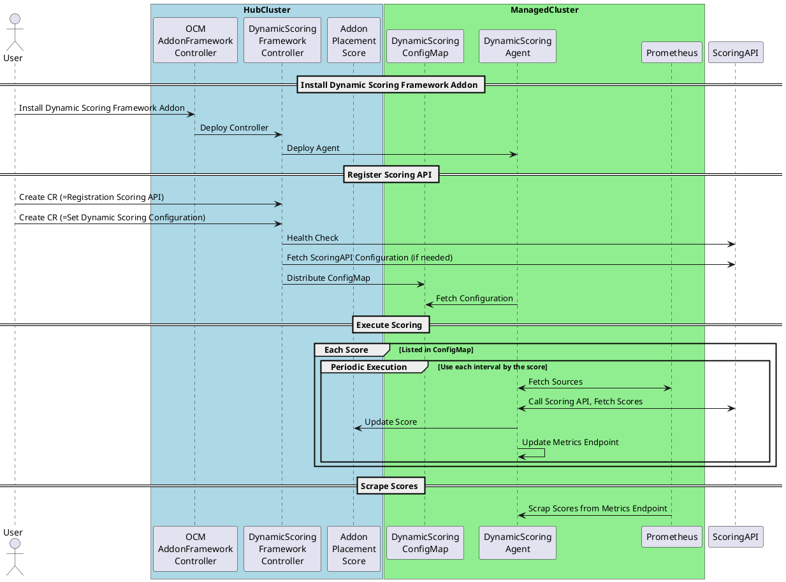
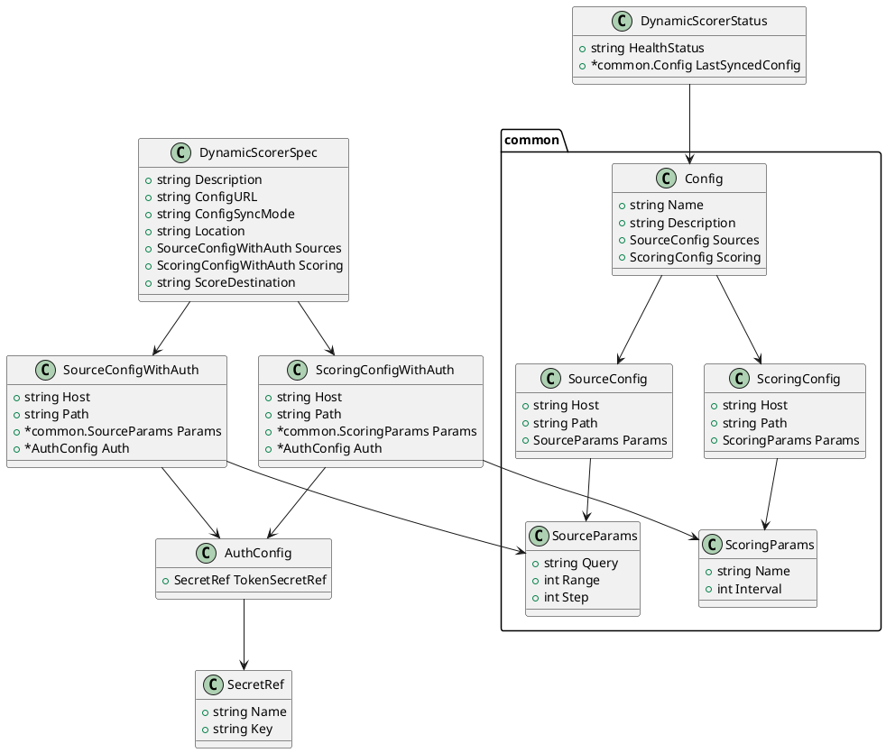
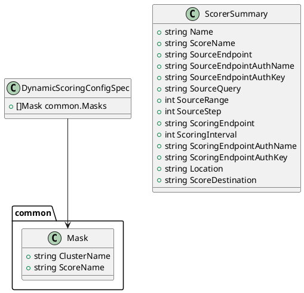
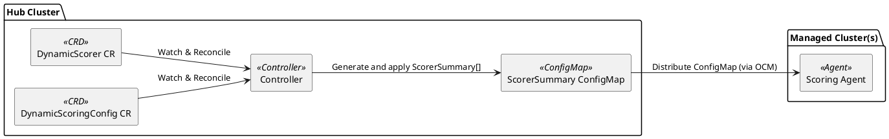
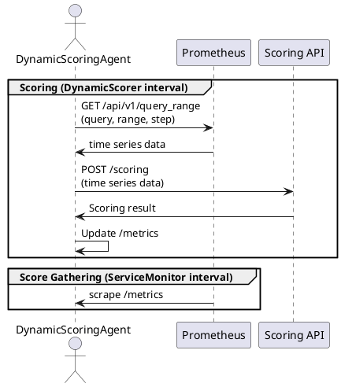

# The Dynamic Scoring Framework Addon

## Release Signoff Checklist

- [ ] Enhancement is `implementable`
- [ ] Design details are appropriately documented from clear requirements
- [ ] Test plan is defined
- [ ] Graduation criteria for dev preview, tech preview, GA
- [ ] User-facing documentation is created in [website](https://github.com/open-cluster-management-io/open-cluster-management-io.github.io/)

## Summary

This enhancement is to add a Dynamic Scoring Framework addon to Open Cluster Management (OCM). The Dynamic Scoring Framework addon enables distributed scoring across multiple managed clusters, where agents collect metrics, invoke external Scoring APIs for computation, and report the results back to the hub for aggregation.

## Motivation

In recent years, there has been a growing demand to use logic that goes beyond simple metric processing for assessing cluster health and resource utilization in multi-cluster management. For example, in the concept of AI-RAN (Radio Access Network shared resources with AI workloads), it is envisioned that workloads could be dynamically relocated based on GPU/CPU/power load prediction evaluations at deployment time, and that the cluster state could be assessed and optimized using large language models (LLMs).
In these evaluation steps, time series data from each cluster are fed into the Prediction/Evaluation/Scoring engine, which generates a score that may subsequently trigger the next orchestration actions.

The Dynamic Scoring Framework addresses two competing requirements for efficient multi-cluster evaluation:

**Resource Efficiency vs. Data Freshness Trade-off:**

- Evaluation (including prediction, scoring) logic often requires significant computational resources and varies across use cases, making it inefficient to deploy separate evaluation pods in every managed cluster
- Data freshness is critical for accurate scoring, requiring evaluation triggers to execute close to where metrics are collected

**Framework Solution:**

The Dynamic Scoring Framework resolves this by implementing a hybrid architecture:

- Centralized scoring APIs Management - Shared computational resources for scoring logic across multiple clusters
- Distributed scoring agents - Local agents in each managed cluster that collect fresh, cluster-specific metrics and trigger scoring APIs

This approach optimizes both resource utilization and data freshness by separating the computationally intensive evaluation logic (centralized) from the time-sensitive data collection and triggering (distributed).
The distribution and control of the Scoring Agent are carried out using the OCM Addon Framework.


### Goals

- **Management of API Endpoints for Scoring Each Cluster**
  - Provide a mechanism to register and manage scoring APIs.
  - Support both external APIs (hosted outside the cluster) and internal APIs (hosted within any cluster, hub or spoke).
    - For internal APIs, connectivity between the scoring API and the requester (an agent in each cluster) must be established.
      - The simplest approach is to deploy scoring API Pods to each cluster and use their own endpoints for scoring (although this may introduce additional costs, as mentioned above).
      - Alternatively, a tool can be used to connect services across clusters and share API endpoints (e.g., Skupper).
        - In this case, the framework should provide access metrics from each cluster to the scoring API (count, latency, ...).
    - For external APIs, the framework should provide an authorization management.
  - Perform health checks on registered APIs and disable those that are not functioning properly.
  - Manage API configurations (e.g., query range, frequency).
    - In some cases, the API provider may want to enforce specific configurations; the framework should support applying these settings.
    - In other cases, the PF operator may wish to set configurations according to their own requirements.
- **Management of Agents Running on Managed Clusters**
  - Deploy agents to each managed cluster to periodically retrieve time-series metrics.
  - Agents should be able to interact with multiple source components:
    - Prometheus (including Prometheus-compatible components)
    - OpenTelemetry
  - Agents should be able to output evaluation results as metrics:
    - Expose results via the agent's metrics endpoint for scraping by Prometheus
    - Store results in other components (e.g., as a placement score)
- Aggregation of Evaluation Results into the Hub Cluster to use for Application Deployment Destination Making
  - Agents work as a prometheus exporter in each managed cluster, and the hub cluster's prometheus scrapes the results (e.g. ```remotewrite```).
  - Agents also update ```AddonPlacementScore``` to be able to use from OCM ```Placement```.
    - It can be used as a placement decision factor in addition to the existing metrics-based placement.

### Non-Goals

Implementation of the evaluation logic itself.
The evaluation logic is expected to be implemented outside the Dynamic Scoring Framework.
(But hte interfaces for Scoring APIs are defined in the framework.)

## Proposal

### User Stories

#### Story 1: Multi-Cluster Multi-Device Inference Platform

For various LLM inference workloads, desired hardware (e.g. accelerator type, memory size, spec, ...) is different. And for cost optimization, inference workloads efficiency is calculated based on various factors including resource utilization, power consumption, and operational costs.
A service provider operates multiple Kubernetes clusters with heterogeneous hardware configurations and wants to optimize the placement of inference workloads based on custom scoring logic that considers these diverse factors.

In this use case, we can use "Inference Efficiency Scoring API" that takes time series data from each cluster (e.g., GPU utilization, CPU utilization, power consumption) and returns an efficiency score for each node or pod.
The scoring API receives accelerator utilization metrics and node power consumption, and calculates an efficiency score based on a custom algorithm that considers both performance and cost factors.
The Dynamic Scoring Framework Addon Agent can correct not only accelerator utilization metrics but also power consumption and cost metrics from each cluster, and provide them to the scoring API.


#### Story 2: AI-RAN Use Case

A telco operator managing multiple Kubernetes clusters for own RAN workloads, and for monetizing own infrastructure by sharing resources with service AI workloads.
The operator wants to optimize resource utilization across clusters by dynamically relocating workloads based on predicted GPU/CPU/power load evaluations at deployment time.
For this purpose, the operator deploys a Dynamic Scoring Framework addon in the OCM hub cluster and implements a custom scoring API that uses time series data from each cluster to predict resource loads.

In this use case, the scoring API receives time series data such as historical GPU and CPU utilization from each cluster's Prometheus, and uses a machine learning model to predict future resource loads.
Based on these predictions, the API calculates a score indicating the suitability of each cluster for additional workloads.


When implementing the scoring API in these use cases, the PF operator doesn't need to worry about how to collect fresh metrics from each cluster or how to distribute the scoring logic, as these are handled by the Dynamic Scoring Framework.

### Implementation Details/Notes/Constraints

- OCM Addon Framework will be used to deploy the Scoring Agent to each managed cluster.
- It assumes that Prometheus-compatible component is already deployed in each managed cluster to collect time-series metrics.

#### Main Components

- DynamicScorer
  - Represents a scoring API endpoint and its configuration.
- DynamicScoringConfig
  - Manages the configuration of scoring APIs to use.
- DynamicScoringAgent
  - Executes the scoring logic by fetching metrics and calling the scoring API.
  - Deployed to each managed cluster via OCM Addon Framework.

#### Architecture Diagram


Users of this framework implement (or select) a scoring API and register it with the Dynamic Scoring Framework.

Registered APIs are aggregated according to the DynamicScoringConfig and distributed as ConfigMaps to each managed cluster.

The DynamicScoringAgent deployed in each managed cluster monitors the distributed ConfigMap, retrieves time-series metrics from Prometheus, and calls the scoring API using these metrics as input.

The scoring results are exposed via the agent's metrics endpoint, stored in each cluster's Prometheus, and further aggregated in the hub cluster. This information can then be used for dynamic resource adjustments.

Additionally, the agent updates the `AddonPlacementScore` resource in each managed cluster, allowing OCM's Placement mechanism to utilize these scores for application deployment decisions.

#### Dynamic Scoring Framework Usage Flow

1. **Create Own Scoring API**  
   Implement your own scoring API that returns scores based on metrics (or use external APIs)

2. **Create DynamicScorer CR**  
   Register scoring API info, authentication, and queries as a CRD

3. **Create DynamicScoringConfig CR**  
   Manage the set of scoring APIs to use

4. **ConfigMaps are distributed to each cluster**  
   Automatically distributed via OCM

5. **DynamicScoringAgent executes scoring**  
   Fetches metrics from Prometheus, calls the scoring API, and exports results as metrics

6. **Visualize and utilize scores with Prometheus/Grafana/ResourceArrangement, etc.**



#### DynamicScorer Definition Details

A CR (Custom Resource) for registering scoring APIs. The fields are defined as follows:



```Sources``` is an array to support multiple data sources. Each source represents a Prometheus-compatible endpoint and a PromQL query to fetch metrics.

```Scoring``` represents the scoring API endpoint and its configuration.

##### Source Configuration

- ```host```: The hostname or IP address of the Prometheus-compatible endpoint.
- ```path```: The API path to query metrics (e.g., `/api/v1/query_range`).
- ```params.query```: The PromQL query to fetch metrics.
- ```params.range```: The time range (in seconds) for the query.
- ```params.step```: The step duration (in seconds) for the query.

##### Scoring Configuration

- ```host```: The hostname or IP address of the scoring API endpoint.
- ```path```: The API path for scoring (e.g., `/score`).
- ```params.name```: The name of the scoring metric.
- ```params.interval```: The scoring interval (in seconds).

##### CR config vs. API config endpoint

If the user of the Dynamic Scoring Framework is also the implementer of the scoring API, this distinction is not necessary.  
If they are different, consider:

- **User-driven configuration**: Set `DynamicScorer.spec.ConfigSyncMode="full"` to use the config values defined in the DynamicScorer CR, explicitly fixing query ranges, etc.
- **API implementer-driven configuration**: Set `DynamicScorer.spec.ConfigSyncMode="none"` to reflect the implementer's intended config in the CR status, which is then used for subsequent requests.

##### Scoring API Schema Propagation

An example PromQL query to configure in the Scoring API source is shown below.

```promql
sum by (node, namespace, pod) (rate(container_cpu_usage_seconds_total{container!=\"\", pod!=\"\"}[1m]))
```

In this case, the Scoring API receives JSON data as shown below.

```json
{
  "data": [
    {
      "metric": {
        "__name__": "sum by (node, namespace, pod) (rate(container_cpu_usage_seconds_total{container!=\"\", pod!=\"\"}[1m]))",
        "instance": "hoge",
        "node": "mynode", 
        "namespace": "mynamespace",
        "pod": "mypod"
      },
      "values": [
        [1718600000, "1.1"],
        ...
      ]
    },
    ...
  ]
}
```

This schema conforms to the standard Prometheus API response format.

The Scoring API calculates scores based on the data above. The schema of the response can be defined by the Scoring API implementer; however, the Dynamic Scoring Agent generates metric endpoints from the received score information by mapping the labels of the metric.
The mapping of labels follows the relationships described below.

- ds_score_name: `spec.scoring.params.name` of DynamicScorer resource
- ds_cluster: name of the managed cluster where the Agent is running
- ds_node: metric label `node`
- ds_pod: metric label `pod`
- ds_container: metric label `container`
- ds_device: metric label `device`
- ds_namespace: metric label `namespace`
- ds_app: metric label `app`
- ds_meta: metric label `meta`

For example, suppose the Agent on cluster1 calls the simple_prediction_score Scoring API and receives the following JSON data.

```json
{
  "results": [
    {
      "metric": {
        "__name__": "container_cpu_usage_seconds_total",
        "instance": "hoge",
        "node": "mynode", 
        "namespace": "mynamespace",
        "pod": "mypod",
        "meta": "eyJwcmVkaWN0b3JfbGFiZWwiOiJjbHVzdGVyMS1jb250cm9sLXBsYW5lX3NrdXBwZXItc2l0ZS1jb250cm9sbGVyX3NrdXBwZXItc2l0ZS1jb250cm9sbGVyLTZkYzQ1ZmZmNDktbWRydDciLCJhbHBoYSI6MjAuMCwidGhyZXNob2xkIjoxLjB9" 
      },
      "score": 123.45
    }
    ...
  ]
}
```

In this case, the Agent generates the following Prometheus metrics.

```text
dynamic_score{ds_app="",ds_cluster="cluster1",ds_container="",ds_device="",ds_meta="eyJwcmVkaWN0b3JfbGFiZWwiOiJjbHVzdGVyMS1jb250cm9sLXBsYW5lX3NrdXBwZXItc2l0ZS1jb250cm9sbGVyX3NrdXBwZXItc2l0ZS1jb250cm9sbGVyLTZkYzQ1ZmZmNDktbWRydDciLCJhbHBoYSI6MjAuMCwidGhyZXNob2xkIjoxLjB9",ds_namespace="mynamespace",ds_node="mynode",ds_pod="mypod",ds_score_name="simple_prediction_score"} 123.45
```

In summary, implementers of the Scoring API should consider the following points when implementing the score calculation logic:

1. Define PromQL queries to retrieve the metrics you want from Prometheus.
2. Implement the score calculation logic based on the schema returned by those queries.
3. Return the score calculation results while taking into account the mapping rules of the Dynamic Scoring Agent:
   1. Set the app, container, device, namespace, node, pod, and meta labels appropriately according to the intended use of the scores.

##### DynamicScorer Endpoint requirements

1. it must have ```/healthz``` endpoint
2. it must have ```/scoring``` endpoint (schema  follows above section)
3. it must have ```/config``` endpoint

```/config``` response body example is here

```json
{
  "name": "simple-prediction-scorer",
  "description": "A simple prediction score for time series data",
  "source": {
    "host": "http://kube-prometheus-kube-prome-prometheus.monitoring.svc:9090",
    "path": "/api/v1/query_range",
    "params": {
      "query": "sum by (node, namespace, pod) (rate(container_cpu_usage_seconds_total{container!=\"\", pod!=\"\"}[1m]))",
      "range": 3600,
      "step": 30
    }
  },
  "scoring": {
    "path": "/scoring",
    "params": {
      "name": "simple_prediction_score",
      "interval": 30
    }
  }
}
```

This endpoint represents the expected configuration when the Scoring API is invoked.

If ```ConfigSyncMode``` is ```"full"```, DynamicScorer CR status is periodically updated by calling this endpoint.

#### DynamicScoringConfig Definition Details

DynamicScoringConfig is a CR that aggregates the current information of registered DynamicScorers and distributes it to managed clusters.

Related class definitions:



ScorerSummary is a flattened summary of DynamicScorer CR information and is distributed to managed clusters as follows:



##### Excluding Unnecessary DynamicScorers with Mask

Mask is defined in the spec of DynamicScoringConfig and is used to restrict which DynamicScorer information is distributed to each managed cluster.

For example, if a cluster does not have a GPU and does not need GPU scoring, you can exclude GPU-related DynamicScorer info with a Mask:

```yaml
spec:
  mask:
    - clusterName: "cluster1"
      scoreName: "something_gpu_score"
```

#### DynamicScoringAgent Definition Details

DynamicScoringAgent is deployed in each managed cluster and executes scoring according to the distributed ConfigMap.

Basic flow:



The agent periodically retrieves time-series data from Prometheus and requests scoring from the registered Scoring API.  
Parameters such as query range, granularity, and scoring interval are obtained from the ConfigMap, following the settings in the DynamicScorer CR.

### Risks and Mitigation

N/A

## Design Details

### Open Questions

- How can we manage authentication and authorization for external scoring APIs securely?

### Test Plan

TBW

### Graduation Criteria

TBW

### Upgrade / Downgrade Strategy

TBW

### Version Skew Strategy

TBW

## Implementation History

+ 2025-11-10 Initial proposal

## Drawbacks

TBW

## Alternatives

### Alternative 1: Localized Evaluation Logic

- Deploy evaluation logic pods in each managed cluster
  - Pros: Data freshness is maximized as evaluation occurs locally.
  - Cons: High resource consumption due to multiple deployments of evaluation logic, leading to inefficiencies.

### Alternative 2: No use prometheus-compatible component

- Agents collect metrics directly from Kubernetes API or other sources (e.g. OpenTelemetry).
  - Pros: Simplifies the architecture by removing the dependency on Prometheus-compatible components.
  - Cons: May lead to inconsistencies in metric collection and increased complexity in agent implementation.

### Alternative 3: Manifest-sourced Scoring API

- Scoring API should receive not only time series data but also manifests of workloads (e.g., Deployment, StatefulSet, Policy) to calculate scores based on both metrics and configuration.
  - Pros: Enables more comprehensive scoring that considers both runtime metrics and workload configurations. And we can implement advanced scoring logic that takes into account resource requests/limits, replica counts, and other configuration parameters.
  - Cons: Increases the complexity of the Scoring API and may require additional data handling mechanisms.


## Infrastructure Needed

- OCM Addon Framework
- Prometheus-compatible component in each managed cluster
- Service connectivity tool across clusters (e.g., Skupper, optional)
