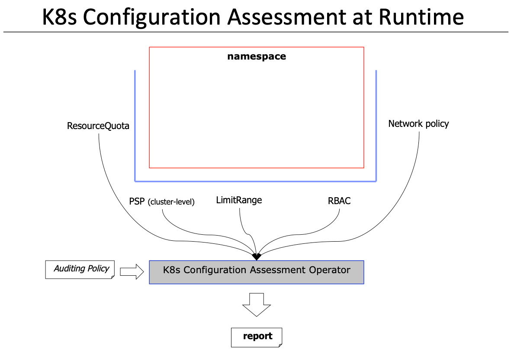

# OCM-EP: K8s Configuration Assessment

<!-- toc -->
- [Release Signoff Checklist](#release-signoff-checklist)
- [Summary](#summary)
- [Motivation](#motivation)
  - [Goals](#goals)
  - [Non-Goals](#non-goals)
- [Proposal](#proposal)
  - [User Stories (optional)](#user-stories-optional)
    - [Story 1](#story-1)
  - [Notes/Constraints/Caveats (optional)](#notesconstraintscaveats-optional)
  - [Risks and Mitigations](#risks-and-mitigations)
- [Design Details](#design-details)
  - [Test Plan](#test-plan)
  - [Graduation Criteria](#graduation-criteria)
  - [Upgrade / Downgrade Strategy](#upgrade--downgrade-strategy)
  - [Version Skew Strategy](#version-skew-strategy)
- [Production Readiness Review Questionnaire](#production-readiness-review-questionnaire)
  - [Feature enablement and rollback](#feature-enablement-and-rollback)
  - [Rollout, Upgrade and Rollback Planning](#rollout-upgrade-and-rollback-planning)
  - [Monitoring requirements](#monitoring-requirements)
  - [Dependencies](#dependencies)
  - [Scalability](#scalability)
  - [Troubleshooting](#troubleshooting)
- [Implementation History](#implementation-history)
- [Drawbacks](#drawbacks)
- [Alternatives](#alternatives)
- [Infrastructure Needed (optional)](#infrastructure-needed-optional)
<!-- /toc -->

## Release Signoff Checklist

<!--
**ACTION REQUIRED:** In order to merge code into a release, there must be an
issue in [kubernetes/enhancements] referencing this OCM-OP and targeting a release
milestone.

Check these off as they are completed for the Release Team to track. These
checklist items _must_ be updated for the enhancement to be released.
-->

Items marked with (R) are required *prior to targeting to a milestone / release*.

- [ ] (R) OCM-OP approvers have approved the OCM-OP status as `implementable`
- [ ] (R) Design details are appropriately documented
- [ ] (R) Test plan is in place
- [ ] (R) Graduation criteria is in place
- [ ] (R) Production readiness review completed
- [ ] Production readiness review approved
- [ ] "Implementation History" section is up-to-date for milestone
- [ ] User-facing documentation has been created
- [ ] Supporting documentation e.g., additional design documents, links to mailing list discussions/SIG meetings, relevant PRs/issues, release notes

[kubernetes.io]: https://kubernetes.io/
[open-cluster-management/enhancements]: https://github.com/open-cluster-management/enhancements
[open-cluster-management]: https://github.com/open-cluster-management

## Summary

<!--
This section is incredibly important for producing high quality user-focused
documentation such as release notes or a development roadmap.  It should be
possible to collect this information before implementation begins in order to
avoid requiring implementors to split their attention between writing release
notes and implementing the feature itself.  OCM-OP editorsshould help to ensure 
that the tone and content of the `Summary` section is useful for a wide audience.

A good summary is probably at least a paragraph in length.

-->

A kubernetes (k8s) cluster can have dozens of namespaces. K8s offers many resources to secure and better configure your namespace. Such resources include `NetworkPolicies` and `ResourceQuotas` among others.

Making sure your namespace is securely configured an following best practices is not an easy task. However we can embed the knowledge of a k8s domain expert in an Operator that is capable of analysing the existing k8s configuration and coming up with recommendation to fix any violations detected.

The Operator implements most of the rules defined in the [Center for Internet Security (CIS) benchmark](https://www.cisecurity.org/benchmark/docker/) Docker container-runtime (i.e. section 5 of the Benchmark document). In addition to other best practices such as making sure your `NetworkPolicies` are not too permissive, or the RBAC `Roles` are not granting excessive permissions.

As shown above, the operator takes as input a policy specifying which resources we wish to analyze, and produces a report detailing the violations found and the remediation steps to fix them.

## Motivation

The CIS benchmark for Docker container-runtime includes many rules to better secure and isolate the containers. However the existing benchmark implementations rely on the Docker API. However Docker is optional when running K8s. And many cloud providers offering K8s as a service skip Docker and use directly ContainerD or RunC making the CIS docker implementations obsolete.

As an alternative, we can make sure that the K8s configuration includes the resources that map to the CIS docker exist and are configured adequately. Surveys show that on average a K8s cluster can have 10 or more namespaces. Hence, ensuring that all the namespaces include the resources needed to ensure their security and boundaries is a tedious and error prone task.

Automation is key to facilitate the task of configuring the K8s cluster according to best practices, hence this proposal of an Operator that scans a k8s cluster, and detects violations and specifies recommendations.

### Goals

<!--
List the specific goals of the OCM-OP.  What is it trying to achieve?  How will we
know that this has succeeded?
-->

The goal here to harden our K8s cluster configuration by scanning the cluster configuration, making sure that the required resources exist and are configured adequately.

### Non-Goals

This proposal is not a substitue for admission controllers that can check the resources at creation time.

We propose an operator for multiple reasons:

1- The Operator can scan and report back on existing k8s resources that were created before the Operator was deployed.

2- The Operator input policy (custom resource) allows for a lot of flexibility in terms of the namespaces to include/exclude and the scans to ingore/verify on each resource kind.

3- The Operator produces a well defined report that can be used for auditing purposes at a later point in time.

4- The Operator can execute as a cron-job that runs at a certain time interval thus saving resources

5- The Operator takes as input a KubeConfig, and therefore it can remotely scan any cluster as long as it has the credentials to query its API server.

## Proposal

<!--
This is where we get down to the specifics of what the proposal actually is.
This should have enough detail that reviewers can understand exactly what
you're proposing, but should not include things like API designs or
implementation.  The "Design Details" section below is for the real
nitty-gritty.
-->

### User Stories (optional)

<!--
Detail the things that people will be able to do if this OCM-OP is implemented.
Include as much detail as possible so that people can understand the "how" of
the system.  The goal here is to make this feel real for users without getting
bogged down.
-->

As a CISO officer, responsible for compliance and security, I want to enforce best practices to be used accross the organization.

I want to define those best practices in a consistent way. I want to be able to audit the individual clusters and see what are the violations.

I would like to offer guidance to my sys-admins to fix the violations. If a violation persists in a given cluster I want it to be reported and persisted as a github issue and assigned to the right person. If that person fails to react within a time frame, I would an escalation to occur assigning the issue to someone else.

#### Story 1

As a sys-admin, I want to be able to block the deployment of application in clusters that do not adghere to the CISO policy. 
I can place this enforcement in the deployment pipeline and point it to the desired cluster, and see if the cluster if compliant.

### Notes/Constraints/Caveats (optional)

<!--
What are the caveats to the proposal?
What are some important details that didn't come across above.
Go in to as much detail as necessary here.
This might be a good place to talk about core concepts and how they relate.
-->

### Risks and Mitigations

<!--
What are the risks of this proposal and how do we mitigate.  Think broadly.
For example, consider both security and how this will impact the larger
kubernetes ecosystem.

How will security be reviewed and by whom?

How will UX be reviewed and by whom?

Consider including folks that also work outside the SIG or subproject.
-->

## Design Details

The Operator is intended to implement most the checks needed to ensure you k8s cluster runs in compliance with the CIS benchmark for Docker container-runtime. Below we map each CIS rule to the check that the Operator will perform on the configuration.

### CIS benchmark for Docker rules mapping to K8s attributes:

5.1 Do not disable AppArmor Profile (Scored)  => `PSP: annotations.appArmor`

5.2 Verify SELinux security options, if applicable (Scored) => `PSP: seLinuxOptions`

5.3 Restrict Linux Kernel Capabilities within containers (Scored) => `PSP: allowedCapabilities`

5.4 Do not use privileged containers (Scored) => `PSP: privilidged`

5.5 Do not mount sensitive host system directories on containers (Scored) => `PSP: allowedHostPaths`

5.6 Do not run ssh within containers (Scored) => `NA`

5.7 Do not map privileged ports within containers (Scored) => `PSP: hostPorts`

5.8 Open only needed ports on container (Scored) => `NA`

5.9 Do not share the host's network namespace (Scored) => `PSP: hostNetwork`

5.10 Limit memory usage for container (Scored) => `LimitRange: default.memory`

5.11 Set container CPU priority appropriately (Scored) => `LimitRange: default.cpu`

5.12 Mount container's root filesystem as read only (Scored) => `PSP: readOnlyRootFilesystem`

5.13 Bind incoming container traffic to a specific host interface (Scored) => `NA`

5.14 Set the 'on-failure' container restart policy to 5 (Scored) => `Pod: restartOnFailure`

5.15 Do not share the host's process namespace (Scored)  => `PSP: hostPID`

5.16 Do not share the host's IPC namespace (Scored) => `PSP: hostIPC`

5.17 Do not directly expose host devices to containers (Not Scored) => `NA`

5.18 Override default ulimit at runtime only if needed (Not Scored)    set mount propagation mode to shared (Scored)  => `NA`

5.20 Do not share the host's UTS namespace (Scored) => `Pod: shareProcessNamespace`

5.21 Do not disable default seccomp profile (Scored) => `PSP: annotations.secComp`

5.22 Do not docker exec commands with privileged option (Scored) => `NA`

5.23 Do not docker exec commands with user option (Scored)  => `NA`

5.24 Confirm cgroup usage (Scored) =>  `LimitRange: default`

5.25 Restrict container acquiring additional privileges => `PSP: allowedPriviledgeEscalation`

5.26 Check container health at runtime (Scored) => `Pod: linvenessProbes`

5.27 Ensure docker commands always get the latest version of the image (Not Scored) => `NA`

### Going beyond the CIS rules

The Operator also checks other rules that are not part of the CIS benchmark. Such as checking if `NetworkPolicies` are too permissive (e.g. selecting all pods), or too restrictive (e.g. fully isolating pods). It also checks if the RBAC `Roles` are using `*` wildcards in their definitions or allowing the modification/creation of new RBAC `Role` which is best practice to be reserved for the `ClusterRoles`. The Operator also examines the resourceQuotas in the namespaces.

### Alerting in case on non-compliance

In case a cluster configuration is found to be non-compliant according the policy details, the Operator can be configured to open a github issue with the body of the issue being the results of the scan.

### Test Plan

The Operator implements a BDD approach. It uses Ginkgo and Gomega.

### Graduation Criteria

For now, the Operator wil be in Alpha, once it matures more and the Custom resource content stabalizes we can discuss with the stakholders the graduation criteria to Beta

<!--
**Note:** *Not required until targeted at a release.*

Define graduation milestones.

These may be defined in terms of API maturity, or as something else. The OCM-OP
should keep this high-level with a focus on what signals will be looked at to
determine graduation.

Consider the following in developing the graduation criteria for this enhancement:
- [Maturity levels (`alpha`, `beta`, `stable`)][maturity-levels]
- [Deprecation policy][deprecation-policy]

Clearly define what graduation means by either linking to the [API doc
definition](https://kubernetes.io/docs/concepts/overview/kubernetes-api/#api-versioning),
or by redefining what graduation means.

In general, we try to use the same stages (alpha, beta, GA), regardless how the
functionality is accessed.

[maturity-levels]: https://git.k8s.io/community/contributors/devel/sig-architecture/api_changes.md#alpha-beta-and-stable-versions
[deprecation-policy]: https://kubernetes.io/docs/reference/using-api/deprecation-policy/

Below are some examples to consider, in addition to the aforementioned [maturity levels][maturity-levels].

#### Alpha -> Beta Graduation

- Gather feedback from developers and surveys
- Complete features A, B, C
- Tests are in Testgrid and linked in OCM-OP

#### Beta -> GA Graduation

- N examples of real world usage
- N installs
- More rigorous forms of testing e.g., downgrade tests and scalability tests
- Allowing time for feedback

**Note:** Generally we also wait at least 2 releases between beta and
GA/stable, since there's no opportunity for user feedback, or even bug reports,
in back-to-back releases.

#### Removing a deprecated flag

- Announce deprecation and support policy of the existing flag
- Two versions passed since introducing the functionality which deprecates the flag (to address version skew)
- Address feedback on usage/changed behavior, provided on GitHub issues
- Deprecate the flag

**For non-optional features moving to GA, the graduation criteria must include [conformance tests].**

[conformance tests]: https://git.k8s.io/community/contributors/devel/sig-architecture/conformance-tests.md
-->

### Upgrade / Downgrade Strategy

Since the Operator (1) does not control any workload (e.g. does not control the lifecycles of pods...) and (2) does not need to running 24/7 (it is more like a cron job), then upgrading is fairly simply, it is a matter of upgrading the container image and restarting the operator with the new image and configuration.

<!--
If applicable, how will the component be upgraded and downgraded? Make sure
this is in the test plan.

Consider the following in developing an upgrade/downgrade strategy for this
enhancement:
- What changes (in invocations, configurations, API use, etc.) is an existing
  cluster required to make on upgrade in order to keep previous behavior?
- What changes (in invocations, configurations, API use, etc.) is an existing
  cluster required to make on upgrade in order to make use of the enhancement?
-->

### Version Skew Strategy

The Operator currently only deals with the K8s API-server and hence the client version the oprator uses should be in sync with the k8s API-server version.
<!--
If applicable, how will the component handle version skew with other
components? What are the guarantees? Make sure this is in the test plan.

Consider the following in developing a version skew strategy for this
enhancement:
- Does this enhancement involve coordinating behavior in the control plane and
  in the kubelet? How does an n-2 kubelet without this feature available behave
  when this feature is used?
- Will any other components on the node change? For example, changes to CSI,
  CRI or CNI may require updating that component before the kubelet.
-->

## Production Readiness Review Questionnaire

<!--

Production readiness reviews are intended to ensure that features merging into
Kubernetes are observable, scalable and supportable, can be safely operated in
production environments, and can be disabled or rolled back in the event they
cause increased failures in production. See more in the PRR OCM-OP at
https://git.k8s.io/enhancements/OCM-OPs/sig-architecture/20190731-production-readiness-review-process.md

Production readiness review questionnaire must be completed for features in
v1.19 or later, but is non-blocking at this time. That is, approval is not
required in order to be in the release.

In some cases, the questions below should also have answers in `OCM-OP.yaml`. This
is to enable automation to verify the presence of the review, and reduce review
burden and latency.

The OCM-OP must have a approver from the
[`prod-readiness-approvers`](http://git.k8s.io/enhancements/OWNERS_ALIASES)
team. Please reach out on the
[#prod-readiness](https://kubernetes.slack.com/archives/CPNHUMN74) channel if
you need any help or guidance.

-->

### Feature enablement and rollback

Using feature flags in the Operator

### Rollout, Upgrade and Rollback Planning

This is typically a single instance type of deployment.

### Monitoring requirements

The operator exposes metrics to Prometheus.

### Dependencies

Only on the K8s APi-server

### Scalability

This is typically a single instance type of deployment.
The experiments conducted on scanning ~100 resource (5 resources x 20 namespaces) have completed in less than 5 seconds
No experiments have yet been conducted on the scalability limits (e.g. how long it takes to scan millions of resources.)

## Implementation History

The implementation and documentation:
https://github.ibm.com/akanso/k8s-namespace-assessment

## Drawbacks

<!--
Why should this OCM-OP _not_ be implemented?
-->

## Alternatives

<!--
What other approaches did you consider and why did you rule them out?  These do
not need to be as detailed as the proposal, but should include enough
information to express the idea and why it was not acceptable.
-->

An alternative implementation choice would be to use the Open-Policy-Agent (OPA) Gatekeeper V3 with its Audit functionality.

This would be useful if the resources we monitor as well as the rules can change frequently. However the CIS rules that we check are pretty stable and rarely change.

The complexity overhead of using Gatekeeper (installing multiple CRDs, having the OPA engine, etc.) can be avoided with a simple Operator.

Moreover, the Operator can acts on the status on the custom resource and open github issues, this is something outside the scope of gatekeeper

## Infrastructure Needed (optional)

<!--
Use this section if you need things from the project/SIG.  Examples include a
new subproject, repos requested, github details.  Listing these here allows a
SIG to get the process for these resources started right away.
-->

Any K8s api-server > v1.15